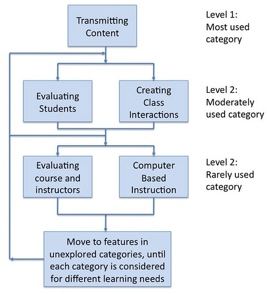

See also: [[blog-home | Home]]

In a [recent post](/blog2/2009/07/31/some-early-results-from-webfuse-evaluation/) I messily wrote about the start of the process of evaluating the use of Webfuse for my thesis. This post takes the ideas/process from that post and applies it to the course websites produced by Webfuse from 2006 through 2007. The data in here is in a similar time frame to the work being done by Col and Ken on their [indicators project](http://beerc.wordpress.com/2009/07/28/quick-indicators-update-2/).

### Background

The basic idea is to use the categories proposed by Malikowski et al (2007) as a way to examine the level of feature usage within the Webfuse course sites from 2006 through 2009 (or as much as 2009 that has completed). The following diagram is adapted from Malikowski et al (2007) and it summarises their five categories and also gives an indication of the level of feature usage they have found in their survey of the LMS/VLE literature.

Webfuse is the web-based e-learning system that is the basis for my PhD and some description of that is available [here](/blog2/publications/an-information-systems-design-theory-for-e-learning/). Most of the course sites hosted on Webfuse are not password protected - you can see the [latest list here](http://webfuse.cqu.edu.au/Courses/2009/T2/)

Two of the Malikowski et al (2007) categories are excluded in the following set of findings because:

1. All Webfuse course sites transmit content.  
    The creation of a Webfuse course site automatically includes any and all course content that is in a fairly standard, accessible digital format.
2. Webfuse doesn't support CBI.  
    Webfuse doesn't pretend to offer any form of computer-based instruction of the type required by Malikowski et al (2007).

### Findings

(**\***: The 2009 academic year is currently half way through the second of three terms. The 2009 numbers will increase.)
| Category | 2006 | 2007 | 2008 | 2009\* |
| --- | --- | --- | --- | --- |
| Number of course sites | 304 | 262 | 229 | 178 |
| Class interactions | 67.1% | 95.4% | 98.3% | 97.8% |
| Evaluating students | 38.1% | 58.7% | 65.1% | 61.2% |
| Evaluating course | 96.7% | 97.7% | 53.3% | 38.2% |

### Questions and observations

A misc. collection of questions and observations arising from the above:

- Webfuse has created a set of results very different from the norm.  
    According to Malikoski et al's (2007) lit survey interactions and student evaluations are moderately used (in the range of 20-40% of courses) and evaluating the course rarely used (i.e. hardly ever used or mentioned). The following highlights some of the differences.
    
    **In the above the level of interactions is approaching 100%.**
    
    At times, **evaluating the course, rarely ever used, is approaching 100% usage.**
    
    **Evaluating students is at levels twice that reported in Malikowski et al (2007)**
    
- In 2007 through 2009 what are the less than 5% of course sites that don't have interactions doing?
- The levels for communication (approaching 100%) is higher than that reported for Blackboard (46% in 2006 and up to 61% for T1, 2009).
- The levels for student evaluation (around 60%) is more than double, sometime three times, that for Blackboard (no more than 20%).
- Strong need to include in this framework some level of usage of each feature.  
    The almost 100% adoption, at times, of interactions and evaluating the course, are almost certain to hide something very troubling. Yes, the course site provides that functionality. However, how much has it actually been used? There's a need to establish some sort of measure of how much each feature has been used to provide a more useful insight into what is going on.

### You can lead a horse to water...

The approach to course sites embedded in Webfuse was that there was a default course site structure. That structure would be created and filled in with information automatically. This would give academics an almost complete course site to modify. Over time, increasingly the course sites were simply copied from last term to the next, edited and used by students.

Even with an almost automated process minimising the work required of the academics, I feel there was a fair bit of limited or inappropriate use. Yes, there may be a class mailing list of discussion forum, but how often did the academics use it? I believe/feel (something that needs to be tested) that a lot of academics simply didn't engage with these features. Either they didn't have time or they didn't have the inclination. For a number, I think it was a case, for a number of reasons, of minimising workloads. Perhaps it might have also been a lack of knowledge.

#### Problems with minimum standards

As mentioned [previously](/blog2/2009/06/19/why-minimium-standards-probably-wont-work-and-will-probably-become-maximum-standards/) my current institution is adopting a set of minimum standards for course websites. A specification of the components that all course websites must have, as a minimum. I'm not a fan of the idea and the findings here further encourage those negative thoughts.

The Webfuse default course sites were essentially a set of minimum standards that were automatically created for the staff member. Even created automatically, I feel that large parts of these course sites were not supported/used by academic staff.

What do you think is going to happen with a set of minimum standards that the academics actually have to implement? i.e. with the move to Moodle, it appears that the staff will have to do the work to construct the course sites. They have to do the work to implement the minimum standards set by someone else.

Is that going to increase the quality of learning and teaching?

### References

Malikowski, S., M. Thompson, et al. (2007). "A model for research into course management systems: bridging technology and learning theory." Journal of Educational Computing Research 36(2): 149-173.