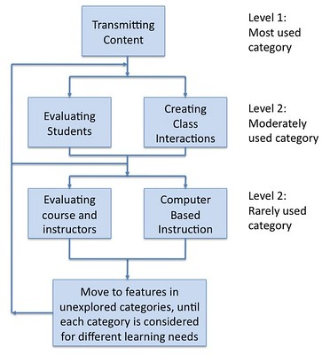

---
categories:
- elearning
- evaluation
- indicators
- lmsevaluation
date: 2009-08-05 13:57:04+10:00
next:
  text: External factors associated with CMS adoption
  url: /blog/2009/08/05/external-factors-associated-with-cms-adoption/
previous:
  text: Factors related to the breadth of use of LMS/VLE features
  url: /blog/2009/08/05/factors-related-to-the-breadth-of-use-of-lmsvle-features/
title: Automating calculation of LMS/CMS/VLE feature usage - a project?
type: post
template: blog-post.html
---
I'm in the midst of looking at the [work of Malikowski et al](/blog/2009/08/05/factors-related-to-the-breadth-of-use-of-lmsvle-features/) in evaluating the usage of VLE features. The aim of this work is an attempt to provide information that can help those who help academics use VLEs. The following is an idea to address those problems and arrive at something that might be useful for cross-institutional comparisons.

Given the widespread adoption of the LMS/VLE, I'd be kind of surprised if someone hasn't given some thought to what I've suggested, but I haven't heard anything.

Do you know of a project that covers some of this?

Interested in engaging in something like this?

### Their contribution

An important contribution they've made is to provide a useful framework for comparing feature usage between different systems and summarised the basic level of usage between the different parts of the framework. The framework is shown in the following image.

### Limitations

However, there remain two important questions/problems:

1. How do you generate the statistics to fill in the framework?  
    Malikowski et al suggest that prior studies relied primarily on asking academics what they did with the LMS. They then point out that this approach is somewhat less than reliable. The adopt a better approach by visiting each course site and manually counting feature usage.
    
    This is not much of an improvement because of the workload involved but also the possibility of errors due to them missing usage. For example, the role in the LMS of the user visiting each course site may not be able to see everything. Alternatively, when they visit the site may change what they see e.g. an academic that deletes a particular function before term ends.
    
2. What does it mean to adopt a feature?  
    In Malikowski (2008) adoption is defined as using a feature more than the 25% percentile. This, I believe, is open to some problems as well.

### Implications

Those limitations mean, that even with their framework, it is unlikely that a lot of organisations are going to engage in this sort of evalaution. It's too difficult. This means less data can be compared between institutions and systems. This in turn limits reflection and knowledge.

Given the amount of money being spent on the LMS within higher education, it seems there is a need to address this problem.

### One approach

The aims of the following suggestion are:

- Automate the calculation of feature usage of LMS.
- Enable comparison across different LMS.
- Perhaps, include some external data.

One approach to this might be to use the model/framework from Malikowski et al as the basis for the design of a set of database tables that are LMS independent.

Then, as need arises, write a series of filters/wrappers that retrieve data from a specific LMS and inserts it into the "independent" database.

Write another series of scripts that generate useful information.

Work with a number of institutions to feed their data into the system to allow appropriate cross institutional/cross LMS comparisons.

Something I forgot - also work on defining some definition of adoption that improves upon those used by Malikowski.

### Start small

We could start something like this at CQU. We have at least two historically used "LMS/VLEs" and one new one. Not to mention [Col](http://beerc.wordpress.com/) already having made progress on specific aspects of the above.

The logical next step would be to expand to other institutions. Within Australia? ALTC?