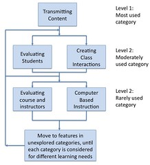
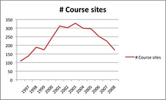
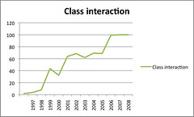
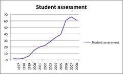
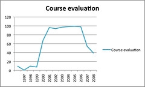

Over the last week I've posted a bit around papers and ideas about how you evaluate the use of a learning management system (LMS). This post is intended to summarise findings from an initial evaluation of the use of features in the Webfuse system from 1997 through 2009. Webfuse is the system I designed as part of my [PhD](/blog2/research/phd-thesis/) and has been used at [Central Queensland University](http://www.cqu.edu.au/) since 1997. At least the "LMS" part of Webfuse will cease being used in 2010.

Aside: Webfuse is not an LMS. Anyone who calls Webfuse an LMS doesn't get it.

Overall, I believe these figures, even with their limitations, show that the processes and ideas underpinning Webfuse have contributed to a very different result than is expected from the literature. I would argue that the Webfuse approach, in a context of some significant difficulty, has produced a result with some significant benefits.

### About the figures

The figures presented below results from an initial analysis of the archives. The figures presented below concentrate on the number of course sites supported by Webfuse and the percentage of those courses that contained various Webfuse features. The features are grouped into the categories proposed by Malikowski, Thompson and Theis (2007) and illustrated in the figure below adapted from Malikowski et al (2007).

An important point made in the following is related to usage levels embedded in the Malkowski et al (2007) model. The model groups LMS functionality into five categories and then, drawing on the results reported in the literature, break the five categories into three levels of usage:

- Level 1 - Most used category.  
    Only the transmitting content category is put into this level. This reflects findings that by far the overwhelming use of an LMS has been to distribute information.
- Level 2 - Moderately used category.  
    Student evaluation (online quizzes, student assessment) and class interactions fit into this category.
- Level 3 - Rarely used category.  
    Evaluating the course/instructors and computer-based instruction fit here.

Malikowski et al in their writings have used two different approaches to defining adoption. The first defines adoption as the presence of the functionality and doesn't take into account how much the feature is actually used. The second required the feature usage to be greater than the 25 percentile. The following uses the first, it's easier to calculate and doesn't have some of the problems of the latter

I've included some brief comments with each graph.

### Webfuse course sites

- I believe that the drop in course sites in 2000 was due to some coordinators adopting WebCT which had been introduced as the "institutional" system. Within an offering or two, these courses had returned to Webfuse.
- 1997 through 2000 were the naive years of Webfuse. The level of features in Webfuse and the default course sites was low. Familiarity with online learning with staff was relatively low.
- At the end of 2000 the golden years of the Webfuse team commenced. I worked full-time on Webfuse, there was a growing and talented Webfuse team, the underlying technology was getting better and there was growing need.
- The middle of 2001 saw the introduction of a new "default course site" that offered more scaffolding for staff than earlier versions. It's essentially the version still being used today.
- After 2001 there was never a great deal of work done on expanding the functionality of the course sites as a whole, beyond the odd bit of tinkering and fixing.
- By 2004 the faculty decided there was no value in me working on Webfuse. Around this time Blackboard was introduced and not long afterwards there was faculty restructure.
- By 2006 the Webfuse team moved out of a faculty into the central IT division. Not long after the team was down to 1 and a bit people.

### Transmitting content

I have not bothered to include a graph showing the percentage of Webfuse courses transmitting content. The Webfuse "model" was that a default course site was automatically created for all courses. By default, this included a link to the course profile, some information about the course and the teaching staff.

So, from the start 100% of the Webfuse course sites were used to transmit content.

### Class interactions

- In 1997 Webfuse was used only for courses within the Department of Mathematics and Computing. There was a history of using mailing lists in some courses. I'm not sure all of these are included in the figure from 1997.
- From 1998, Webfuse supported courses within the Faculty of Informatics and Communication and included courses in Journalism, Communications, Multimedia and others.
- I was surprised when I found that the level of class interactions rose to 100% in the last few years. This is a significantly different result than that reported in the literature and breaks Malikoswki et al's (2007) suggested model.

### Evaluating students

- Getting into the 60/70% of courses using Webfuse to evaluate students is another result somewhat different than you would expect, certainly when compared to the level of adoption in other institutional systems at CQU.
- A significant proportion of this is online assignment submission which has been a focus of work within Webfuse and has resulted in publications (Jones and Jamieson, 1997; Jones and Behrens, 2003; Jones et al, 2005) and a system that has been streets ahead of what's been available in LMSes.

### Evaluating courses or staff

- Since 1997 Webfuse has provided a feature to survey students. Initially this was based on the paper-based course evaluation form used at CQU at that time. Preceding the institutional use of online forms to survey students by a number of years.
- The upsurge in course evaluation starting in 1999 arises because of inclusion of the course barometer feature. In 1999, I attended the EdMedia'99 conference in Seattle. One of the presentations I attended introduced the idea of the course barometer (Svensson, Andersson, Gadd and Johnsson, 1999). I thought it would be great for my course and created a Webfuse course barometer. In that first year a handful of other academic voluntarily added it to their sites.
- In June 2001, the faculty QA person convinced me and faculty management that it would be a good day to make the barometer a part of the default course site. i.e. every course site would have one. This continued until 2006 when it was made optional.
- Only for a brief period of time (first six months of 2002) was the barometer really effectively supported by the faculty. However, due to the nature of the barometer and some other contextual issues, it wasn't an entirely positive experience. For more information refer to a couple of papers that were written (Jones, 2002; 2003)
- It is likely when analysis of usage moves beyond the presence of a barometer in a course site, that percentages might decrease. However, the level of usage in the last few years, when it has been optional, is still significantly higher than might be expected based on the literature.

### Computer-based instruction

Webfuse has never provided any functionality that fits within this category.

### References

Jones, D., & Jamieson, B. (1997). Three Generations of Online Assignment Management. Paper presented at the ASCILITE'97, Perth, Australia.

Jones, D. (2002). Student Feedback, Anonymity, Observable Change and Course Barometers. Paper presented at the World Confernece on Educational Multimedia, Hypermedia and Telecommunications, Denver, Colorado.

Jones, D. (2003). Course Barometers: Lessons gained from the widespread use of anonymous online formative evaluation. Paper presented at the OLT'2003, QUT, Brisbane.

Jones, D., & Behrens, S. (2003). Online Assignment Management: An Evolutionary Tale. Paper presented at the 36th Annual Hawaii International Conference on System Sciences, Hawaii.

Jones, D., Cranston, M., Behrens, S., & Jamieson, K. (2005). What makes ICT implementation successful: A case study of online assignment submission. Paper presented at the ODLAA'2005, Adelaide.

Malikowski, S., Thompson, M., & Theis, J. (2007). A model for research into course management systems: bridging technology and learning theory. Journal of Educational Computing Research, 36(2), 149-173.

Svensson, L., Andersson, R., Gadd, M., & Johnsson, A. (1999). Course-Barometer: Compensating for the loss of informal feedback in distance education. Paper presented at the EdMedia'99, Seattle, Washington.