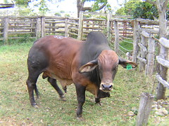
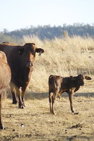

---
categories:
- thesis
date: 2009-08-11 08:54:50+10:00
next:
  text: '"BIM #1: Working on the prototype"'
  url: /blog/2009/08/11/bim-1-working-on-the-prototype/
previous:
  text: The chasm
  url: /blog/2009/08/09/the-chasm/
title: Big Z's first progeny
type: post
template: blog-post.html
---
October last year we purchased Wandilla Zanzibar - Big Z from the big Brahman sales in Rocky. He was the new bull for the small number of remnants of our might herd of cattle.

Almost 10 months to the day when he arrived on our place, the first of his progeny arrived. Two have arrived so far, going by appearance we can expect a number more over coming weeks.

Of course, this means that at some stage in the next couple of months there will be the additional chores of castration and de-horning to perform.