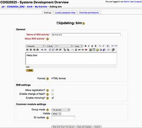

See also: [[blog-home | Home]]

I'm involved in some early discussions with some folk from the Psychology department here at [CQUniversity](http://www.cqu.edu.au/) about a project looking at curriculum mapping. If I've got any idea of their problem, it's associated with the need to show their students, themselves and the accrediting bodies how the activities, resources and assessments of the courses within they degree meet the outcomes for the courses and the program.

I have a meeting with them tomorrow. The following is an edited copy of a post I've just made to a [discussion about curriculum mapping](http://moodle.org/mod/forum/discuss.php?d=110759) on the Moodle general developer forum. It's an attempt to identify one potential way forward.

Before moving forward - a definition of some terms as I'll use them in the following:

- Course - the smallest unit of study a student can enrol in. Usually goes over 12 weeks or so. A bachelor's degree consists of 24 courses.
- Program - a collection of courses that contribute to a degree (e.g. the psychology program).
- Curriculum mapping - an attempt to generate a representation of the alignment (or lack thereof) between stated outcomes for programs and courses and the activities, resources and tasks provided to students.

### Top-down versus bottom-up

In the discussion around curriculum mapping on the Moodle general developer's forum, [Ger Tielemans](http://moodle.org/user/view.php?id=2675&course=5) makes the following point

> The point is that Moodle works - by design - bottom-up while most curriculum tools work top-down.
> 
> - In the top-down approach you have first to fill a cascade of questions before you can enter one single resource or activity (teachers hate this!)
> - In Moodle you start on course level and even there it is a free form design, teachers become "bricoleurs" (French for handyman).
> 
> Teachers like this approach, but it is killing your curriculum wish.
> 
> Is it possible to combine these approaches, still with simplicity in mind?

This point was the inspiration for the following suggestion/idea. It really strikes a chord with my experience helping academic staff with their teaching and also as an academic staff member trying to teach.

The rest of this post includes some additional background why I think engaging with the bottom up practice of most academics is the better solution than forcing them to work top-down; and an initial description of a potential solution that might achieve this.

### Reasons why changing to top-down is hard

The basic assumption is that trying to change academics from a bottom-up to a top-down approach is almost certainly going to fail, or at least be really, really difficult and expensive. Instead, it is a better idea to try and achieve the same goal while allowing academics to retain their bottom up approach. This section outlines a few reasons for that.

If the goal is to enable curriculum mapping, I would suggest not changing academic practice from bottom-up to top-down. If you believe there are other benefits in changing academic practice to top-down, that's another argument. I'm focusing here on the pragmatic question of how best to generate a curriculum map of a program/set of courses.

#### Change and task corruption

When it comes to change in teaching practice with university academics, it's very hard. Most (there is a minority of innovators that are an exception) tend not to change their practice.

When the push for this change is from the top-down (i.e. management), it is even less likely that academics will change teaching practice. If pushed the end result is, at best compliance, and at worst [task corruption](/blog2/2009/03/04/task-corruption-in-teaching-university-negative-impact-of-place/). This tends to defeat the purpose of any change in the first place.

The need for curriculum mapping is mostly top-down. It's needed for accreditation and accountability reasons - mostly concerns for management. My fear is that any requirement for academics to produce/contribute to curriculum maps is likely to be seen as an additional impost and either they won't participate or they will be seen to comply.

#### Other work

It appears that there is [some work](http://www.iamse.org/conf/conf12/abstracts/Assessment/ed%20-%20jackson.htm) (more detail on [Moodle forum](http://moodle.org/mod/forum/discuss.php?d=117150)) being done at the University of Virginia School of Nursing on developing a more traditional top-down approach to curriculum mapping for Moodle. It's also a lot more than that.

There's a vaguely related set of work being done around [syllabus builders](http://www.editlib.org/p/31976) that might perform some of the same roles. At least from the perspective of entering course outcomes and possibly mapping.

For the reasons I outline below (and probably some more) I don't think these approaches would be as effective in my context (I make no claims about other contexts). A comparison between the different approaches might be interesting.

#### Task fit and familiarity

There's a theory/model called [Task Technology Fit (TTF)](http://www.istheory.yorku.ca/tasktechnologyfit.htm) from the information systems discipline, which basically says an IT system is more likely to have a positive impact on individual performance if the system matches the tasks the user must perform. i.e. it's pretty hard to use a hammer to cut wood. Related to this is the idea is that people like familiarity and avoid the unfamiliar.

At least in my context, within the next year or so academics will be familiar with Moodle. As all our courses will be expected to have a Moodle presence. The use of Moodle will become a standard part of the task they are expected to perform - running a course (I use that title rather than "create a learning experience/environment" because I believe that's how many interpret their task).

#### Design versus copying across

In my context, it is my perception that there are very few courses that are designed from scratch (i.e. designed from the top-down). Mostly people re-use documents, resources and course sites from previous terms and make slight modifications. Few people have the time or inclination and design a course from scratch. The exceptions are obviously those folk who are creating new courses, but I believe they are in the minority.

For me, this means that approaches that focus on creating curriculum maps through the course design process are also not likely to fit.

In addition, at my institution the "syllabus builder" that we use is a locally developed system. While it serves a purpose, it has some limitations and enhancing it to fulfill the role of curriculum mapping would be difficult. Rather than waste that investment in a proprietary system, it would seem to make more sense to put this functionality into a open system like Moodle.

Especially when Moodle is the system the academics will be using throughout the term for most of the learning and teaching. Why make them use another system?

### Evaluating potential innovations

Back in 2003, some colleagues and I proposed a model, drawing heavily on Rogers (1995), for evaluating potential web-based innovations [(Jones, Jamieson and Clark, 2003](/blog2/publications/a-model-for-evaluating-potential-web-based-education-innovations/)). The claim was

> innovations are largely promoted on the basis of a collection of supposedly objective benefits. The implementation of these innovations often ignores contextual issues that can cause problems with adoption of the innovations. This paper has proposed the use of a model from diffusion theory through which educators can increase their awareness of potential implementation issues, estimate the likelihood of reinvention, and predict the amount and type of effort required to achieve successful implementation of specific WBE innovations.

Based on my interpretation of the model I would see any top-down approach to curriculum mapping as having significant implementation issues, a high probability of reinvention and is likely to require a great deal of complicated and expensive "social engineering" to achieve meaningful outcomes. A bottom-up approach is likely to be somewhat easier, though potentially still not incredibly straight forward depending on the context.

For example, given that the psychology folk are fairly motivated about curriculum mapping, either approach is likely to be much simpler. However, another grouping of academics with a different set of motivations, are likely to be very different.

### A solution?

Based on the above background and sparked by Ger's observation of the difference between top-down and bottom-up, the following idea came to me overnight. It's also informed by some [recent experience I gathered](/blog2/2009/08/17/bim-4-re-jigging-how-bim-works/) while trying to become familiar with Moodle (which means I'm still new to Moodle so take the following with a grain of salt).

The basic idea is to modify the operation of Moodle so that everytime an academic edits or adds a resource or activity to a Moodle course they can easily select which of the course and program outcomes that resource or activity is associated with. This would provide a database with the information necessary to create a curriculum map.

My organisation already has the program and course outcomes in a database. We also know which courses belong to which programs. So this information could be fed in automatically. The academics wouldn't have to enter it.

It is my understanding that the update form for most resources/activities in Moodle will include a "Common module settings" box like that shown in the following image. See the box near the bottom of the page with the title "Common module settings"

So, given that (generally) when an academic is updating a resource/activity they are working within a particular course and that we've already entered into a database the course and program outcomes that are associated with the course. It shouldn't be too hard to add a "Course/program outcomes" section to every update form. This section would include a list of all the relevant program and course outcomes.

So, every time an activity or resource is edited by an academic they can choose which of the program and course outcomes are associated with the activity or resource. This "mapping" is then stored in a database and is available for other services to use. Those other services might include:

- A block that reminds/notifies the academic that some of the course outcomes aren't yet covered by an assessment or activity.
- A website that shows prospective and current students where and how each outcomes is met.
- The necessary curriculum map for accreditation and management purposes.

### Drawbacks

The drawbacks I can think of include:

- Doesn't this require a mod to the Moodle core? That's hard right?
- Doesn't selecting the program/course outcomes imply additional work for the academics?
- What about activities/resources that aren't online/in Moodle?

#### Mod to the Moodle core?

I believe this suggestion might require a change in the "core" of Moodle to enable the "Program/course outcomes" to be added as an option on all of the of update forms of activities/resources. This might not be straight forward - I don't know enough to comment.

However, based on my ignorance, I think I could see how the modular structure of Moodle would allow this to be done in a way that might not require large changes....would need to look at this more. i.e. in the bit that produces the "common settings" add a function call to the program/course outcomes stuff - if it exists. (Does my ignorance show?)

Even if it were difficult, my argument has always been that with modern information systems it's more important to make the users' job easy, than the systems developers.

#### Isn't it more work?

Doesn't this still mean additional work for academics? Aren't they just as likely to ignore it or "comply" with it?

Yes, but there's always a limit to how far you can go. I think this is about as simple as you can. In addition, I think some of the visualiations/services that this data makes possible could be used to encourage academics.

For me, this remains that most challenging aspect, finding effective and appropriate ways to encourage academics to engage with this sort of thing.

#### What about off-line activities/resources?

Yep, this is a problem. No grand thoughts about this.

### Thoughts?

This is still an initial thought, a rough idea. It will have significant flaws. Any suggestions? Comments? Given the need to get comments from my local context, I'll probably blog this as well.

### References

Jones, D., K. Jamieson, D. Clark. (2003). [A model for evaluating potential Web-based education innovations](/blog2/publications/a-model-for-evaluating-potential-web-based-education-innovations/). 36th Annual Hawaii International Conference on System Sciences, Hawaii, IEEE.

Rogers, E. (1995). Diffusion of Innovations. New York, The Free Press.