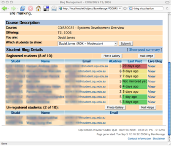
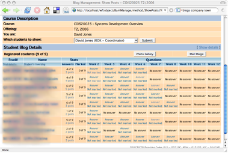
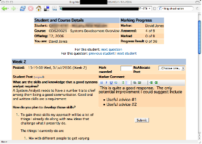

In the last [bit of work](/blog2/2009/08/17/bim-4-re-jigging-how-bim-works/) I did on BIM, I got to the stage of having some initial working code for BIM module that allow someone to create a BIM activity and have that data saved to the database. The activity wouldn't do anything, but it's a start.

The aim today is to try and make some progress on getting a prototype up and going. i.e. some working Moodle code that academic staff can interact with and get some idea of how BIM will work. I'm still uncertain how far I will go with this. I have two main options:

1. hard coded HTML; or  
    Have the code return hard-coded HTML, don't read any database. Just give the same information.
    
    This would be the simplest approach in terms of database tables and code. However, given that Moodle uses a forms library, I won't be able to do the simplest thing - copy the HTML from BAM into BIM. I'll have to do some translation. It may turn out to be simpler to do the next bit.
    
2. generate HTML from a pre-populated database.  
    Take/manipulate some data from the existing BAM database to create a BIM database in Moodle. Write code in BIM that will generate HTML based on that data, but not allow modification of the data.
    
    Some increased complexity, but also like to be a temptation to write the whole code which will slow down the production of the prototype.
    

Based on that bit of reflection, I think I'll start with a hard-coded HTML approach and see what happens.

### What to show

First step, I should probably ask if <a href="http://www.cqu.edu.au/CQU has a theme for its Moodle implementation. If I apply it to my dev box, I can make the initial prototype experiments look like the live system. Have to ask.

Okay, with the current status of BIM, if I "view" the activity, it doesn't produce any HTML. The plan here is that different users will see different information when the view the activity. The different views are:

- Student
    - If they haven't registered their blog, see the information about how to create and register their blog.
    - If they have registered their blog, they should see
        - Details about their blog, including an interface to change their registered blog (if so configured by the coordinator).
        - Details about their posts/answers.  
            This is where they see which posts to their blog BAM has recognised as an answer to a required question. It will also show whether the answer has been marked and also any comments from the marker.
- Staff - the following draws on screen shots of the existing system. The appearance will change to fit Moodle and also possibly to improve the interface.
    - By default the "student blog details" screen (see below) [](http://www.flickr.com/photos/david_jones/3268716654/ "BAM show student blog details by David T Jones, on Flickr")
    - Link to the "answers page" [](http://www.flickr.com/photos/david_jones/3268716836/ "BAM show all student posts page by David T Jones, on Flickr")
    - Which in turn links to the marking page [](http://www.flickr.com/photos/david_jones/3267891725/ "BAM mark post page by David T Jones, on Flickr")

### To find out

This means that I need to find out how to do the following in Moodle:

- Perform different operations for different types of users.
- Ensure only the authorised users can perform those operations.

#### Different operations

Viewing an activity is done via the view.php file in the module. At this stage it looks like this PHP code should check various parameters as well as course and user details and decide what to do as a result.

It seems that view.php follows a fairly set structure (not suprisingly).

- Parameter check  
    Check each of the parameters exist and are valid - including checking that there is an instance of the activity (e.g. bim) that matches the id that's come in. Crash and burn if these checks don't pass.
- Security check  
    Get the login details/objects of the user, perform security/capability checks.
- Log some activity  
    i.e.
    
    ```
    add_to_log($course->id, "bim", "view", "view.php?id=$cm->id", "$bim->id");
    ```
    
- Display the HTML  
    Which often involves a fair bit of calculation and then some use of standard header/footers.

The quiz module appears to use the idea of pagelib.php - which appears to implement/extend a factory class. i.e. a class that determines which type of quiz is being displayed and how to display it. There's a global Moodle pagelib.php which seems to define the base classes for these. There's a number of them - quiz uses page\_generic\_activity.

The LAMS module in the contrib collection appears to take the simple if approach i.e.

```
if (has_capability('mod/lams:manage', $context)){
....
}else if(has_capability('mod/lams:participate', $context)){
....
if ($lams->introduction) {

```

In the long run this will have to be thought through. The if/else option isn't a technically nice and neat solution. I'm happy for a hard-coded prototype to use it though.

#### Authorised users, capabilities etc.

The question now is how to determine between different types of users. How to know the difference between students and staff.

According to the [intro to moodle course docs](http://dev.moodle.org/mod/resource/view.php?id=43) there's a roles and capabilities system that has replaced fixed roles. That sounds like, and based on the modules I've looked at, the way to go. More [documentation here](http://docs.moodle.org/en/Roles_and_capabilities).

Capabilities etc are defined in the db/access.php file for the module which looks a bit like this

```
$mod_lams_capabilities = array(

    'mod/lams:participate' => array(

        'captype' => 'write',
        'contextlevel' => CONTEXT_MODULE,
        'legacy' => array(
            'student' => CAP_ALLOW
        )
    ),

    'mod/lams:manage' => array(

        'captype' => 'write',
        'contextlevel' => CONTEXT_MODULE,
        'legacy' => array(
            'teacher' => CAP_ALLOW,
            'editingteacher' => CAP_ALLOW,
            'admin' => CAP_ALLOW
        )
    )
);

```

Should be able to add a couple of dummy ones and use that to add in some if/else to display different HTML based on the type of user.

First problem is that it appears changes to db/access.php only get recognised if you increment the version and/or reinstall

Next problem is that the little test I'm doing isn't working. I thought I'd set a capability only for a student - but the code is being executed for the admin user. Either I've done it wrong or the admin user has some additional "powers".

Looks like the latter. Need to create another user and assign as a teacher. Yep, that works.

Now, rather than simply "else not student" let's add a capability the identifies teachers and maybe another one that identifies admin. Okay, the administrator version is working. But not the teacher one.

At this stage, I'd like to know if there's anyway, in the code, to spit out information about the available capabilities. Would that be in the context variable? Nope, it's fairly simple....doesn't seem to be any reasonably straight forward code.

need to move on. I'm stuck at the moment with two of the capabilities working, but not the one with the student. Guess, I'll have to go with a default.

### Put in the student details page

While this is fairly straight forward. The other unlooked for complication is the need to grasp the use of [weblib.php](http://docs.moodle.org/en/Development:lib/weblib.php) and its functions. So far, the introduction to weblib is not straight forward.

It looks like it will require a dive into weblib.php and some trial and error. Can't seem to find anything in terms of decent overview documentation - apart from that generated [automatically from the code](http://phpdocs.moodle.org/19/index.html).

Again, it's another one of those frustrating jobs, not difficult, just painful.

Looks like it is time to go.

### Status

Have made some progress on the prototype. But really identified some additional reading and understanding that's required to do this in "proper" Moodle-ese.