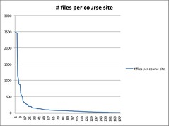
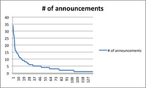

As part of the thesis I've been engaging with some of the literature around LMS feature usage to evaluate usage of Webfuse. A good first stab of this was reported in [an earlier post](/blog2/2009/08/07/breadth-of-webfuse-use-1997-through-2009/). There were a number of limitations of that work, it's time to expand a bit on it. To some extent for the PhD and to some extent because of a paper.

As with some of the other posts this one is essentially a journal or a log of what I'm doing and why I'm doing it. A permanent record of my thinking so I can come back later, if needed.

There's even an unexpected connection with power law distributions towards the end.

### Content distribution

In [that previous post](/blog2/2009/08/07/breadth-of-webfuse-use-1997-through-2009/) I did not include a graph/any figures around the use of Webfuse course sites to distribute content or files. This is because Webfuse had a concept of a default course site. i.e. every course would have the same basic default site created automatically. Since about 2001 this meant that every course site performed some aspect of information distribution including: [the course synopsis on the home page](http://webfuse.cqu.edu.au/Courses/2009/T2/COIS20025/), details about [the course assessment](http://webfuse.cqu.edu.au/Courses/2006/T2/COIS20025/Assessment/), details about [course resources](http://webfuse.cqu.edu.au/Courses/2006/T2/COIS20025/Resources/) including textbook details and a link to the course profile, and [details about the teaching staff](http://webfuse.cqu.edu.au/Courses/2006/T2/COIS20025/Staff/).

Beyond this staff were able to upload files and other content as they desired. i.e. moving beyond the default course site was optional and left entirely up to the teaching staff. Some of us, perhaps went [overboard](http://webfuse.cqu.edu.au/Courses/2006/T2/COIS20025/Resources/Lecture_Slides/). Other staff may have been more minimal. The aim here is to develop metrics that illustrate that variability.

Malikowski et al (2007) have a category of LMS usage called Transmitting Content. The LMS features they include in this category include:

- Files uploaded into the LMS.
- Announcements posted to the course site.

So, in keeping with the idea of building on existing literature. I'll aim to generate data around those figures. Translating those into Webfuse should be fairly straight forward, thinking includes:

- Files uploaded into the LMS.  
    Malikowski et al (2007) include both HTML files and other file types. For Webfuse and its default course sites I believe I'll need to treat these a little differently:
    - HTML files.  
        The default course sites produce HTML. I'll need to exclude these standard HTML files.
    - Other files.  
        Should be able to simply count them.
    - Real course sites.  
        Webfuse also had the idea of a real course site. i.e. an empty directory into which the course coordinator could upload their own course website. This was usually used by academics teaching multimedia, but also some others, who knew what they wanted to do and didn't like the limitations of Webfuse.
- Announcements.  
    The default course site has an RSS based announcements facility. However, some of the announcements are made be "management". i.e. not the academics teaching the course but the middle managers responsible for a group of courses. These announcements are more administrative and apply to all students (so they get repeated in every course). In some courses they may be the [only updates](http://webfuse.cqu.edu.au/Courses/2009/T2/COIS20025/Updates/). These announcements are usually posted by the "webmaster", so I'll need to exclude those.

### Implementation

I'll treat each of these as somewhat separate.

- Calculate # non-HTML files.
- Calculate # of announcements - both webmaster and not.
- Calculate # HTML files beyond default course site (I'll postpone doing this one until later)

#### Calculate # non-HTML files.

Webfuse created/managed websites. So all of the files uploaded by staff exist within a traditional file system. Not in a database. With a bit of UNIX command line magic it's easy to exact name of every file within a course site and remove those that aren't of interest. The resulting list of files is the main data source that can then be manipulated.

The command to generate the main data source goes like this

> find T1 T2 T3 -type f | _get all the files for the given terms_ grep -v '.htm$' | grep -v '.html$' | _remove the HTML files_ grep -v 'CONTENT$' | _remove the Webfuse data files_ grep -v .htaccess | _remove Apache access restriction file_ grep -v 'updates.rss$' | _remove the RSS file used for announcements_ grep -v '.ctb$'| grep -v '.ttl$' | grep -v '/Boards/\[^/\]\*$' | grep -v '/Members/\[^/\]\*$' | grep -v '/Messages/\[^/\]\*$' | grep -v '/Variables/\[^/\]\*$' | grep -v 'Settings.pl' | _remove files created by discussion forum_ sed -e '1,$s/.gz$//'

The **sed** command at the end removes the gzip extension that has been placed on all the files in old course sites that have been archived - compressed.

The output of this command is the following

```
T1/COIT11133/Assessment/Assignment_2/small2.exe
T1/COIT11133/Assessment/Weekly_Tests/Results/QuizResults.xls
T1/COIT11133/Resources/ass2.exe
```

The next aim is to generate a file that contains the number of files for each course offering. From there the number of courses with 0 files can be identified, as can some other information. The command to do this is

> sed -e '1,$s/^(T./........./).\*$/1/' all.Course.Files | sort | uniq -c | sort -r -n > count.Course.Files

After deleting a few entries for backup or temp directories. We have our list. Time to manipulate the data, turn it into a CSV file and into Excel. Graph below, fairly significant disparity in number of files - the type of curve looks very familiar though.

[](http://www.flickr.com/photos/david_jones/3849901067/ "Number of uploaded files per Webfuse course site for 2005 by David T Jones, on Flickr")

In total, for 2005 there were 178 course sites that had files. That's out of 299 - so 59.5%. This compares to the 50% that Col found for the Blackboard course sites in the same year.

#### Calculate # of Announcements

The UNIX command line alone will not solve this problem. Actually, think again, it might. What I have to do is:

- For each updates.rss
    - count the number of posts by webmaster
    - count the number of posts by non-webmaster
    - output - courseOffering,#webmaster,#non-webmaster

Yep, a simple shell script will do it

```
echo COURSE,ALL,webmaster
for name in `find T1 -name updates.rss`
do
  all=`grep '' $name | wc -l`
  webmaster=`grep 'webmaster' $name | wc -l`
  echo "$name,$all,$webmaster"
done

```

Let's have a look at the 2005 data. Remove some dummy data, remove extra whitespace. 100% of the courses had updates. 166 (55%) had no updates from the teaching staff, 133 (45%) did. That compares to 77% in Blackboard. Wonder if the Blackboard updates also included "webmaster" type updates?

In terms of the number of announcements contributed by the teaching staff. The following graph shows the distribution. The largest number for a single offering was 34. Based on a 12 week CQU teaching term, that's almost, on average, 3 announcements a week

[](http://www.flickr.com/photos/david_jones/3850198849/ "Number of coordinator announcements - Webfuse 2005 by David T Jones, on Flickr")

### Power laws and LMS usage?

The two graphs above look very much like a power law distribution. Clay Shirky has been [writing and talking](http://www.shirky.com/writings/powerlaw_weblog.html) about power law distributions for some time. Given that there appears to be a power law distribution going on here with usage of these two LMS features, and potentially that the same power law distribution might exist with other LMS features, what can Shirky and other theoretical writings around power law distributions tell us about LMS usage?

### References

Malikowski, S., Thompson, M., & Theis, J. (2007). A model for research into course management systems: bridging technology and learning theory. Journal of Educational Computing Research, 36(2), 149-173.