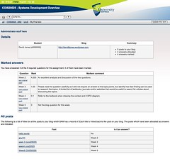

See also: [[blog-home | Home]]

It's been a while since I [last did some work on BIM](/blog2/2009/08/20/bim5-getting-a-prototype-bim-going/), various other tasks getting in the way. The main mid-term KPI is the delivery of a working prototype of BIM working within Moodle. That's what I started in the last bit of work.

The aim here is to get into [weblib.php](http://docs.moodle.org/en/Development:lib/weblib.php) enough so I can get most/much of the prototype in place. weblib.php contains PHP functions used in Moodle to generate output. I could just output HTML but using weblib.php will make it easy for the prototype to look like Moodle. weblib.php also brings other benefits, so better to start using it now, rather than later. Just another step in learning Moodle.

### weblib.php

The following is an attempt to understand and internalise the model/approach that underpins weblib.php - defined in the comments as

> Library of all general-purpose Moodle PHP functions and constants that produce HTML output

First, I'm simply going through the library file and getting a feel for the functions there. The following is a list of those functions, in the order that they currently appear with some light categorisation applied. On the surface it's a mindless exercise, but it helps me see the "lay of the land".

- Utility functions:
    - s|p($var, $strip=false) - add quotes to HTML characters
    - addslashes\_js( $var ) - quote javascript
    - strip\_querystring( $url ) - remove the query string from url
    - get\_referer( $stripquery=true ) - return HTTP\_REFERER
    - me() - return name of current script with querystring
    - qualified\_me - me with a full URL
- class moodle\_url - useful for dealing with URLs with multiple parameters. Apparently mostly for pages that link to themselves.
- More utility functions
    - data\_submitted( $url='' ) - is there form data waiting to be processed
    - stripslashes\_safe($mixed) - removes backslashes from string
    - stripslashes\_recursive( $var ) - used on arrays/objects
    - addslashes\_recursive( $var ) - reverse of above
    - break\_up\_long\_words( $string, $maxsize=20, $cutchar='') - break up text ...
    - str\_ireplace( $find, $replace, $string ) - search&replace
    - stripos($haystack, $needle, $offset=0 ) - find location of string.
- Popup windows
    - element\_to\_popup\_window(.....) - the description is harder to understand than the function name. I'm assuming it displays something that leads to a popup window
    - link\_to\_popup\_window(....) -- seems to be a trend developing
    - button\_to\_popup\_window(...)
    - close\_window\_button( .... )
    - close\_window($delay=0)
- Form elements
    - choose\_from\_menu(...) - take an array and output HTML for select element
    - choose\_from\_menu\_yesno(...)
    - choose\_from\_menu\_nested(...)
    - choose\_from\_radio(....) - group of radio buttons
    - print\_checkbox(...) - display html checkbox with optional label
    - print\_textfield(...)
    - popup\_form(...) - little popup form
- Misc utility functions
    - formerr($error) - print some red text
    - validate\_email($address )
    - get\_file\_argument( $scriptname) -- extract file argument
    - get\_slash\_arguments - get them from the environment variables
    - parse\_slash\_arguments - get the PATHINFO stuff at end of URL?
- text formats -
    - format\_text\_menu() - return array of text formats that can be used in a popup menu
    - format\_text(....) - take text in a variety of format codings and return it as safe HTML.
    - text\_format\_name( $key ) - get the name of the Moodle text format of a given selection of text in that format.
    - reset\_text\_filters\_cache()
    - format\_string(....) - take a string, return string after processing. Used for activity titles, post subjects etc.
    - format\_text\_email(...) - given text in variety of formats return it as normal text ready for email
    - filter\_text( $text, $courseid=NULL) - HTML text is run through filters
    - filter\_string( $string, $courseid=NULL )
- Trusted text
    - trusttext\_present( $text ) - is this text marked as trusted?
    - trusttext\_strip( $text ) - called before clearning...??
    - trusttext\_mark( $text ) - mark text as trusted - without doing anything on it???
    - trusttext\_after\_edit(...)
    - trusttext\_prepare\_edit(...)
- cleaning up text and other stuff
    - clean\_text( $text, $format ) - take raw text and remove nasty tags
    - purify\_html( $text ) - cleaning function using HTML purifier
    - cleanAttributes() - clean attributes of tags
    - cleanAttributes2() - another one?
    - replace\_smilies() - replace text smilies with image one
- text conversion
    - text\_to\_html(...)
    - markdown\_to\_html(..)
    - html\_to\_text()
    - convert\_urls\_into\_links(..)
- Misc other
    - highligh(...) - highlight words in a given string
    - highlightfast(...) - faster
    - get\_html\_lang() - return lang attributes in HTML
    - skip\_main\_destination() - an accessibility think to skip to main content
- standard web page parts
    - print\_header(......) - header of HTML
    - require\_js - include javascript libraries
    - get\_require\_js\_code(..) - not called directly
    - force\_strict\_header($output) - debugging aid
    - print\_header\_simple
    - print\_footer
    - current\_theme - what's the current theme
    - current\_category\_theme
    - style\_sheet\_setup - called by style sheets
    - theme\_setup
    - user\_login\_string - indicates login status of user
    - check\_theme\_arrows - have they been set?
    - link\_arrow\_right(...) - return the HTML for..
    - link\_arrow\_left(...)
    - get\_accesshide(....)
    - get\_separator(..) - return breadcrumb separator
    - print\_navigation(...) - print breadcrumbs
    - build\_navigation(...) - used by print\_header etc.
    - print\_headline(...) - retained for backward compatbility
    - print\_heading($text, $align='',$size=2,$class='main',$return=false) - print text formatted for a heding
    - print\_heading\_with\_help - centered heading with help button
    - print\_heading\_block(...)
    - print\_continue( $link, $return) - print link to continue on another page
    - print\_box($message, $classes, $ids, $return ) - print a message in a standard themed box
    - print\_box\_start(...) - starts a box with divs
    - print\_box\_end()
    - print\_container(...) - print message in standard themed container
    - print\_container\_start|\_end
    - open\_containers - return # of open containers
    - print\_container\_end\_all - close 'em all
    - print\_single\_button(...) - self-contained form with single submit
    - print\_spacer(...) - print spacer image
    - print\_file\_picture(...) - include picture from file/url
    - print\_user\_picture(...) - print user's avatar
    - print\_user(...) - print summary of user in a little box (uses a table to get the box!!!)
    - print\_group\_picture(..) - show the group's avatar.
    - print\_png - show png image
    - print\_table( $table, $return=false ) - show nicely formatted table
    - print\_recent\_activity\_note(....)
    - print\_textarea(...)
    - use\_html\_editor(...) on all textareas in the current page
    - print\_editor\_config(...)
    - update\_course\_icon( $courseid) - show the edit button for courses
    - switchroles\_form(...)
    - update\_mymoodle\_icon..
    - update\_tag\_button
    - update\_module\_button
    - update\_categories\_search\_button
    - navmenu - return popup menu with course activity modules
    - navmenulist - similar to above</li
    - print\_date\_selector - print form items for date entry
    - print\_time\_selector -
    - print\_timer\_selector
    - print\_grade\_menu
    - print\_scale\_menu
    - print\_scale\_menu\_helpbutton
    - print\_error - error page
    - editorhelpbutton() - print help icon linked to help page on a number of topics
    - helpbutton(....) print a help button
    - emoticonhelpbutton
    - editorshortcutshelpbutton
    - notice( ... ) print a message and exist
    - notice\_yesno(....) print a message with yes or no options
    - redirect(...) - print notice and redirect
    - notify(...) message in bold in optional colour
    - obfuscate\_email(..)
    - obfuscate\_text()
    - obfuscate\_mailto()
    - print\_paging\_bar(...)
    - print\_side\_block(..)/print\_side\_block\_start|end
    - print\_speller\_code - code for spellchecking
    - print\_speller\_button
    - print\_maintenance\_message
    - adjust\_allowed\_tags
    - class tabobject ??
    - print\_tabs
    - page\_doc\_link - string contining link to user docs
    - doc\_link(..)
    - debugging/disable\_debugging
    - frametarget
    - print\_location\_comment
    - print-arrow(...) - used to show up/down arrow for column sorting, can be given language string to save on dbase access
    - right\_to\_left - true if language is right to left

Some questions that arise out of that:

- What's the difference between container and box?  
    Haven't found an answer to that one....only a quick check. From experiments, the container is a HTML container - doesn't necessarily look like anything. While the box is visual.

### Getting into it

Time to get some hard-coded HTML in place. Work on the default view for students that shows their details, blog posts and other stuff. Working, alright for first step. More next week.

