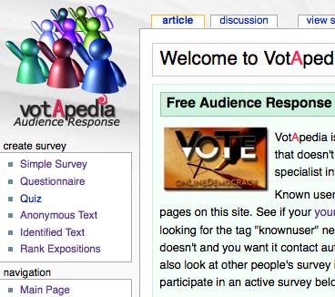
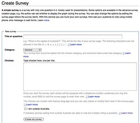
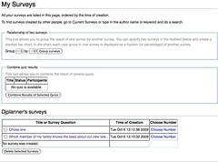
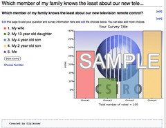
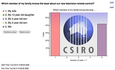

---
categories:
- ilecture
- votapedia
date: 2009-10-06 15:40:49+10:00
next:
  text: Initial CRC investigations
  url: /blog/2009/10/07/initial-crc-investigations/
previous:
  text: Thoughts on &quot;Insidious pedagogy&quot;
  url: /blog/2009/10/06/thoughts-on-insidiuous-pedagogy/
title: Using Votapedia
type: post
template: blog-post.html
---
In the next couple of weeks I'm going to be giving [a presentation](/blog/2009/10/05/lectures-and-the-lms-alternatives-and-experiments/) that will also serve as an experiment in alternate technologies for presentations. One of those technologies will be [Votapedia.com](http://www.votapedia.com/) - an Australian-based, free SMS/Web audience response system. This post is meant to capture the process I went through in learning about how to use Votapedia.

### Accounts

Votapedia is based on [Mediawiki](http://www.mediawiki.org/wiki/MediaWiki). To create quizzes on Votapedia you need to get an authorised account. This consists of two steps:

1. create an account;  
    Using the normal mediawiki approach.
2. get the account authorised or known.  
    This is entails sending an email to a person with some blurb about what you're using it for. I got a response in a few hours.

Participants using the service to "vote" don't need accounts. However, those voting via the Web can create accounts to use in voting - they don't need to.

There are limits placed on how many times participants can "vote", but this is done on the basis of the IP address (if via the web) or their phone number (via phone).

### Creating a survey

Surveys exist on their own page on the Votapedia installation of MediaWiki. You can create surveys by using some specific markup or using one of a number of "forms" which automate the process. Let's create one.

A part of the [Votapedia](http://www.votapedia.com) home page is shown in the following image. The links in the first left-hand menu are how you create surveys. There are 6 different types of surveys.

| Survey type | Description |
| --- | --- |
| Simple survey |  |
| Questionnaire | This is a survey with more than one question. Wit h this type of survey you don't need to wait for everyone to finish a question before moving on. |
| Quiz | Essentially a questionnaire, but with other features (allocate points, can't see the quiz page before it starts..) to allow it to be used for student assessment. |
| Anonymous text | Participants submit whatever they want |
| Identified text |  |
| Rank expositions |  |

Each link takes you to a basic HTML form that guides you in the information required to create the chosen survey. The following image is for the simple survey (click on it to see more).

Well, that's not good. It didn't work. Filled out the form, all good, hit submit and I get "There is currently no text in this page".

So, I try to create another survey. Very simple and don't do anything to upset the gods. Same error. Not good. Go looking and see there's a link "My Surveys", perhaps that might give me the link. Yep, the two surveys do show up on that page, see the following image.

Okay, if I click on the link for one of the surveys on "My Surveys" page I get a page with the same "error". Now, there is a "Choose Number" link for each survey, maybe I need to select that first.

It appears that Votapedia has a limited set of phone numbers, choose number means selecting from that collection of numbers, one number for each response. Some are in red - which means you can't use them - some are in green.

Trouble is that you can only chose one number at a time and it always asks for me to choose the first number. What about the others?

It would seem that I am missing something important.

Tried to create an "anonymous text" survey, same problem. There are other surveys that seem to be working....

Mmmm, now they are working. The main thing that changed was that I changed the password for my account. I don't think that will have changed anything. Here's the proof.

Still only able to choose one phone number. Well, let's try and start the survey. Hit the "Start survey" button....that seems to start it. The numbers are already there. Let's try. Phone the number for my response, and hey presto it works. Engaged tone and the graph is updated in front of my eyes. That's neat. Time to tell some other folk.

Ahh, I've now got an SMS from Votapedia thanking me for my vote and giving me some details to login to the website.

Now I did want to try and change the survey while it was running. I wanted to remove the results from the page and enable web voting. But it didn't look like I could change it while the survey was running. So I've turned it off and will reset the survey and see if the changes work.

But of course, this was because I was viewing the survey through my account. Not what a visitor would see. Silly David.

### Running a survey

Just briefly, asked a few colleagues to take the survey - all up 7 participants. The experience highlighted:

- Getting the engaged signal when dialing the number gave the impression of failure - this needs to be made clear at the start.
- The web interface for taking the poll suffered the same problem that I described above when creating the question.

Results looked like the following image. Interestingly, it seems at least some of the participants missed the **least** modifier in the question.

### Conclusions

Still a bit dodgy in places via the web interface. Phone side worked well. Will need the right sort of preparation of participants.

The question of the phone numbers and how long it takes to dial a response is also an issue.