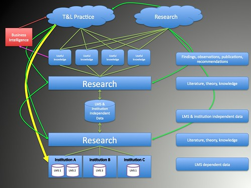

---
categories:
- elearning
- indicators
date: 2009-10-12 14:52:30+10:00
next:
  text: Thoughts about the next steps for the indicators project
  url: /blog/2009/10/15/thoughts-about-the-next-steps-for-the-indicators-project/
previous:
  text: 'The learning pyramid: true, false, hoax or myth?'
  url: /blog/2009/10/11/the-learning-pyramid-true-false-hoax-or-myth/
title: The indicators project and what it means for me
type: post
template: blog-post.html
comments:
    - approved: '1'
      author: dwarlick
      author_email: david.warlick@gmail.com
      author_ip: 24.136.171.121
      author_url: http://2cents.davidwarlick.com/
      content: "David,\n\nThanks for the loyal inclusion of all us Davids.  I would second\
        \ Stephen Downes' point.  At the end of my post I said that a richly networked,\
        \ digital, and information abundant learning experience would result in...\"an\
        \ enormously dense, rich, and seductively meaningful mass of data that could be\
        \ analyzed and visualized in a wild variety of ways.  I\u2019d be happy with that\
        \ \u2014 especially if students became partners with us as self-analyzers and\
        \ self-assessors, mastering their own skills as information artisans.\""
      date: '2009-10-12 17:51:08'
      date_gmt: '2009-10-12 07:51:08'
      id: '2848'
      parent: '0'
      type: comment
      user_id: '0'
    - approved: '1'
      author: davidtjones
      author_email: d.jones@cqu.edu.au
      author_ip: 138.77.2.133
      author_url: https://djon.es/blog/
      content: 'G''day David,
    
    
        I am hoping that one of the end results of the indicators project will be some
        sort of investigation/application of the findings to engage with students.  Don''t
        know what form that might take.
    
    
        Though I do wonder that if by the time we get to that stage, will the students
        have moved onto other techs beyond the LMS that will require a different approach.
    
    
        Time will tell.  Thanks for sharing your thoughts on your blog.  The helped improve
        some of the my thinking
    
    
        David.'
      date: '2009-10-13 10:07:39'
      date_gmt: '2009-10-13 00:07:39'
      id: '2849'
      parent: '2848'
      type: comment
      user_id: '1'
    
pingbacks:
    - approved: '1'
      author: 1000 blog posts &#8211; a time to look back &laquo; The Weblog of (a) David
        Jones
      author_email: null
      author_ip: 66.155.8.213
      author_url: https://djon.es/blog/2013/01/24/1000-blog-posts-a-time-to-look-back/
      content: '[...] also saw the start of the Indicators project our little foray into
        &#8220;learning [...]'
      date: '2013-01-24 15:06:42'
      date_gmt: '2013-01-24 05:06:42'
      id: '2850'
      parent: '0'
      type: pingback
      user_id: '0'
    
---
After at least a decade of "wouldn't it be a good idea if" and at least [one aborted attempt](http://cddu.cqu.edu.au/index.php/Blackboard_Indicators) (hint: an organisational restructure in which you are a loser, is not a great context for a new project with intra-organisational implications), the [Indicators Project](http://indicatorsproject.wordpress.com/) is getting started. This post is my attempt to define what the project means for me. What I hope to get out of the project, and what I hope others might get out of the project.

The main aim is to let people know about the project and encourage feedback, either here or on the [project blog](http://indicatorsproject.wordpress.com/).

### Absence of data and poor decision making

[Dave Snowden](http://www.cognitive-edge.com/blogs/dave/) defines sensemaking as

> How do we make sense of the world, so that we can act in it.

When it comes to education, [David Wiley makes this point](http://opencontent.org/blog/archives/1098) which resonates strongly with me

> The data that we, educators, gather and utilize is all but garbage. What passes for data for practicing educators? An aggregate score in a column in a gradebook. A massive, course-grained rolling up of dozens or hundreds of items into a single, collapsed, almost meaningless score. “Test 2: 87.” What teacher maintains item-level data for the exams they give? What teacher keeps this data semester to semester, year-to year? What teacher ever goes back and reviews this historical data?

For a long time I have believed that the absence and/or poor quality of the data available has meant that universities have been particularly bad at sensemaking around learning and teaching, and especially e-learning.

For me, a major consequence of this "garbage data" is that decisions made within universities (I work within a [university](http://www.cqu.edu.au), I'm paid to help improve learning and teaching at that institution, so my focus is on universities) about learning and teaching, and especially about e-learning, are made with very little sense of what is happening within the real world. This situation is increasingly getting worse as, at least within my experience, management at universities are attempting to adopt a more top-down, "corporate" approach to decision making.

Such an approach to decision making means that when management make the decisions about learning and teaching not only don't have good data to base their decision on. They are also making decisions on the basis of one of the following categories of teaching experience:

- only taught recently with a significant amount of support;  
    (this means they don't have to experience all the low level "make work" that consumes so much time)
- haven't taught for a number of years;
- have never taught within the local context; or
- have never taught.

For individual academics, they are stuck with the "garbage data" from their own courses and their own gut feel. Since teaching at University is mostly a solo activity, there is little or no opportunity to compare and contrast with the experience of others. Even when the opportunity does arise, it has to be done with "garbage data".

Support staff, be they instructional designers, academic developers or IT folk, are almost entirely without data, which means they can't target their assistance. They have to take a one size fits all (i.e. one size that helps no-one) approach. Mainly because what data that is available about learning and teaching is only available to the teacher or their line supervisor.

Students, well they are at the bottom of the pile. They get essentially no indication of how where the sit with respect to other students. etc.

The [indicators project](http://indicatorsproject.wordpress.com/) aims to provide better data to teaching staff, management, support staff and students.

### What can be done?

[David Wiley](http://opencontent.org/blog/archives/1098) believes that

> using technology to capture, manage, and visualize educational data in support of teacher decision making has the potential to vastly improve the effectiveness of education.

A lot of the work by Dave Snowden is based around the idea of achieving

> A synthesis of technology and human intelligence

Using technology for what it is good for in order to generate indicators that can help people do what they are good at - pattern matching.

David Wiley's long term goal is huge, difficult and expensive. You can read more about it [on his blog](http://opencontent.org/blog/archives/1098). That goal is beyond the scope of our [little indicators project](http://indicatorsproject.wordpress.com/). I think the aims for our project can be summarised as:

- Identify potentially interesting indicators from LMS usage data and some other institutional data (e.g. student characteristics etc.).
- Make that information available to students, teaching staff, management, support staff and researchers.  
    We aren't likely to achieve all this at once, different folk will get it at different times.
- Engage in additional research around the indicators, how they are used, how they can be used and what they can tell us about learning and teaching.
- Return to step #1.

#### Cross platform and cross institution

Importantly, we're aiming to/hoping for the project to identify, encourage and enable use of the indicators across different institutions and different LMS. As we progress, we'll be looking for people interest in partnering with the project.

#### Graphical representation

In an attempt to understand what we have to do and where the interesting work might be we developed the following graphical representation of the project.

\[caption id="" align="aligncenter" width="424" caption="Figure 1. Project Overview"\]\[/caption\]

Working from the bottom up, the figure includes:

- LMS and institutional specific data.  
    Each institution will have its own LMS and also some other data in the form of information about the students (e.g. age, country of origin, type of student) and the courses (e.g. discipline, number of campuses offered at etc.).
- We need to do some "research" to identify the knowledge necessary to effectively convert this institutional and LMS dependent data into something that is independent of LMS and institution.
- The LMS & institutional independent data forms the main data source of the indicators. At the very least, partner institutions will be able to perform comparisons. In a perfect world, the data will be in such a form as to enable free sharing, anyone who has an interest can get the data and perform analysis.
- We then need to do some research to generate knowledge to convert the LMS and institution independent data into indicators. The indicators abstract the data into a form that provides useful knowledge for students, teachers, managers, support staff or researchers.  
    One simple example, is the percentage of courses within an LMS that [have adopted specific features](http://indicatorsproject.wordpress.com/about/examples/#featureAdoption).
- Some of the "useful knowledge" will be passed onto the institutional business intelligence folk who are responsible for institutional data warehouses, dashboards and the like.
- Some of the useful knowledge will be used by a variety of people (teaching staff, support staff, students and management) to improve the practice of learning and teaching.
- Some of the useful knowledge will be used as the basis for additional research to identify the whys and wherefores of the indicators.  
    For example, [Why do international students "break"](http://indicatorsproject.wordpress.com/2009/10/09/why-do-international-students-break-the-link-between-lms-activity-and-student-grades/) the link between LMS activity and student grades?

### Problems

This is by no means a simple task. There are any number of problems that will impact the project. Here are some.

#### Online only is rare

David Wiley is in the somewhat rare situation of having an online only context

> The Open High School of Utah is the first context in which I’m studying this use of technology. Because it is an online high school, every interaction students have with content (the order in which they view resources, the time they spend viewing them, the things they skip, etc.) and every interaction they have with assessments (the time they spend answering them, their success in answering them, etc.) can all be captured and leveraged to support teachers.

It is very rare for my institution, and I'm assuming many other universities, to have courses that are entirely online. In our situation a large percentage of our students must attend on-campus sessions and another large percentage believes they are missing out on something important if they don't get face-to-face. So, in our situation the online data is only ever going to tell part of the story. It is going to have to be supplemented with other approaches and methods.

#### Data quality

[David Warlick](http://davidwarlick.com/wordpress/?page_id=2) in a [blog post](http://davidwarlick.com/2cents/?p=1942) that responds to David Wiley's post (is it me, or are there a lot of David's in this post?) identifies the problems with data quality

> even in the best of situations, the data is scarce, shallow, grainy, and awfully expensive to collect

He is perhaps talking about a different context with high schools, but some of these limitations apply in existing work. Much of the research into LMS usage has focused on the use of surveys, interviews of manual examination of course sites to generate insight. Where data mining is done on system data it is often for limited time frames (e.g. 1 term or 1 year) and is usually communicated in a LMS dependent way that makes comparisons between systems and institutions difficult.

#### Who will use it?

[David Warlick](http://davidwarlick.com/wordpress/?page_id=2) makes another important point [in his blog post. This time the question is "who will use all this data?"](http://davidwarlick.com/2cents/?p=1942)

> not to mention that the only people who can make much use of it are the data dudes that school systems have been hiring over the past few years.

This is a problem I've seen with universities with the rise of data warehouses and dashboard. Unless there is a particular motivated and well resourced team, such information systems become the toys of the "data dudes", occasionally the weapons of managers who wish to make a particular point, or a resource for a small group of researchers to publish papers. They rarely become embedded into the day to day practice of learning and teaching.

#### The LMS problem

The LMS is based on the assumption that all "learning" - or at least content access and discussion forum use - occurs within the LMS. This "one ring to rule them all" approach does provide one benefit. All of this data is in the one place, the one system, the one database.

This "one ring to rule them all" approach is also, in my opinion and that of many others, the main problem with the LMS. It removes choice from the student and the teacher about what tools can be used. However, if alternatives such as personal learning environments become prevalent, then the sort of approach being adopted by the indicators project will no longer be possible. The focus will have to change to the type of question [Stephen Downes raised](http://www.downes.ca/cgi-bin/page.cgi?post=50170) when pointing to Wiley's post

> Shouldn't we be devising ways for students to organize and track their own learning?

This an important point. If I had my way we wouldn't be using an LMS. The trouble is that the LMS is the almost universal response to e-learning by universities. To get them to change, we're going to have to - at the very least - provide lots of meaningful data that encourage management and others to recognise the limitations of the LMS approach. Certainly one of my aims in being involved with the indicators project is to illustrate the inherent limitations and problems with the LMS approach.

### Where to from here?

The project is starting to gather some momentum. We've had our first paper [accepted at a conference](http://indicatorsproject.wordpress.com/2009/10/09/the-indicators-project-identifying-effective-learning-adoption-activity-grades-and-external-factors/). We're talking about research and ALTC grants. We've started identifying additional work we need to make progress on, in particular making a start on the cross LMS comparisons. We're talking about making connections with various folk to help the project move one.

So, feel free to share your comments and thoughts.