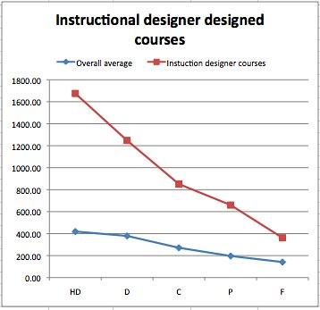
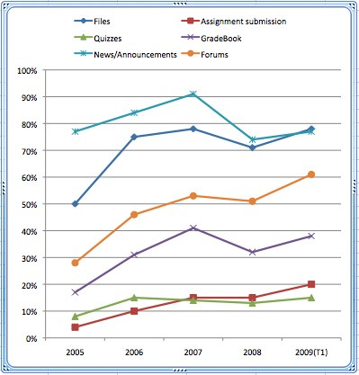

See also: [[blog-home | Home]]

This post is an attempt to capture some adhoc, over night thoughts about how the [indicators project](http://indicatorsproject.wordpress.com/) might move forward.

### Context

Currently the [indicators project](http://indicatorsproject.wordpress.com/) is an emerging research project at [CQUniversity](http://www.cqu.edu.au/). There are currently [three researchers involved](http://indicatorsproject.wordpress.com/about/participants/) and we're all fairly new to this type of project. I'd characterise the project at being at the stage where we've laid a fair bit of the ground work, done some initial work, identified some interesting holes in the literature around analytics/LMS evaluation and made the observation that there is a lot of different ways to go.

The basic aim is to turn the data gathered in Learning Mangement Systems (LMS, aka CMS, VLEs) usage logs into something useful that can help students, teaching staff, support staff, management and researchers using/interested in e-learning make sense of what is going on so they can do something useful. We're particularly interested in doing this in a way that enables comparisons between different institutions and different LMS.

### The process

A traditional approach to this problem would be big up front design (BUFD). The idea is that we spend - or at least report that we spent - lots of time in analysis of the data, requirements and the literature before designing the complete solution. The assumption is that, like gods, we can learn everything we will ever need to know during the analysis phase and that implementation is just a straight forward translation process.

Frankly, I think that approach works only in the most simplistic of cases, and generally not even then because people are far from gods. The indicators project is a research project. We're aiming to learn new things.

For me this means that we have to adopt a more emergent, agile or ateleological approach. Lots of small steps where we are learning through doing something meaningful.

### Release small patterns, release often

So, rather than attempt to design a complete LMS and institutional independent data schema and associated scripts to leverage that data, lets start small, focus on one or two interesting aspects, take them through to something final and then reflect. i.e. focus on a depth first approach, rather than a breadth first.

As part of this we should take the [release early, release often](http://catb.org/esr/writings/cathedral-bazaar/cathedral-bazaar/ar01s04.html) approach. Going breadth first is going to take some time. Depth first we should be able to have something useful that we can release and share. That something will/should also be fairly easy for someone else to experiment with. This will be important if we want to encourage other folk, from other institutions to participate.

We should also aim to build on what we have already done and also build on what other people have done. I think that the impact on LMS usage by various external factors might be a good fit.

### External factors and LMS usage

First, this is a line of work in which others published. Malikowski, Thompson & Theis (2006) investigate what effect class size, level of class and college in which a course was offered had on feature adoption (only class size had significant impact). Hornik et al (2008) have put courses into high and low paradigms and seen how this, plus the level of the course, has impacted on outcomes in web-based courses. There are some limitations of this work we might be able to fill. For example, Malikowski et al (2006) manually checked courses sites and because of this are limited to observations from a single term.

Second, we've already done some work in this area in our [first paper](http://indicatorsproject.wordpress.com/2009/10/09/the-indicators-project-identifying-effective-learning-adoption-activity-grades-and-external-factors/). We

- Looked at how two different LMS within the same institution at the same time could have very [different levels of feature adoption over time](http://indicatorsproject.wordpress.com/2009/10/09/the-indicators-project-identifying-effective-learning-adoption-activity-grades-and-external-factors/#feature).
- [Discovered an apparent anomaly](http://indicatorsproject.wordpress.com/2009/10/09/the-indicators-project-identifying-effective-learning-adoption-activity-grades-and-external-factors/#grade) in the previously identified correlation between activity within an LMS and student grades.
- Showed how a course designed with an instructional designer [has a fairly different signature](http://indicatorsproject.wordpress.com/2009/10/09/the-indicators-project-identifying-effective-learning-adoption-activity-grades-and-external-factors/#designer) than other courses.
- Showed how increased teaching staff participation in an LMS tends to increase the [connection between student LMS activity](http://indicatorsproject.wordpress.com/2009/10/09/the-indicators-project-identifying-effective-learning-adoption-activity-grades-and-external-factors/#staff) and final grades.

This sort of examination of external factors and their impact on LMS usage is useful as it helps identify areas of interest in terms of further research and also potential insights for course design. It's also (IMHO) somewhat useful in its own right without any need for additional research. So it's something relatively easy for us to do, but also should be fairly easy for others to experiment with.

### Abstracting this work up a bit

The first step in examining this might be an attempt to abstract out the basic principles and components of this sort of work. If we can establish some sort of pattern/abstraction this can guide us in the type of work required and some sort of move towards a more rigorous process. The following is my initial attempt.

There have been two main approaches we've taken in the first paper:

1. Impacts on student performance.
2. Impacts on LMS feature adoption.

#### Impacts on student performance

An example is the impact of an instructional designer. The following graph compares the level of student participation mapped against final result between course designed with an instructional designer and all other courses.

\[caption id="" align="aligncenter" width="358" caption="Instuctional Designer Designed Courses vs Overall Average"\]\[/caption\]

In this type of example, we've tended to use three main components:

1. A measure of LMS usage.  
    So far we have concentrated on
    the average number of hits by the student on the course website and discussion forum; and- the average number of posts and replies by the student on the discussion forum
2. A measure of student performance.  
    Limited to grade achieved in the course, at the moment.
3. A way to group students.  
    This has been done on the basis of mode of delivery/type of student (i.e. a distance education student, an Australian on-campus student, an international student) or by different types of courses.

Having identified these three components we can actively search for alternatives. What alternatives to student performance might there be?

For example, in the [paper](http://indicatorsproject.wordpress.com/2009/10/09/the-indicators-project-identifying-effective-learning-adoption-activity-grades-and-external-factors/) we use Fresen's (2007) taxonomy of factors to promote quality web-supported learning as a way to group students. For example, staff participation should promote quality, hence is there any difference in courses with differing levels of staff participation?

Are there other theoretical insights which could guide this work?

#### Impacts on LMS feature adoption

We've used the LMS independent framework for LMS features developed by Malikowski et al (2007) to examine to what level different features are used within courses. We've looked at this over time and between different LMS. The following shows the evolution of feature adoption over time within the Blackboard LMS used at CQU.

\[caption id="" align="aligncenter" width="399" caption="Blackboard Feature Adoption"\]\[/caption\]

Under this model, the components could be described as:

- Framework for grouping LMS features.
- Definition of adoption.

#### A mixture of the two?

I wonder if there's any value in using the level of feature adoption as another way of grouping courses to identify if there's any connection with student outcome. e.g. do courses with just content distribution have different student outcomes/usage than courses with everything?

### Next steps

Some quick ideas:

- Look at improving the abstraction and alternatives of the two abstractions above.
- Look at focusing on developing some platform independent database schema to enable the cross-LMS and cross-institutional comparison of the above two abstractions.  
    This would include:
    - the database scheme;
    - some scripts to convert various LMS logs into that database format;
    some tools to automate interseting graphs.

### References

Fresen, J. (2007). "A taxonomy of factors to promote quality web-supported learning." International Journal on E-Learning 6(3): 351-362.

Hornik, S., C. S. Saunders, et al. (2008). "The impact of paradigm development and course level on performance in technology-mediated learning environments." Informing Science 11: 35-58.

Malikowski, S., M. Thompson, et al. (2006). "External factors associated with adopting a CMS in resident college courses." Internet and Higher Education 9(3): 163-174.

Malikowski, S., M. Thompson, et al. (2007). "A model for research into course management systems: bridging technology and learning theory." Journal of Educational Computing Research 36(2): 149-173.