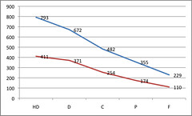
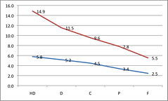
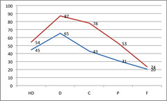
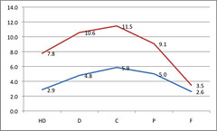

---
categories:
- elearning
- indicators
date: 2009-10-24 08:58:00+10:00
next:
  text: The bureaucratic model and the grammar and future of universities
  url: /blog2/2009/10/26/the-bureaucratic-model-and-the-grammar-and-future-of-universities/
previous:
  text: Alternate ways to get the real story in organisations
  url: /blog2/2009/10/21/alternate-ways-to-get-the-real-story-in-organisations/
tags:
- vle-cms-lms
title: Participation, impact, collecting data and connecting people
type: post
template: blog-post.html
---
A couple of colleagues and I are trying to kickstart a little thing we call the [Indicators project](http://indicatorsproject.wordpress.com/). We've developed a "tag line" for the project which sums up the core of the project.

> Enabling comparisons of LMS usage across institutions, platforms and time

The project is seeking to enable different people at different institutions to analyse what is being done with their institutions learning management system (LMS, VLE, CMS) and compare and contrast it with what is happening at different institutions with different LMS.

To some extent this project is about improving the quality of the data available to decision makers (which we define to include students, teaching staff, support staff and management). In part this is about address the [problem identified by David Wiley](http://opencontent.org/blog/archives/1098)

> The data that we, educators, gather and utilize is all but garbage.

But it's not just about the data. While the data might be useful, it's only going to be as useful as the people who are seeing it, using it and talking about it. [David Warlick makes this point](http://davidwarlick.com/2cents/?p=1942) about what's happening in schools at the moment

> not to mention that the only people who can make much use of it are the data dudes that school systems have been hiring over the past few years.

And then this morning [George Siemens tweeted the following](http://twitter.com/gsiemens/status/5100825004)

> Collecting data less valuable that connecting people" http://bit.ly/3SMJCT agree?

If it's an either/or question, then I agree. But with the indicators project I see this as a both/and question. For me, the indicators project is/should be collecting data in order to connect people.

What follows is an attempt to map out an example.

### The link between LMS activity and grades

There is an established pattern within the literature around data mining LMS usage logs. That pattern is essentially

> the higher the grade, the greater the usage of the LMS

The order is reversible as I don't think anyone has firmly established a causal link, it's just a pattern. My belief (yet to be tested) is that is probably, mostly good students get good grades and do everything they can do to get good grades, including using the LMS.

With our early work on the indicators project we have found some evidence of this pattern. See the two following graphs (click on them to see bigger versions).

The X axis in both graphs is student final grade at our current institution. From best to worst the grades are high distinction (HD), distinction (D), credit (C), pass (P), and fail (F).

In the first graph the Y axis is the average number of hits on either the course website or the course discussion forum. Hopefully you can see the pattern, students with better grades average a higher number of hits.

In the next graph, the Y axis is the average number of posts (starting a discussion thread) and the average number of replies (responding to an existing discussion thread) in the course discussion forum. So far, the number of replies is always greater than the number of posts. As you can see, the pattern is still there, but it is somewhat less evident for replies.

### Importance of staff participation

Fresen (2007) identified the level of interaction or facilitation by teaching staff as a critical success factor for web-supported learning. We though we would test this out using the data from the project by dividing courses up into categories based on the level of staff participation.

The previous two graphs are actually for the 678 courses (the high staff particiaption courses) for which teaching staff had greater than 3000 hits on the course website during the term. The following two graphs show the same data, but for the super-low staff participation courses (n=849). A super-low course is one where teaching staff had less than 100 hits on the course website during term.

What do you notice about the pattern between grade and LMS usage?

First, the hits on the course site and the course discussion forum

Now, the average number of posts and replies in the course discussion forum

For me, the pattern is not there. The HD students appear to have decided there's no value on the course website and decided they need to rely upon themselves. They've still been able to get a HD in spite of the super low staff participation. More work needs to be done.

I'm also interested in what the students in these super low courses might be talking about and what networks they are forming. The [SNAPP](http://research.uow.edu.au/learningnetworks/seeing/snapp/index.html) tool/work at Wollongong might be useful here.

### How to bring people together

My fear is that this type of finding will be used to "bring people together" in a way that is liable to be more destructive than anything. i.e. something like this:

- The data mining dweebs (I do recognise that this probably includes my colleagues and I) will bring it to the attention of university management.  
    After all, at least at my institution it's increasingly management that have access to the dashboards, not the academic staff.
- The data mining dweebs and management will tell stories about these recalcitrant "super-low" academics and their silliness.
- A policy will be formulated, probably as part of "minimum standards" (aka maximum requirements), that academics must average at least X (probably 3000 or more) hits on their course website in a term.
- As with any such approach [task corruption](/blog2/2009/03/04/task-corruption-in-teaching-university-negative-impact-of-place/) will reign supreme.

While the indicators project is a research project focused on trying to generate some data, we also have to give some thought and be vocal about how the data could be used appropriately. Here are some initial thoughts on some steps that might help:

- Make it visible.  
    To some extent making this information visible will get people talking. But that visibility can't be limited to management or even teaching staff. All participants need to be able to see it. We need to give some thought about how to do this.
- Make it collaborative.  
    If we can encourage as many people as possible to be interested in examining this data, thinking about it and working on ways to harness it to improve practice, then perhaps we can move away from the blame game.
- Be vocal and critical about the blame game.  
    While publicising the project and the resulting data, we need to continuously, loudly and effectively criticise the silliness of the "blame game"/policy approach to responding to the findings.
- Emphasise the incompleteness and limitation of the data.  
    The type of indicators/data we gather through the LMS is limited and from some perspectives flawed. An average doesn't mean a great deal. You can't make decisions with a great deal of certainty solely on this data. You need to dig deeper, use other methods and look closer at the specifics to get a picture of the real diversity in approaches. There may be some cases where a super-low staff participation approach makes a lot of sense.

### References

Fresen, J. (2007). A taxonomy of factors to promote quality web-supported learning. International Journal on E-Learning, 6(3), 351-362.