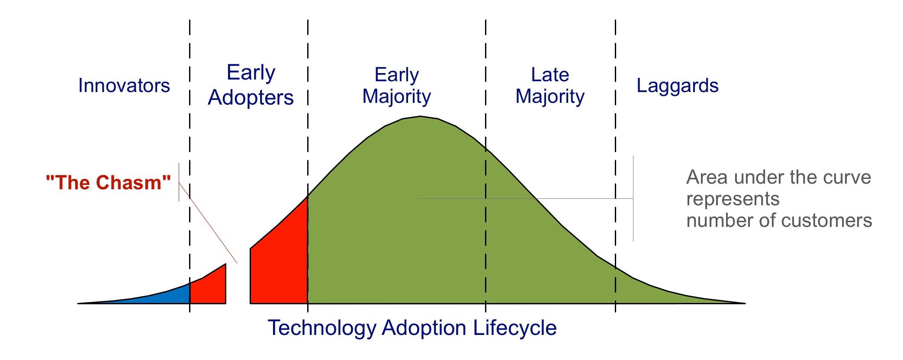

---
categories:
- elearning
date: 2009-11-24 08:42:42+10:00
next:
  text: Any one for a grant application/research project?
  url: /blog/2009/11/27/any-one-for-a-grant-applicationresearch-project/
previous:
  text: Web 2.0 in assessment - an opening statement?
  url: /blog/2009/11/22/web-2-0-in-assessment-an-opening-statement/
tags:
- asw2a
title: Reflections on asw2a
type: post
template: blog-post.html
comments:
    - approved: '1'
      author: VRBones
      author_email: vrbones@hotmail.com
      author_ip: 150.101.181.34
      author_url: http://www.vrbones.com
      content: '<blockquote>We focused solely on the individual student blog as a way
        to make the learning visible to the staff member. I think encouraging (not necessarily
        requiring) student blog posts to be visible to other students would have opened
        up unexpected benefits. It may also have been somewhat difficult.</blockquote>
    
        Sounds like that would tie into a karma system and make advances into establishing
        authority from within the class rather than being teacher/tutor centric.
    
    
        There has been some interesting discussions</a> into the development of authority
        via simple devices such as  thumbs up/down on posts. The idea is to allow ANY
        form of participation to be expressed; some may want to dive in and write a response,
        some might want to sign up and follow the whole conversation, but some just want
        to nod in confirmation of a good idea or followup. ALL of these forms add weight
        to the conversation and help give a sense of contribution. Within group discussion
        we have these positive affirmation cues given through subtle non-verbal means
        that help communicate back to the speaker as well as the group about how effective
        their contribution has been.'
      date: '2009-11-24 17:16:31'
      date_gmt: '2009-11-24 07:16:31'
      id: '2874'
      parent: '0'
      type: comment
      user_id: '0'
    - approved: '1'
      author: Colin Warren
      author_email: colwar@deakin.edu.au
      author_ip: 180.222.21.45
      author_url: http://www.learnerbytes.net
      content: 'thanks for your thoughts David, you have covered some interesting ideas
        in this post.
    
    
        I wanted to pick up two things. I''ve come to see that we need to find the vehicle/structure
        that will help the early &amp; late majority of staff to ''cross the chasm''.
        We need to employ the correct tools (be they social software/networking applications
        or professional development activities) to bridge the gap. We need to get people
        on the bus. The problem is giving them the reason or initiative to come on the
        ride with us.
    
    
        ...and that leads to my other point. If the institution isn''t providing the correct
        policy, resources &amp; framework - this will be difficult, and things won''t
        change. There''s too much emphasis on the management system and not enough on
        how to improve learning.'
      date: '2009-11-26 20:20:00'
      date_gmt: '2009-11-26 10:20:00'
      id: '2875'
      parent: '0'
      type: comment
      user_id: '0'
    - approved: '1'
      author: davidtjones
      author_email: d.jones@cqu.edu.au
      author_ip: 59.154.24.147
      author_url: https://djon.es/blog/
      content: 'G''day Colin,
    
    
        I''m not sure I can see that getting the right "tools" will provide the vehicle
        to cross the chasm.
    
    
        At the moment, I think the potholes in the road across the chasm arise from the
        entire environment around learning and teaching within universities.  The over
        emphasis on research in promotion, fear of failure, top-down edicts around L&amp;T,
        a focus on fads (e-portfolios, LMS, Web 2.0...) and a lack of focus on contextual
        needs..... all create the chasm.  I think you pick this up a bit with the policy/resources/framework
        point.
    
    
        My trouble is - apart from perhaps being overly pessimistic/realistic - that the
        mindsets and expectations of the people creating that environment are also held
        back by the environment within higher education.  Short-term contracts for senior
        management which encourage them to focus on short-term gains, or at least the
        perspective of gains, at the expense of long-term improvement.  A focus on re-arranging
        the deck chairs, rather than removing the iceberg.
    
    
        Need to give some more thought to all this and see if I can capture it in a post.
    
    
        To some extent, this is the point I tried to argue in the <a href="https://djon.es/blog/2009/09/14/herding-cats-losing-weight-and-how-to-improve-learning-and-teaching-2/"
        rel="nofollow">herding cats, loosing weight talk</a>
    
    
        Thanks for the comment, got me thinking again.
    
    
        David.'
      date: '2009-11-27 09:38:48'
      date_gmt: '2009-11-26 23:38:48'
      id: '2876'
      parent: '2875'
      type: comment
      user_id: '1'
    
pingbacks:
    []
    
---
The following is a collection of reflections on the [Web 2.0 Authoring Tools in Higher Education Learning and Teaching: New Directions for Assessment and Academic Integrity National Roundtable](http://web2assessmentroundtable.pbworks.com/) that I attended yesterday.

In summary, while I question some of the assumptions underpinning the roundtable the event was worthwhile in some of the people I met and some measure of reassurance. The reassurance was two fold

1. institutional; and  
    Even with various problems and issues, [CQUniversity](http://www.cqu.edu.au/) isn't really that far behind in getting its head around Web 2.0 (damning with faint praise as I didn't see any other institutions who had made even half serious head way.
2. individually.  
    The work I and other "lone rangers" have been involved with at CQUniversity has been just as good, and in many cases significantly ahead, of what other folk are doing.

It was particularly interesting to hear from this crowd of mostly educational folk that they are facing similar constraints, limitations and problematic relationships with IT.

### Limitations of the roundtable

The organisers had gathered [30 odd people](http://web2assessmentroundtable.pbworks.com/Information-about-participants) from across the higher education sector from various different backgrounds - mostly experience with using Web 2.0 and academic integrity - and were trying to collect that experience and distill out principles to guide some experiments they'll be performing next year at [Uni Melbourne](http://unimelb.edu.au/), [Monash](http://monash.edu.au/) and [RMIT](http://rmit.edu.au/). This was to be done in one day with little or not pre-work apart from reading a discussion paper.

Given the constraints the organisers had to work within and what they were trying to achieve (getting some level of agreement out of a disparate group of academics), they did a pretty good job. However, I was left with some questions/observations:

- Given there was only time to two group breakout sessions, my interaction with participants was not complete. I felt that more time to become aware of the experiences and lessons learned from all the participants might have been helpful. But then, I found hearing about the experiences of others a major takeaway.
- Given the focus was Web 2.0 in assessment, the use of Web 2.0 to scaffold the workshop seemed somewhat limited. There was [a wiki](http://web2assessmentroundtable.pbworks.com/) but it was set up fairly late and not used by many of the participants (one of the problems with more use of Web 2.0 would be getting participation) but there wasn't a suggested twitter hash tag, there weren't really any specific activities designed before, during or after the roundtable to use the wiki. The wiki was mostly used by session scribes.

### What is Web 2.0? Should we use something else?

The use of the Web 2.0 term seemed to be somewhat problematic. At the least I and a few other attendees don't particularly like the term for various reasons. But the main problem I had was that it was defined for the purposes of the roundtable to encompass a broad array of technologies for which it was impossible to generate general principles (even if you get over the questions I have about principles below). Are there specific principles for assessment that apply for Second Life, public blogs, twitter and a wiki within Blackboard?

### Can we identify web 2.0 assessment specific principles?

Through out the roundtable I and many of the other participants (including the project staff) kept saying, "but how is that different from normal assessment". That is, many of the principles that were being generated are principles that you (should) follow for all assessment, not just Web 2.0 in assessment. I can't really recollect any principles that weren't either:

1. general assessment principles, or  
    
2. principles associated with the affordances of Web 2.0 tools.  
    

Which led me to wonder whether or not there it is possible to generate principles for Web 2.0 use in assessment or whether it is a case of taking known assessment principles and combining them in contextually appropriate ways with good knowledge of the affordances of the specific Web 2.0 tools.

On reflection, drawing on the view of [TPACK](http://tpack.org/), it could be argued that there is specific knowledge here. That is, from a TPACK perspective you might argue that the combination of assessment principles and the technology affordances is itself a complex enough combination to be classed as specific knowledge. From this knowledge, you might well be able to identify something called general guidelines/advice (I'm still reluctant to use principles).

So, perhaps that's a way forward. Rather than focus on the abstract and general Web 2.0 term. Focus on a specific tool (e.g. blogs). Specify what the affordances are of that tool. See how you can best combine those affordances with known assessment principles and derive guidelines from there.

#### An example from the blogosphere?

As I'm writing this a couple of folk have retweeted Mike Bogle's [blog post from today](http://techticker.net/2009/11/24/blogs-reflection-and-learner-centred-design/) on blogs, reflection and learner-centered design. What I see in this post is a description of many of the affordances of blogs and how learning/assessment design might need to change to leverage those affordances effectively.

And in this paragraph

> What is required though, is a fundamental rethinking of the idea of learning spaces to recognise distributed, learner-centric designs, and then having done that, a look at the available mechanisms – such as RSS and tagging – that will enable courses, programs or instructors to filter out only the content that is relevant to them and re-purpose it in a format that will streamline administrative, assessment, or grading requirements of the course.

Mike describes something similar to my [first experiment with using open blogs](/blog/publications/blog-aggregation-management-reducing-the-aggravation-of-managing-student-blogging/) for individual student reflection.

The rest of his post also reinforces for me one of the drawbacks and one of the difficulties encountered in this experiment. The drawback was that we didn't design the assignment to encourage connections between students. We focused solely on the individual student blog as a way to make the learning visible to the staff member. I think encouraging (not necessarily requiring) student blog posts to be visible to other students would have opened up unexpected benefits. It may also have been somewhat difficult.

The difficulty in this experiment was that we didn't change the mindset of the academic staff to meet the affordance of the technology the assignment design was trying to emphasise. The intent was to make student learning/development visible to staff, so they could engage and guide students. But the part-time staff weren't used to and weren't paid in ways that encouraged them to engage.

This idea needs more work

### Difficulty with principles

In general I have a problem with principles. Especially principles that advise (not) to do something, but don't provide any information about why this is a good/bad idea. Principles without the underlying theory or knowledge severely limit the ability for the principles to cross contexts. Each assessment item is occuring in a very different context and a principle that worked in one won't necessarily translate easily to another context. You need the theory/knowledge underpinning it so you can decide whether it applies to your context and how it might need to be tweaked.

Then there's the whole problem of e-learning being new. If, as Bates (2005) suggests, e-learning within higher education is still in its infancy, even after 10 years of LMS usage. What does this suggest for the use of Web 2.0. Infancy was a popular adjective for Web 2.0 for assessment at the roundtable.

So, if we're still learning how to use it effectively, how can you generate principles?

### Nutritionists and the chasm

It was my observation that all of the folk there yesterday talking about Web 2.0 were innovators or very early adopters. Folk on the left hand side of Moore's chasm shown in the following image.

The majority of academics at universities are on the right hand side of the chasm. They are significantly different from the innovators. What excites them, what encourages them to change is significantly different. Moore (2002) and Geohegan (1994) have some specific things to say about the nature of this difference and the problems it poses for technology mediated learning.

Any of the principles from the roundtable are likely to be better suited for the innovators, not the majority. Hence, they are likely not to work.

The analogy I [used in this blog post](/blog/2009/11/22/web-2-0-in-assessment-an-opening-statement/) about super-fit, nutritionists generating principles for obese people to lose weight still resonates here.

### Yet another fad

12 years ago I was told the Director of the Distance Education division at my then institution had said in a meeting something along the lines "The World-Wide Web will have little or no impact on distance education". Last year, when the idea of Web 2.0 tools possibly offering an alternative to the LMS as the institutional response to e-learning another senior person said "That's just an opinion.". I was an early adopter of both the Web and Web 2.0. I saw the Division of Distance Education take control of web-based learning about 10 years ago and I fully expect the institution to leap onto Web 2.0 in the next couple of years.

At this stage, I see the use of Web 2.0 being yet another fad in technology mediated learning within universities. The focus will be on project managing the implementation of the technology with little or no notice that the entire policy, practice and structure of higher education is actively constraining innovative learning and teaching. For this reason, I don't expect there to be any significant change or improvement in the pedagogy used in higher education through the introduction of Web 2.0. There will be too much [herding cats, and not enough focus on creating an environment that enables weight loss](/blog/2009/09/28/reflection-and-moving-on-herding-cats-and-losing-weight/).

### References

Geoghegan, W. (1994). Whatever happened to instructional technology? 22nd Annual Conferences of the International Business Schools Computing Association, Baltimore, MD, IBM.

Moore, G. A. (2002). Crossing the Chasm. New York, Harper Collins.