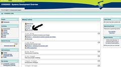
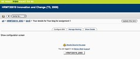
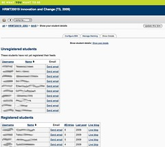
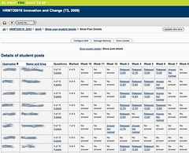
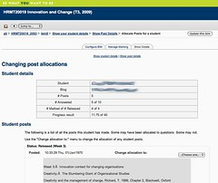

---
categories:
- bim
date: 2010-01-09 12:35:55+10:00
next:
  text: BIM - Mark Post screen
  url: /blog2/2010/01/10/bim-mark-post-screen/
previous:
  text: BIM - getting navigation bread crumbs and tabs working
  url: /blog2/2010/01/09/bim-getting-navigation-bread-crumbs-and-tabs-working/
title: BIM - Design of "Manage Marking" and other features for Coordinators
type: post
template: blog-post.html
comments:
    []
    
pingbacks:
    - approved: '1'
      author: BIM &#8211; Manage Marking &laquo; The Weblog of (a) David Jones
      author_email: null
      author_ip: 72.233.96.176
      author_url: https://djon.es/blog/2010/01/17/bim-manage-marking/
      content: '[...] Additional discussion of this collection of functionality was in
        an earlier post [...]'
      date: '2010-01-17 10:25:54'
      date_gmt: '2010-01-17 00:25:54'
      id: '2911'
      parent: '0'
      type: pingback
      user_id: '0'
    
---
[BAM/BIM](/blog2/research/bam-blog-aggregation-management/) has initially been designed for use at [CQU](http://www.cqu.edu.au/). In that time it has been used in 29 course offerings with 13 of those averaging around 200 students per offering. i.e. BAM/BIM is originally designed for large offerings and hence needs to provide support for the teaching staff in charge of those large offerings.

I'm currently implementing the "coordinator" (at CQU the "coordinator" is the academic in charge of the course) interface for BIM (initial [work here](/blog2/2010/01/09/bim-getting-navigation-bread-crumbs-and-tabs-working/)). The purpose of this post is to generate feedback from current and past coordinators about what features might be useful.

The post has the following sections:

- How will it work?  
    A very brief summary of how BIM will work.
- What will it look like?  
    A description of what it will look like. This introduces the basic functionality.
- Ideas for manage marking  
    Describes some initial new ideas to add into BIM.
- A request for your ideas.

### How will it work?

The basic process will be something like this

- Your Moodle course is created via the normal institutional means.
- You can add a BIM activity in the same way you add any other activity to a Moodle course.  
    There will be support, if you desire, to have multiple BIM activities in your course. When you add a BIM activity you will configure the activity.
- Once added there will be a link in your Moodle course as shown in the following image. (**Click on the images to see larger versions**)  
    
- Students and staff will use this page to access BIM related services.

Depending on the type of person using BIM, they will see different information. More information about what students and other staff will see will be outlined later. The rest of this will focus on what the coordiantor will see.

### What will it look like?

As above, this focuses on what BIM will look like for staff who are coordinating the course.

#### 3 main sections

The coordinator interface for BIM will consist of at least 3 main sections:

1. Configure - allows modification of the configuration of BIM.
2. Manage marking - services associated with managing and releasing the marking of student posts.
3. Show details - provides the coordinator with access to the normal BAM screens showing details of students, posts, allocating posts and marking of their students.

The default Moodle page will look something like the following.

Note the three tabs that allow the coordinator to navigate between sections/services. At this point, only the Show Details section has been implemented.

#### Show details

This is essentially what coordinators see at the moment with BAM. It's also what markers will see. There are four main pages in show details.

1. Show student details - shows details about the students.  
    
    
    The tables here will be sortable.
    
2. Show post details - shows the summary of all the posts for students.  
    
3. Allocate posts - this is how the marker manually changes the allocation of a student post as an answer.  
    
4. Mark post - how you mark an individual post (not currently implemented).

### Ideas for manage marking

The main aim of this post is to ask for suggestions for the Manage Marking section for the coordinator. I'm currently suggesting the following as possibilities (might get included in the initial release of BIM) or requirements (will be included in the initial release of BIM):

- Ability to release marked posts (Requirement)  
    When posts are marked by markers, they are not visible to the student. To be visible to the student they will have to be released by the coordinator. My intent for this interface is to duplicate some of the functionality from OASIS. This means that it should allow the coordinator to release marked posts:
    
    - For all students.
    - For groups of questions (e.g. all marked posts for "Week 5").
    - For all students of particular markers (e.g. all Fred's and all Ginger's students)
- Ability to get an overview of marking progress of all markers. (Possibility)  
    Again, an idea borrowed from OASIS. As coordinator you should be able to see a list of all the markers and a summary of the progress in marking/submitting posts for each question by their students.
- Ability to dig down into the marking progress view to see the details (Possibility).  
    e.g. if you see that Fred has 15 student posts not marked, enable you to click on the 15 and see the details of those 15 students.

### A request for your ideas

That's a fairly limited selection. Due to this and because BAM has never really provided this functionality, I'd like to hear any suggestions you may have. Let me know.