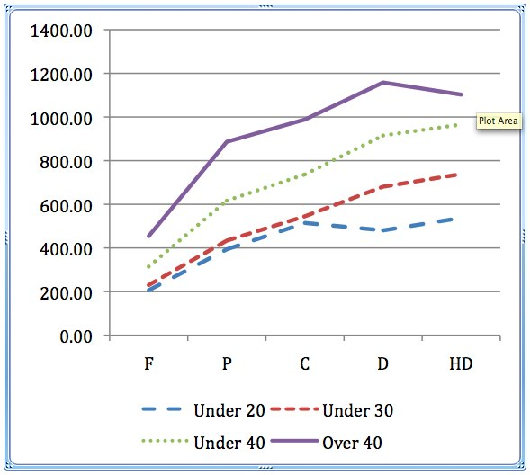

See also: [[blog-home | Home]]

One of the good and also problematic things about the [Indicators project](http://indicatorsproject.wordpress.com/) (attempting to identify patterns in LMS usage data) is that there are so many interesting idea for further research that arise from the patterns being identified. What's best/worst is that the project has really only scratched the surface. This post is an attempt to write down an idea I had today in order to save it for another day, perhaps see if anyone has any insights that can improve it, and if anyone is keen to get involved.

### Why is age correlated with LMS usage?

This idea arises out [of an interesting pattern](http://beerc.wordpress.com/2009/12/02/what-is-the-effect-of-age-on-the-rate-of-participation-in-lms-delivered-courses/) that Col has identified. The pattern establishes a very distinct correlation between the age of distance education students and their level of usage of the LMS.

When we presented at ASCILITE'09 the pattern was opposite to what people initially thought. The older students used the LMS more than the younger students. The graph follows.

28,000 Undergraduate distance education students. Average hits grouped by grade.

### Why?

The obvious question is why? That's the research project.

I can see three parts to the project:

- Literature review to find related reports and theories that might offer an explanation?  
    Any suggestions?
- More statistical analysis of the figures.  
    The above is, I believe, just hits on the course site. What about course discussion forums? Posts and replies on those forums? What other patterns and correlations exist? How strong are those patterns? Is there something similar for on-campus students? What about on-campus students of different types? Do students perform differently in different courses?
- Ask the students. (more detail below).

### Ask the students

Initially this is an investigation so asking the students probably can't be done by surveys because of the bias. Open-ended interviews and other methods that are more exploratory than confirmatory would probably be best suited.

You could use the usage logs to identify students that fit within the various groups, ask them what they think and then perform analysis of the responses to see if there are any commonalities.

Perhaps asking students what they are doing on the LMS as the term progresses might be better than a one-off. A one-off interview would be biased by what they were thinking at any particular point in time.

Perhaps identifying the students first might lead to too much bias. Perhaps just ask the students questions during term and then at the end of term look at the usage data.

### Suggestions and volunteers?

What could be done to improve this idea?

Interested in being involved?