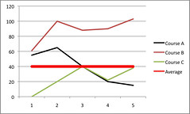
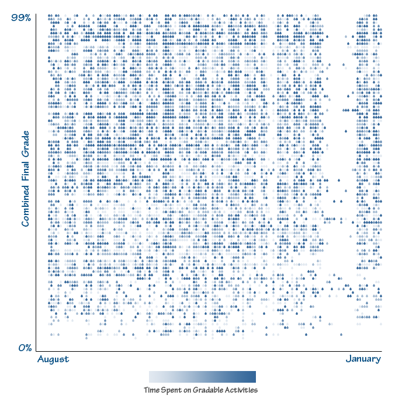

The following draws on principles/theory from psychology to guide thinking about how to incorporate "data" from "academic analytics" into an LMS in a way that encourages and enables academic staff to improve their learning and teaching. It's based on some of the ideas that underpin similar approaches that have been used for students such as [this Moodle dashboard](http://lewiscarr.co.uk/dashboard) and the [signals work](http://minutebio.com/blog/2009/08/31/signals-at-purdue-u-increasing-student-success/) at University of Purdue.

The following gives some background to this approach, summarises a paper from the psychology literature around behaviour modification and then explains one idea for a "signals" like application for academic staff. Some of this thinking is also informing the ["Moodle curriculum mapping" project](/blog2/research/curriculum-mapping/).

Very interested in pointers to similar work, suggestions for improvement or expressions of interest from folk.

### Background

I have a growing interest in how insights from psychology, especially around behaviour change can inform the design of e-learning and other aspects of the teaching environment at universities in a way to encourage and enable improvement. **Important:** I did not say "require", I said "encourage". Too much of what passes in universities at the moment takes the "require" approach with obvious negative consequences.

This is where my current interest in ["nudging" - the design of good choice architecture](/blog2/2010/02/03/loosing-weight-nudging-and-changing-the-lt-environment-early-foundations-of-my-work/) and [behaviour modification](/blog2/2010/03/17/embedding-behaviour-modification-paper-summary/) is coming from. The basic aim is to redesign the environment within which teaching occurs in a way the encourages and enables improvement in teaching practice, rather than discourages it.

To aid in this work, I've been lucky enough to become friends with a [pyschologist](http://mathehu.wordpress.com/) who has some similar interests. We're currently talking about different possibilities, informed by our different backgrounds. As part of that he's pointing me to bits in the psychological literature that offers some insight. This is an attempt to summarise/reflect on one such paper (Michie et al, 2008)

### Theory to intervention

It appears that the basic aim of the paper is to

- Develop methods to clarify the list of behaviour change techniques.
- Identify links between the behaviour change techniques and behavioural determinants.

First a comparison of two attempts at simplifying the key behavioural determinants for change - the following table. My understanding is that there are some values of these determinants that would encourage behaviour change, and others that would not.

Key Determinants of Behaviour Change from Fishbein et al., 2001; Michie et al., 2004
| Fishbein et al | Michie et al |
| --- | --- |
| Self-standards | Social/professional role and identity   Knowledge |
| Skills | Skills |
| Self-efficacy | Beliefs about capabilities |
| Anticipated outcomes/attitude | Beliefs about consequences |
| Intention | Motivation and goals   Memory, attention and decision processes |
| Environmental constraints | Environmental context and resources |
| Norms | Social influences   Emotion   Action planning |

It is interesting to see how well the categories listed in this table resonate with the limits I was planning to talk about in [this presentation](/blog2/2010/03/25/limits-in-developing-innovative-pedagogy-with-moodle-the-story-of-bim-2/). i.e. it really seems to me, at the moment, that much of the environment within universities around teaching and learning is designed as to reduce the chance of these determinants to be leaning towards behaviour change.

### Mapping techniques to determinants

They use a group of experts in a consensus process for linking behaviour change techniques with determinants of behaviour. The "Their mapping" section below gives a summary of the consensus links. The smaller headings are the determinants of behaviour from the above table, the bullet points are the behaviour change techniques.

Now, I haven't gone looking for more detail on the techniques. The following is going to be based solely on my assumptions about what those techniques might entail - and hence it will be limited. However, this should be sufficient for the goal of identifying changes in the LMS environment that might encourage change in behaviour around teaching.

First, let's identify some of the prevalent techniques, i.e. those that are mentioned a more than once and which might be useful/easy within teaching.

### Prevalent techniques

#### Social encouragement, pressure and support

The technique "Social processes of encouragement, pressure, support " is linked to 4 of the 11 determinants: Social/professional role and identity, beliefs about capabilities, motivation and goals and social influences. I find this interesting as it can be suggested that most teaching is a lone and invisible act. Especially in a LMS where what's going on in other courses. Making what happens more visible might enable this sort of social process.

There's also some potential connection with "Information regarding behaviour of others" which is mentioned in 3 of 11.

#### Monitoring and self-monitoring

Get mentioned as linked to 4 of 11 determinants. Again, most LMS don't appear to give good overall information about what a teacher is doing in a way that would enable monitoring/self-monitoring.

Related to this is "goal/target specified", part of monitoring.

There's more to do here, let's get onto a suggestion

### One suggestion

There's a basic model process embedded here, something along the lines of:

- Take a knowledge of what is "good" teaching and learning  
    For example, Fresen (2007) argues that the level of interaction, facilitation or simply participation by academic staff is a critical success factor for e-learning. There's a bunch more literature that backs this up. And our own [research/analysis](http://indicatorsproject.wordpress.com/2009/10/09/the-indicators-project-identifying-effective-learning-adoption-activity-grades-and-external-factors/) has backed this up. Courses with high staff participation show much higher student participation and a clearer correlation between student participation and grade (i.e. more student participation, the higher the grade).
- Identify a negative/insight into the behavioural determinants that affect academic staff around this issue.  
    There are a couple. First, it's not uncommon for staff to have an information distribution conception of teaching. i.e. they see their job as to disseminate information. Not to talk, to communicate, or participate. Associated with this is that most staff have no idea what other staff are doing within their course sites. They don't know how often other staff are contribution to the discussion forum or visiting the course site.
- Draw on a behavioural technique or two to design an intervention in the LMS that can encourage a behaviour change. i.e. that addresses the negative in the determinants.  
    In terms of increasing staff participation you might embed into the LMS a graph like the following. Embed it in such a way as the first thing an academic sees when they login, is the graph - perhaps on part of the screen.  
    
    
    
    What this graph shows is for a single (hypothetical) staff member the number of replies they have made in course discussion forums for the three courses the staff member has taught. The number of replies is shown per term, in reality it might be shown by week of term - as the term progresses.
    
    This part can hit the "monitoring", "self-monitoring" and "feedback" techniques.
    
    The extra, straight line represents the average number of replies made by staff in all courses in the LMS. Or alternatively, all courses in a program/degree into which the staff member teaches. (Realistically, the average would probably change from term to term).
    
    This aspect hits the "social processes of encouragement, pressure, support", "modelling/demonstration behaviour of others". By showing what other people are doing it is starting to create a social norm. One that **might** perhaps encourage the academic, if they are below the average, to increase their level of replies.
    
    But the point is not to stop here. Showing a graph like this is simple using business intelligence tools and is only a small part of the change necessary.
    
    It's now necessary to hit techniques such as "graded task, starting with easy tasks", "Increasing skills: problem-solving, decision-making, goal-setting", "Planning, implementation", "Prompts, triggers, cues". It's not enough to show that there is a problem, you have to help the academic with how to address the problem.
    
    In this case, there might be links associated with this graph that show advice on how to increase replies or staff participation (e.g. advice to post a summary of the week's happenings in a course each week, or some other specific, context appropriate advice). Or it might also provide links to further, more detailed information to shed more light on this problem. For example, it might link to [SNAPP](http://ceit.uq.edu.au/content/snapp-group) to show disconnections.
    
    But it's even more than this. If you wanted to hit the "Environmental changes (e.g. objects to facilitate behaviour)" technique you may want to go further with than simply showing techniques. You may want to enable this "showing of techniques" to be within a broader community where people could comment on whether or not a technique worked. It would be useful if the tool help automate/scaffold the performance of the task, i.e. moved up the abstraction layer from the basic LMS functionality. Or perhaps the tool and associated process could track and create "before and afters". i.e. when someone tries a technique, store the graph before it is applied and then capture it at sometime after.
    

It's fairly easy to see how the waterfall visualisation (shown below) and developed by David Wiley and his group could be used this way.

### Their mapping

#### Social/professional role and identity

- Social processes of encouragement, pressure, support

#### Knowledge

- Information regarding behaviour by others

#### Skills

- Goal/target specified: behaviour or outcome
- Monitoring
- Self-monitoring
- Rewards; incentives (inc. self-evaluation)
- Graded task, starting with easy tasks
- Increasing skills: problem-solving, decision-making, goal-setting
- Rehearsal of relevant skills
- Modelling/demonstration of behaviour by others
- Homework
- Perform behaviour in different settings

#### Beliefs about capabilities

- Self-monitoring
- Graded task, starting with easy tasks
- Increasing skills: problem-solving, decision-making, goal-setting
- Coping skills
- Rehearsal of relevant skills
- Social processes of encouragement, pressure and support
- Feedback
- Self talk
- Motivational interviewing

#### Beliefs about consequences

- Self-monitoring
- Persuasive communication
- Information regarding behaviour, outcome
- Feedback

#### Motivation and goals

- Goal/target specified: behaviour or outcome
- Contract
- Rewards; incentives (inc. self-evaluation )
- Graded task, starting with easy tasks.
- Increasing skills: problem-solving, decision-making, goal-setting
- Social processes of encouragement, pressure, support
- Persuasive communication
- Information regarding behaviour, outcome
- Motivational interviewing

#### Memory, attention, decision processes

- Self-monitoring
- Planning, implementation
- Prompts, triggers, cues

#### Environmental context and resources

- Environmental changes (e.g. objects to facilitate behaviour)

#### Social influences

- Social processes of encouragement, pressure, support
- Modelling/demonstration of behaviour by others

#### Emotion

- Stress management
- Coping skills

#### Action planning

- Goal/target specified: behaviour or outcome
- Contract
- Planning, implementation
- Prompts, triggers, cues
- Use of imagery

### References

Fresen, J. (2007). "A taxonomy of factors to promote quality web-supported learning." International Journal on E-Learning 6(3): 351-362.

Michie, S., M. Johnston, et al. (2008). "[From theory to intervention: Mapping theoretically derived behavioural determinants to behaviour change techniques.](http://people.oregonstate.edu/~flayb/MY COURSES/Adv Health Behavior Theory H699 Winter09/Week 9/Michie et al 08 Behavior ch techniques.pdf)" Applied Psychology: An International Review 57(4): 660-680.