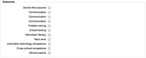

---
categories:
- curriculummapping-cddu
date: 2010-03-30 09:46:11+10:00
next:
  text: Elevator pitch for "Moodle curriculum mapping"
  url: /blog/2010/04/01/elevator-pitch-for-curriculum-mapping/
previous:
  text: Moodle, Oracle, blobs and MS-Word - problem and solution?
  url: /blog/2010/03/26/moodle-oracle-blobs-and-ms-word-problem-and-solution/
title: Moodle curriculum mapping - Step 2
type: post
template: blog-post.html
comments:
    - approved: '1'
      author: jostorey
      author_email: j.storey@cqu.edu.au
      author_ip: 138.77.2.133
      author_url: null
      content: 'Hi David
    
        I can follow most of this even though some of the more technical stuff is a bit
        beyond me.  I guess the issue I have with mapping the university GAs is that this
        will essentially be done ''backwards'' so that GAs are forced to fit with existing
        content instead of the other way around.  There is nothing much we can do about
        this as the situation is fairly similar for us in psychology.  When I send you
        an electronic copy of our accreditation document though this might help as you
        can see the breakdown of the Psychology GAs at the next level of detail.  Hopefully
        this will make more sense when you have the document in front of you.  Look forward
        to reading the next instalment.'
      date: '2010-03-31 14:20:25'
      date_gmt: '2010-03-31 04:20:25'
      id: '2991'
      parent: '0'
      type: comment
      user_id: '0'
    - approved: '1'
      author: davidtjones
      author_email: d.jones@cqu.edu.au
      author_ip: 59.154.24.147
      author_url: https://djon.es/blog/
      content: 'G''day Jo,
    
    
        Don''t let the technical stuff faze or concern you too much.  I''m just trying
        to document what I''m seeing and thinking as I work through this.  So, by its
        nature it''s a weird combination of technical and education.
    
    
        As for the "order of fit". I''m taking a more "process" oriented view.  i.e. it
        doesn''t matter how bad it is at the start, the point is to be able to engage
        with and consider learning outcomes, graduate attributes etc. as you work on the
        courses.  i.e. as the academic performs their current normal practice, the graduate
        attributes etc are more visible and consequently considered more, hopefully leading
        to improvement.
    
    
        I think mapping the GAs or other stuff onto the existing courses will be an interesting
        exercise, as long as it isn''t seen as a stick.  i.e. if your course doesn''t
        cover the GAs, you''ll get a talking to. Instead, I hope it''s seen as a learning
        exercise, a positive process to see what''s covered, what''s not and then hopefully
        figure out how to improve.
    
    
        David.'
      date: '2010-03-31 15:45:46'
      date_gmt: '2010-03-31 05:45:46'
      id: '2992'
      parent: '2991'
      type: comment
      user_id: '1'
    - approved: '1'
      author: jostorey
      author_email: j.storey@cqu.edu.au
      author_ip: 138.77.2.133
      author_url: null
      content: 'HI David
    
    
        Yes, defintely interesting and also highlights the importance of the mapping exercise
        as something that has to happen acrosss the program.  Not all GAs will be covered
        in every course but we need some way of ensuring that mechanisms are in place
        to track how these are developed across the curriculum (in keeping with Bloom''s
        progression).  I think that is the exercise is done this way it will remove the
        perception of the ''big stick''.  It certainly was the way that we approached
        our first attempt at mapping i.e., from the birds eye view perspective, so that
        individuals did not feel as if they were being specifically targetted - more the
        approach that we are working as a team to achieve these GAs.
    
    
        Just my thoughts, Jo.`'
      date: '2010-03-31 15:52:33'
      date_gmt: '2010-03-31 05:52:33'
      id: '2993'
      parent: '0'
      type: comment
      user_id: '0'
    - approved: '1'
      author: davidtjones
      author_email: d.jones@cqu.edu.au
      author_ip: 59.154.24.147
      author_url: https://djon.es/blog/
      content: 'G''day Jo,
    
    
        I saw mention of Bloom''s progression in something I was reading yesterday.  In
        that case, the idea being that a first year course should be low on bloom''s and
        it should increase over subsequent years.
    
    
        I''m not sure I agree with this as a blanket statement.  Can see some value, but
        not for everything.
    
    
        I think you hit on one of the most important aspects of this project.  The bit
        I''m doing at the moment is just finding out more about how it might technically
        work within Moodle.  Fairly easy stuff.
    
    
        The much more difficult part, and much more important part, is  getting the staff
        involved in an appropriate way.  The design of the "system"/processes will aim
        to maximise engagement, but that won''t be the full, or even main part of the
        story.
    
    
        It''s at that stage that I think Kate and yourself become critically important.
    
    
        David.'
      date: '2010-03-31 16:37:37'
      date_gmt: '2010-03-31 06:37:37'
      id: '2994'
      parent: '2993'
      type: comment
      user_id: '1'
    
pingbacks:
    - approved: '1'
      author: Moodle curriculum mapping &#8211; Step 3 &laquo; The Weblog of (a) David
        Jones
      author_email: null
      author_ip: 72.233.96.160
      author_url: https://djon.es/blog/2010/04/02/moodle-curriculum-mapping-step-3/
      content: '[...] curriculum mapping &#8211; Step&nbsp;3  This will be a brief extension
        of previous work. The main aim is to start identifying some of the methods used
        by Moodle with its current outcomes [...]'
      date: '2010-04-02 10:04:48'
      date_gmt: '2010-04-02 00:04:48'
      id: '2995'
      parent: '0'
      type: pingback
      user_id: '0'
    
---
This is the second exploration of an idea for enhancing Moodle to enable curriculum mapping. It carries on from the [first step](/blog/2010/03/23/first-step-in-moodle-curriculum-mapping/) and is part of a [broader project](/blog/research/curriculum-mapping/).

The aim today is to:

- Create a CSV file of Moodle outcomes for a couple of programs.  
    Mostly to get a feel for the outcomes that accrediting bodies are after and to test out this "uploading" of outcomes. Also to get some insight into how the "scales" might work.
- "Map" a course or two with those outcomes.  
    The aim is to get a feel for how difficult doing this actually is and how well it works. Perhaps get some insights into ways it could be made easier/more effective.
- Start identifying the database structures where that information is placed.  
    This is a pre-cursor to starting to develop extensions to Moodle that will draw on this information. It helps identify where the information is, what is there and what might be possible in terms of development.

Am going to be updating this post throughout today (30 March, 2010)

### Moodle outcomes CSV file testing

Moodle allows you to upload outcomes into Moodle via a CSV file. The format is a 6 field CSV file

- outcome\_name - full name
- outcome\_shortname - short name
- outcome\_description
- scale\_name - name of scale
- scale\_items - comma separate list of scale items
- scale\_description

e.g.

> outcome\_name;outcome\_shortname;outcome\_description;scale\_name;scale\_items;scale\_description  
> Participation;participation;;Participation scale;"Little or no participation, Satisfactory participation, Full participation";

Each outcome in Moodle is associated with a scale. It's typically used to make student performance against the outcome. For curriculum mapping, I believe the scale can be used to measure how well the course/activity/resource meets the outcome/attribute etc.

The task now is to create a useful CSV outcomes file for my purposes. The choices that exist include:

- The [institution's graduate attributes](http://dmai.cqu.edu.au/FCWViewer/view.do?page=7949); or
- The outcomes required of specific disciplinary accrediting bodies.

Am thinking I'll start with the institutional graduate attributes - mostly for political reasons - and then do one of the disciplinary bodies outcomes for a bit more learning.

#### Graduate attributes

Not 100% certain this represents the current state of the institution's graduate attributes, but it's good for an experiment. The institution is apparently introducing graduate attributes progressively during 2010 with all undergraduate programs done from Jan 2011 and all other programs from 2012.

The institution has 8 graduate attributes:

- Communication
- Problem solving
- Critical thinking
- Information literacy
- Team work
- Information technology competence
- Cross cultural competence
- Ethical practice

As it stands, I've been unable to find any description of these. However, [a document describing the project](http://dmai.cqu.edu.au/FCWViewer/getFile.do?id=31123) has developed some "levels of achievement" for the attributes and offered descriptions of those levels using learning outcomes and the revised Bloom's taxonomy.

The three levels are: introductory, intermediate and graduate. Each of the outcomes/levels are associated with learning domains from the revised Bloom's taxonomy.

**Note:** my aim here is to identify what has been done and work out how it can be translated into Moodle's outcomes CSV file. Not to judge what's been done.

#### The CSV file

The first version of a CSV file for the attributes is done and successfully in. Will reflect more on this after lunch.

The Moodle help documentation suggests that the format is as listed above, with outcome\_description and scale\_description as optional. That means that you don't have to include them in a line, but you do need to include all fields. Getting the format exactly right was an interesting experience in trial and error.

The first two lines of the file are

> Communication;comm;"Described here http://dmai.cqu.edu.au/FCWViewer/view.do?page=7949";"CQU Graduate Attributes (Communication)";"Introductory - Use appropriate language to describe/explain discipline-specific fundamentals/knowledge/ideas (C2), Intermediate - Select and apply an appropriate level/style/means of communication (C3), Graduate - Formulate and communicate views to develop an academic argument in a specific discipline (A4)";

#### What is looks like

When trying to map an activity/resource in Moodle, you use the "edit" facility for that activity/resource and a part of the resulting page looks like the following - click on it to see it bigger.

Some comments on this image:

- Duplicate outcomes suggest Outcome management not great.  
    You can see three outcomes for Communication. This is due to the problems associated with importing the CSV file - 2 failed attempts, followed by a successful one. And subsequent difficulties in finding out how to delete the older versions of the outcome.....Ahh, you have to go to "edit outcomes".
- Not enough information.  
    While it wouldn't be a problem eventually, the problem I'm currently facing is that I'm not familiar enough with the outcomes to understand what they mean. I want some additional pointers in the interface - even just the normal Moodle help link (a little question mark). This absence is somewhat related to the next point.
- Can't use the scale here and now.  
    For curriculum mapping, I want to select the scale here and now. The idea is to specify to what level this activity/resource meets the outcome. This highlights the difference in purpose between the outcomes in Moodle (focused on measuring individual student performance) and what the outcomes would be used in many forms of curriculum mapping (mapping how well a course covers outcomes). For Moodle outcomes the scale starts to apply in the gradebook, i.e. when you're marking the individual student. Not in the activity/resource.
    
    Graduate attributes could be used for both approaches, map the course and also track student progress.
    
- The need for groupings of outcomes.  
    The first outcome "David's first outcome" is some from some earlier testing. But it does highlight an additional requirement, the ability to separate (and perhaps map) between different groupings of outcomes. e.g. CQU's graduate attributes, course learning outcomes and perhaps discipline accrediting body learning outcomes.
- The Moodle workflow is somewhat limited.  
    With outcomes, as with other aspects of Moodle, the "workflow" - the sequence of screens you go through as you perform a task - leaves a bit to be desired. It's not often clear where to go, or as you finish how best to proceed.

### Other outcomes

Am now looking at the accreditation requirements for psychology and public relations to understand what is there and what implications that might have for this idea.

In terms of public relations it appears to be a combination of course outcomes, university graduate attributes and some specific "criteria/areas" specified by the program.

In psychology, there's an odd mixture of discipline specific "graduate attributes", with each having its own set of critiera, and a collection of "skills" to "map" assessment against.

### Where's the data?

Seems the outcomes stuff might be stored in three tables:

- grade\_outcomes: id, courseid, shortname, fullname, scaleid, description, timecreated, time modified, usermodified  
    Obviously the table the CSV import modifies.
- grade\_outcomes\_courses: id, courseid, outcomeid  
    Links a course with an outcome in the previous.
- grade\_outcomes\_history: id, action, oldid, source, timemodified, loggeduser, courseid, shortname, fullname, scaleid, description.  
    Not sure on this one.

So, one question is where does the mapping against a particular activity/resource get put?

### What about code?

moodle/lib/grade/grade\_outcome.php defines a class grade\_outcome, that is meant to handle it all, including database manipulation.