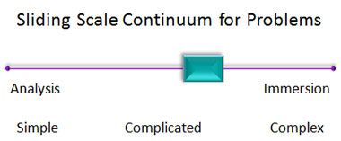

---
categories:
- bim
- elearning
- futures
- moodle
- phd
- psframework
- webfuse
coverImage: 2153105227_341c4ee602_o-e1627001406797.jpg
date: 2010-04-25 12:40:40+10:00
next:
  text: '"The realities of the ERA and L&#038;T support services"'
  url: /blog2/2010/04/28/the-realities-of-the-era-and-lt-support-services/
previous:
  text: Clarification of the alignment project
  url: /blog2/2010/04/22/clarification-of-the-alignment-project/
title: Inside out, Outside in or both?
type: post
template: blog-post.html
comments:
    - approved: '1'
      author: leighblackall
      author_email: leighblackall@gmail.com
      author_ip: 124.168.209.103
      author_url: http://learnonline.wordpress.com/
      content: 'Great response David! It is totally a fair call - and brings some clarity
        to the question for me. Its true that my perspectives are driven somewhat by the
        idea that ''outside'' learning is.. important, but that it needs recognition and
        support by the ''inside'' or both sides miss out. I''d go further though, and
        say that improving ''inside'' teaching and learning happens by connecting it with
        ''outside'' teaching and learning.
    
    
        I think BIM does this in one direction, and is the single most significant addition
        to Moodle I have seen that has me considering the use of Moodle again. It effectively
        brings the outside in, I just wish it could bring the inside out. Your future
        plans could do that.
    
    
        The ultimate (for me) is a tool that is developed on the outside, but that can
        be used seamlessly on the inside. The people over at Wikieducator for example,
        are working on import export extensions that try to connect Moodle with MediaWikis
        and OpenOffice. While I think that example is futile, it is none-the-less guided
        by thinking I can agree with.
    
    
        Thanks for posting David. It was a great response. I look forward to seeing a
        recording and/or notes of your MoodleMoot presentation.'
      date: '2010-04-25 23:46:04'
      date_gmt: '2010-04-25 13:46:04'
      id: '3014'
      parent: '0'
      type: comment
      user_id: '0'
    - approved: '1'
      author: davidtjones
      author_email: d.jones@cqu.edu.au
      author_ip: 138.77.2.133
      author_url: https://djon.es/blog/
      content: 'Leigh, thanks for the positive feedback.
    
    
        I agree 100% that "inside" needs to connect with the "outside".  The really hard
        stuff is encouraging that "connection" to happen. It has to happen in a way that
        makes sense for those inside, without sacrificing what is important about the
        insight from outside.
    
    
        What frustrates me is that the nature of the "inside" environment actually makes
        it harder to connect, not easier.
    
    
        In terms of the future plans for BIM, I take the "immersion" approach very seriously.
        I think any addition of further "social media" features into BIM is best accomplished
        by responding to the real needs of someone trying to use BIM, rather than what
        I "analyse" to be best.
    
    
        As a result, I''m really keen to connect with someone who wants to use these types
        of features with BIM.  I''m more likely to add them, once I engage with such folk,
        than if I don''t.
    
    
        So, if you know of anyone - or you yourself get serious - let me know.'
      date: '2010-04-27 11:05:06'
      date_gmt: '2010-04-27 01:05:06'
      id: '3015'
      parent: '3014'
      type: comment
      user_id: '1'
    - approved: '1'
      author: theteachingtomtom
      author_email: john.benwell@rmit.edu.au
      author_ip: 120.21.6.59
      author_url: http://www.teachingtomtom.com
      content: All these years on, and through another similar discussion, we're back
        here. I'm sorry that I didn't get serious, or in all my dealings with hundreds
        of teachers at several institutions, I didn't remember to get serious. But over
        those 5 years since when we talked and arrived at "outside in" I think we have
        observed significant trends. Google Apps for Education (for better and worse)  Hangouts
        on Air and Youtube, social media generally, Creative Commons licensing, and broader
        notions of extracurricular and experiential work place learning, indicate to me
        that "outside in" is having a significant impact on practice. At RMIT we're even
        starting to have directional conversations about "Bring Your Own Account" where,
        conceivably at least, the university will accept the idea of people rejecting
        the use of a university supplied account, and legitimately use an existing online
        identity. BYOA, like BYOD a few years prior, are examples of Outside-in thinking...
      date: '2015-08-28 17:29:11'
      date_gmt: '2015-08-28 07:29:11'
      id: '3022'
      parent: '0'
      type: comment
      user_id: '0'
    - approved: '1'
      author: David Jones
      author_email: davidthomjones@gmail.com
      author_ip: 101.179.25.109
      author_url: https://djon.es/blog/
      content: 'At some level I''m wondering whether the notions of what is "inside" and
        what is "outside" is different and/or changed.  Or at least it''s more than just
        a dichotomy.
    
    
        e.g. I wouldn''t class myself as being (or ever have been) "inside" an organisation
        in terms of fitting within the strategic and operational goals of a university.  There''s
        a reason why last ASCILITE paper was titled <a href="https://davidtjones.wordpress.com/2014/09/21/breaking-bad-to-bridge-the-realityrhetoric-chasm/"
        rel="nofollow">"Breaking BAD"</a>. I''ve always been on the edges of the organisation
        and its systems/expectations, seen by some as "bad", and thus can relate to your
        other comment about it being a lonely experience. That said, nothing I''ve done
        has ever questioned/challenged some of the fundamental assumptions that your work
        has. Perhaps it''s just that aim looking at changing a different set of assumptions.
    
    
        The work you mention at RMIT is indicative of the environmental factors that will
        continue to drive some of this. Digital technology will become more and more prevalent
        and embedded in our lives and it will no longer make sense for them to provide
        accounts.  It''s the same scarcity/abundance transition that happened with providing
        Internet access.  Back in the early 1990s Universities had banks of modems to
        which students dialed up to in order to get Internet access.  That would be silly
        to do now.
    
    
        But the question will be whether <a href="http://www.papert.org/articles/school_reform.html"
        rel="nofollow">the "grammar of school"</a> as embodied by Universities will continue
        to constrain the type of transformation that can/should happen?'
      date: '2015-09-03 15:51:11'
      date_gmt: '2015-09-03 05:51:11'
      id: '3023'
      parent: '3022'
      type: comment
      user_id: '1'
    
pingbacks:
    - approved: '1'
      author: Qualms about the alignment project &laquo; The Weblog of (a) David Jones
      author_email: null
      author_ip: 76.74.254.72
      author_url: https://djon.es/blog/2010/05/14/qualms-about-the-alignment-project/
      content: '[...] this stage I come back to some thinking about inside-out versus
        outside-in that was sparked by questions from Leigh Blackall. In my job I [...]'
      date: '2010-05-14 14:14:49'
      date_gmt: '2010-05-14 04:14:49'
      id: '3016'
      parent: '0'
      type: pingback
      user_id: '0'
    - approved: '1'
      author: Using the NetSpot Innovation fund to enhance bim &laquo; The Weblog of (a)
        David Jones
      author_email: null
      author_ip: 216.151.210.18
      author_url: https://djon.es/blog/2012/08/07/using-the-netspot-innovation-fund-to-enhance-bim/
      content: '[...] Blackall and I had this conversation a while ago. There are minuses
        in this approach, but there are some plusses as well and there aren&#8217;t many
        [...]'
      date: '2012-08-07 09:24:01'
      date_gmt: '2012-08-06 23:24:01'
      id: '3017'
      parent: '0'
      type: pingback
      user_id: '0'
    - approved: '1'
      author: A bit more NGL catchup | The Weblog of (a) David Jones
      author_email: null
      author_ip: 66.155.8.88
      author_url: https://djon.es/blog/2014/08/21/a-bit-more-ngl-catchup/
      content: '[&#8230;] I&#8217;ve also argued that working within the walled garden
        and slowly opening up more holes in the wall has some promise as a [&#8230;]'
      date: '2014-08-21 15:12:04'
      date_gmt: '2014-08-21 05:12:04'
      id: '3018'
      parent: '0'
      type: pingback
      user_id: '0'
    - approved: '1'
      author: No guarantees! The realities of working with NGL? | EVEN ELMO&#039;S GOT
        A MOBILE
      author_email: null
      author_ip: 192.0.80.199
      author_url: http://astrethewey.wordpress.com/2014/08/22/no-guarantees-the-realities-of-working-with-ngl/
      content: "[&#8230;] fight the good fight and to try to\_bring about change, working\
        \ from the bottom up! \_Or as David puts in &#8211; the [&#8230;]"
      date: '2014-08-22 19:24:09'
      date_gmt: '2014-08-22 09:24:09'
      id: '3019'
      parent: '0'
      type: pingback
      user_id: '0'
    - approved: '1'
      author: Assignment 2 &#8211; DBR Proposal | EVEN ELMO&#039;S GOT A MOBILE
      author_email: null
      author_ip: 192.0.83.190
      author_url: http://astrethewey.wordpress.com/2014/11/12/assignment-2-dbr-proposal/
      content: '[&#8230;] Jones, D. (2010, April 25). Inside out, Outside in or both?
        [Web log post]. Retrieved from https://djon.es/blog/2010/04/25/inside-out-outside-in-or-both/
        [&#8230;]'
      date: '2014-11-12 11:04:00'
      date_gmt: '2014-11-12 01:04:00'
      id: '3020'
      parent: '0'
      type: pingback
      user_id: '0'
    - approved: '1'
      author: Kludging an authoring process with Moodle books (almost) | The Weblog of
        (a) David Jones
      author_email: null
      author_ip: 192.0.80.104
      author_url: https://davidtjones.wordpress.com/2015/02/08/kludging-an-authoring-process-with-moodle-books-etc/
      content: '[&#8230;] it at the institutional level. I&#8217;m simply aiming to enhance
        my current practice a bit. An &#8220;inside out&#8221; approach, rather than outside
        [&#8230;]'
      date: '2015-02-08 13:13:41'
      date_gmt: '2015-02-08 03:13:41'
      id: '3021'
      parent: '0'
      type: pingback
      user_id: '0'
    - approved: '1'
      author: OEP, institutions and culture &#8211; The Weblog of (a) David Jones
      author_email: null
      author_ip: 192.0.99.68
      author_url: https://davidtjones.wordpress.com/2016/09/21/oep-institutions-and-culture/
      content: '[&#8230;] end, I think we may need to draw upon the following from David
        Wiley and Cable Green, which echoes a discussion Leigh Blackall and I had back
        in [&#8230;]'
      date: '2016-09-21 15:40:25'
      date_gmt: '2016-09-21 05:40:25'
      id: '3024'
      parent: '0'
      type: pingback
      user_id: '0'
    
---
During the last week I have been in Canberra for various events, including [giving a presentation](/blog2/2010/04/07/reducing-the-aggravation-of-student-blogging-the-story-of-bim/) on [BIM](/blog2/research/bam-blog-aggregation-management/) at University of Canberra. Somewhat surprisingly (as last I knew, he was in New Zealand), [Leigh Blackall](http://leighblackall.blogspot.com/) was in "audience" at the presentation, and as is Leigh's wont, he asked some serious questions. I was troubled by those questions and needed time to reflect on what an answer might be.

This is an attempt to develop an answer to why I was troubled. In part, this attempts to [pick up a comment](http://leighblackall.blogspot.com/2010/04/on-system-that-manages-learning.html#comment-2932560188421168672) I'd made earlier on Leigh's blog about thesis, anti-thesis and synthesis

### The question

The initial question Leigh asked which troubled me is repeated in [his blog post](http://leighblackall.blogspot.com/2010/04/aggregating-blogs-feeds-into-moodle.html) on the presentation. It is

> I asked the obvious question of why, or if BIM might consider developing outside the framework of Moodle say, as a Firefox based or other Feed Reader plug in, and offering a file that can be imported to Moodle (as well as a spreadsheet, a MediaWiki table, a Wikispaces Table, MySQL database, a text document and a PDF to email), and thereby offering the functionality of BIM to a wider user base than just Moodle.

The immediate answer I gave is reported faithfully in Leigh's post

> David explained that the project was constrained in many ways to the needs of the sponsoring Institution,

(as is the fact that we had broader discussions.

What troubled me (in part) about my response is that the constraints of the sponsoring institution is both more and less than it sounds. In part it is what is simply easiest, the institution pays my wage and it uses Moodle. But it is also, to me, what is the best way in terms of improving L&T.

It appears to be the difference between an "inside out" approach (which I'm taking and will argue has a chance of success) and an "outside in" approach (which is somewhat close to what Leigh suggests). At the very least, it makes for a good title.

### Inside out

The main reason I didn't start with Firefox or some other external way of developing BIM, is that I'm taking an inside out approach to improving learning and teaching. i.e. I'm starting with what is being used within the organisation and trying to change it for the better. The organisation is currently using Moodle, so if I want more people to be thinking about using Web 2.0 and reflective student journals in their L&T, I have to start with Moodle. Doing so lowers the barriers to entry and actually makes it somewhat likely that people will use it. It even fits (with some difficulty) within the constraints of how Moodle is being managed within the institution.

In [commenting](http://leighblackall.blogspot.com/2010/04/aggregating-blogs-feeds-into-moodle.html#comment-8136859140934964414) on Leigh's post, Peter gets close to the approach

> The central question though for an educational developer is how to promote innovation and change and it seems to me that it has to be based on an invitational ethos: teaching staff need be convinced of the benefits of technology adoption, they sometimes come to it slowly, they come to it in surprisingly unexpected ways at times and positive things happen.

I actually think more than this is needed and will pick up on it below. But first..

### Outside in

To a limited extent, Leigh's approach could be characterised as outside in. Start with the outside stuff, support those people and then perhaps change might eventually occur within the institution. However, in [responding](http://leighblackall.blogspot.com/2010/04/aggregating-blogs-feeds-into-moodle.html#comment-127547259220592129) to [Peter's comment](http://leighblackall.blogspot.com/2010/04/aggregating-blogs-feeds-into-moodle.html#comment-8136859140934964414) Leigh suggests a perspective that doesn't really both with the "inside" (current universities)

> To borrow your highway metaphor, a bypass is needed, one that goes around that old town, and offers a more direct route for the people in need of credentials with minimal debt. Remember, the experiences in the old town have become irrelevant. An old road can remain for those who like nostalgic tourist routes, but an alternative route is needed.

There are many within current institutions that react negatively to this perspective, however, I can see the need for it. Mainly because, as Leigh points out, there are significant barriers within universities that suggest that an inside out approach may not work.

> I don't believe a passive approach can be effective when considering our dense hierarchies, performance reviews, infrastructure, broken feedback systems, conservatism and the wrong sorts of incentives and rewards.

### Limits in developing innovative pedagogy with Moodle

In fact, I'm hoping to use the development of BIM and the limitations of this approach as the basis for a couple of publications, including a presentation at [MoodleMoot AU 2010](http://moodlemoot.org.au/). (still waiting to hear if the submission has been successful). The "theme" for this conference is "without limits....". Rather than accepting that Moodle is "without limits", [I argue](/blog2/2010/03/25/limits-in-developing-innovative-pedagogy-with-moodle-the-story-of-bim-2/) that

> e-learning with Moodle, as currently practised, has a number of limits and that progress can be made through the recognition, understanding and removal of those limits.

So, what may you ask, is my problem with Leigh's comments?

### Both-and, not either-or

The questions around the quality of L&T within universities, the requirement from society for different approaches and the future of universities are complex. So complex, that it's never going to be about a single answer, there is no such thing. For this, and other personal reasons, I prefer a both-and approach. It's not about outside-in or inside-out, it's about both.

Actually, I should paraphrase, in terms of improving L&T within universities, it's a question of both-and. In terms of responding to societies changing needs around learning (or simply recognising a long-standing need that has been ignored), I'm not so sure there is a need for an "inside-out" perspective. However, as I'm paid by a university to improve the quality of L&T, I see the need for a both-and approach for the long-term benefit of the university (and hopefully society...there's a big question in there).

What this means is that there is a huge need for folk like Leigh and many others (Leigh gives a list of some in [this post](http://leighblackall.blogspot.com/2010/04/on-system-that-manages-learning.html)) who are identifying and creating insights into what the "outside" should be. The value is not just for the "outside" it's also for the universities and other institutions as it helps identify some options around where we need to be.

However, there is also a need - at least at the moment - for folk who are taking the "inside-out" approach. Thinking about how to effectively make the "inside" a better fit or enabler for what the outside should be like. That need may not exist in the future, but for the moment it does and because this is a complex area, I think we need both.

### Inside-out is currently failing

As stated above and numerous times on this blog, I think the current approaches being used within universities are failing. Most L&T at universities is poor quality by traditional standards, let alone if measured by adoption of social media. For me, this is not a sign that it is impossible, it's a sign that the principles of current approaches are just plain wrong. This is [what my current work](/blog2/2010/04/14/identifying-and-designing-interventions-to-improve-lt-a-behaviour-change-framework/) is looking at.

### Why is it failing?

The following diagram represents what I think is a fundamental mismatch (The image is taken from [this post](http://bdld.blogspot.com/2010/04/immersion-and-analysis-continuum-in.html) by Donald Clark).

As I said above, this problem is a complex one. Based on the above diagram, the best type of solution arises from immersion in the problem. The problem is that most universities are attempting to solve this problem by analysis.

For along time I've been saying that learning and teaching is a wicked problem (Rittel & Webber, 1973). [Clark's blog post](http://bdld.blogspot.com/2010/04/immersion-and-analysis-continuum-in.html) (source of the image) draws on another of Rittel's publications to suggest that for a complex problem

> This is because as Rittel (1972) discovered — the best experts within these types of environments are those affected by the solution — since they are the only ones to have experienced the complexity of the problem, they are the best experts for helping to improve that environment.

At the moment, universities are only paying lip service to involving the "experts" - the students and teachers. Most of it is being driven by "management" who don't have in-depth experience of a specific context. Their decisions are driven more by other considerations than in-depth understandings of the current context. Importantly, this isn't about asking the students and teachers what they want, for me, it's about understanding what they are experiencing and where they are now as an important first step in helping them go somewhere else.

At the same time, the approach taken by the "outside in" folk - like Leigh - also has the same failure. It doesn't seek to understand the existing context or practice of the students and staff. But that's okay, that's not what they are about, they are about figuring out and creating a better future. (I fully recognise that this is a gross simplification and generalisation. However, I do think it's a distinction that has some value.)

### What is both-and?

As an inside-out person, I believe any success comes from having deep knowledge of the current context (the experience of staff and students) and marrying that with "solution" knowledge from the experts and insights into how the environment can be changed in a way that encourages and enables the staff and students to improve their experience. This describes BIM:

- knowledge of current context;  
    The need for BIM arose out of my need to teach a 200+ student course that had a "reflective" journal assignment which had significant problems (a problem faced by other staff).
- expert knowledge; and  
    I knew about Web 2.0, the benefits of student-owned journals/blogs and the institutional need for and staff/teacher familiarity with the LMS.
- environment change.  
    Add a module to Moodle that enables staff to manage individual student blogs hosted on external services.

### But it's not enough

This is what really troubled me, and now I'm becoming repetitive in the same post. The above by itself is not enough. As a measly [e-learning and innovation specialist](/blog2/2009/08/20/elearning-and-innovation-specialist-report-1-4-20-august)/ I have no power to make the further changes in the environment that are necessary to make BIM truly attractive.

I guess the real reason why Leigh's questions troubled me, is that I'm frustrated at my inability to make the change and the on-going blindness of institutional leadership.

How's that for a positive end to a rambling post?

### A response to Leigh

Couldn't leave it there, let me return to the original question from Leigh. I believe that an inside-out approach is probably more likely to help improve L&T on a broad-scale within a university than an outside-in approach. I value the insights offered by outside-in folk, but I think I need to value the experiences of the students/staff within a university and build on that experience to help improvements happen. Perhaps, it's simply a question of purpose. My purpose is to help improve L&T within universities, yours is more about helping those people who are already learning outside of universities.

That's why I think building BIM on top of Moodle was a better fit for my purpose. A purpose, which I agree, is fairly narrow.

### References

Rittel, H. W. J., & Webber, M. M. (1973). Dilemmas in a general theory of planning. Policy Sciences, 4(2), 155-169.