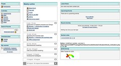

See also: [[blog-home | Home]]

[Col](http://beerc.wordpress.com/) has been playing around with some ideas for a [Moodle indicators block](/blog2/2010/05/09/requirements-for-an-indicators-moodle-block/). This is a record of my first attempt to install and play with the block. Might also do a bit of reflection and setting up of processes etc so we can go further with this.

The long term goal is to promote the [Indicators project](http://indicatorsproject.wordpress.com/), help some folk and do some research.

**Warning:** Much of the following is intended only for the indicators project team. At this stage, there's probably not a lot of value in anyone outside the project trying to use the block. It's very early days.

### Installing the block

Installing the single PHP file provided by Col in the right place in my local Moodle install, setting permissions, visiting the "admin" page for my Moodle install and she's all right to go. Go to a dummy course, login as a staff member, add the block and it's all working. The block currently shows some idea of effort on the part of students, so logged in as a staff member, I don't see much. Login as a dummy student and this is what I see. (Click on it to see a bigger version)

It seems to work, though with a few errors. The dummy student I'm using hasn't done a lot and the arrow indicates that. The errors include:

- The PHP error re: undefined variable.
- The \[\[Indicators\]\] as the label.
- The quite large amount of screen space being taken up by the right hand block column - only since the indicators block was added.
- The white background for the graph, rather than transparent.

The aim is to make this open source and let anyone work on it - or at least anyone in the indicators project as a first step. This means we need to get this under version control.

### New code - effort tracking during early stages

Col's just sent some new code, installed it and refreshed the page for the dummy student. I get the following

The background colour has been improved. However, the interesting observation is that the one page reload has catapulted this student from a fairly low effort level, to a fairly high effort level.

My first guess, without even having looked at the code is that this is because this is a dummy course, there are no real students and I only use it occasionally for testing. This means very low levels of usage by "students". At these levels, depending on the maths used, a single extra page refresh can make a huge difference.

This is something the block should recognise and address, some solutions might include:

- Having a "too low to show" option, so that effort isn't tracked in a state of low usage.
- Or showing that overall usage is low and liable to wild swings. Perhaps a visible "confidence" level that indicates how confident the block is that it is showing you something meaningful.

### Putting the block under git

If we're going to work collaboratively on this, and allow other people to use it, we need some sort of support for version control and a range of other features. I've been using git and github for [BIM](/blog2/research/bam-blog-aggregation-management/), so I think we should use those for the block. I'm still a newbie at this, but I'm slightly ahead of the other guys in the indicators project. So the following shares what I did to get this up and going in the hope that it is useful for them and that they (and others) can pick up any errors I made.

#### Getting started

I've only done this once before, a month or so ago, and can't remember anything. So, I'm starting with the [github help](http://help.github.com/).

I've already set up my laptop to use github which from memory involved: creating a github account, setting up some environment stuff and generating some ssh keys. Just follow the guides in the right hand menu on help.github.com. Just found the [learn.github](http://learn.github.com/) site.

#### The process

Here's what I did

- initialised a new git repo for the block; \[sourcecode language="bash"\] bash$ cd blocks/indicators bash$ git init Initialized empty Git repository in /Applications/XAMPP/xamppfiles/htdocs/moodle/blocks/indicators/.git/ \[/sourcecode\] This is the empty git repository
- add and commit the file \[sourcecode language="bash"\] bash$ git add block\_indicators.php bash$ git commit -m 'initial commit' \[master (root-commit) c1a7051\] initial commit 1 files changed, 103 insertions(+), 0 deletions(-) create mode 100644 block\_indicators.php \[/sourcecode\]
- Quick double check \[sourcecode language="bash"\] bash$ git log commit c1a70517f09d2f86de53e9e1c6a056d864e7622d Author: David Jones <davidthomjones@gmail.com> Date: Thu May 13 10:17:50 2010 +1000
    
    initial commit \[/sourcecode\]
- Add a new repository on github  
    Actually, when you create a new repository, github presents you with the full set of instructions. (Point I didn't remember, is to make the name of the project match the folder name.) Part of those instructions include what I've already done. Here's the rest. \[sourcecode language="bash"\] bash$ git remote add origin git@github.com:djplaner/indicators.git bash$ git push origin master Counting objects: 3, done. Delta compression using up to 2 threads. Compressing objects: 100% (2/2), done. Writing objects: 100% (3/3), 1.63 KiB, done. Total 3 (delta 0), reused 0 (delta 0) To git@github.com:djplaner/indicators.git \* \[new branch\] master -> master \[/sourcecode\]
- github like to have a README file, so let's add one. \[sourcecode language="bash"\] bash$ vi README bash$ git add README bash$ git commit -m "Added readme" \[master a08e84a\] Added readme 1 files changed, 5 insertions(+), 0 deletions(-) create mode 100644 README bash$ git push origin master Counting objects: 4, done. Delta compression using up to 2 threads. Compressing objects: 100% (3/3), done. Writing objects: 100% (3/3), 419 bytes, done. Total 3 (delta 0), reused 0 (delta 0) To git@github.com:djplaner/indicators.git c1a7051..a08e84a master -> master \[/sourcecode\]
- I have a second local Moodle install, here's how I get the code from git into the appropriate place for that second Moodle install \[sourcecode language="bash"\] bash$ cd cm\_moodle/blocks bash$ git clone git://github.com/djplaner/indicators.git Initialized empty Git repository in /Applications/XAMPP/xamppfiles/htdocs/cm\_moodle/blocks/indicators/.git/ remote: Counting objects: 6, done. remote: Compressing objects: 100% (5/5), done. remote: Total 6 (delta 0), reused 0 (delta 0) Receiving objects: 100% (6/6), done. bash$ cd indicators bash$ ls README block\_indicators.php \[/sourcecode\] At this stage, I think you need to create a local git repository to work with this locally.
- Let's fix that undefined variable problem, caused by a variable not being declared/initialised before an "if", and then update github? \[sourcecode language="bash"\] bash$ vi block\_indicators.php bash$ git commit -m "fixed undefined canview" bash$ git push --mirror git@github.com:djplaner/indicators.git Counting objects: 5, done. Delta compression using up to 2 threads. Compressing objects: 100% (3/3), done. Writing objects: 100% (3/3), 341 bytes, done. Total 3 (delta 1), reused 0 (delta 0) To git@github.com:djplaner/indicators.git a08e84a..caf4b54 master -> master \* \[new branch\] origin/HEAD -> origin/HEAD \* \[new branch\] origin/master -> origin/master \[/sourcecode\]
- Okay, now to get that change showing up in my original indicators block \[sourcecode language="bash"\] bash$ git pull origin master From github.com:djplaner/indicators \* branch master -> FETCH\_HEAD Updating a08e84a..caf4b54 Fast forward block\_indicators.php | 1 + 1 files changed, 1 insertions(+), 0 deletions(-) \[/sourcecode\] A similar thing on my second Moodle install (which I think others will be doing), would've been just "git pull".

### Reflections and what's next

That all seems to work. I do realise that I've probably just identified some of the basic commands without really groking the full capabilities of git and github. Perhaps I'll learn.

Tasks to do later on include:

- Identify how to add the other members of the indicators project to the github repository (so they have write access).
- Take a look at Col's code and start thinking about what we can do to add features.