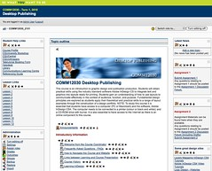
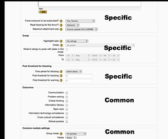
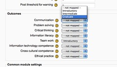
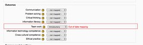

---
categories:
- alignment
date: 2010-05-19 21:05:17+10:00
next:
  text: Draft chapter 4 of the thesis is up
  url: /blog/2010/05/21/draft-chapter-4-of-the-thesis-is-up/
previous:
  text: Moving the indicators Moodle block to a factory class
  url: /blog/2010/05/17/moving-the-indicators-moodle-block-a-factory-class/
title: How curriculum mapping in Moodle might work
type: post
template: blog-post.html
comments:
    - approved: '1'
      author: Mark Del Lima
      author_email: noddy@ersatzdesign.com
      author_ip: 65.115.72.120
      author_url: http://www.facebook.com/mark.dellima
      content: 'Hello! This topic is very interesting to me. I want to put together a
        prototype for a linear, structured curriculum in Moodle. The point is not to create
        a student-facing course but to provide new teachers with a structure to follow
        or learn from. For example, Grade 2/Communication Skills/Bimester 1/Daily Lesson
        Plans 1-x. Each lesson plan would have its own page with a title, high level description,
        an activity, necessary materials and approximate duration. Additionally, there
        would be a space for other teachers to share assets, make comments about the lesson
        plan, etc. The idea is that all of this would be captured and evolve the set of
        lesson plans. New teachers could learn from experienced teachers in this collaborative
        space. Is this possible to do in Moodle or is it (as you describe) needed functionality:
        "curriculum mapping"? Any info would be *great*'
      date: '2012-02-29 09:57:41'
      date_gmt: '2012-02-28 23:57:41'
      id: '3053'
      parent: '0'
      type: comment
      user_id: '0'
    - approved: '1'
      author: David Jones
      author_email: davidthomjones@gmail.com
      author_ip: 139.86.2.14
      author_url: https://djon.es/blog/
      content: 'G''day Mark,
    
    
        Sorry for the delay in replying. Start of semester here, new job etc....
    
    
        You could probably do something like you''ve suggested in Moodle, but I don''t
        think you''ll find much active support from Moodle functionality.  At least not
        without a great deal of exaptation.
    
    
        Curriculum mapping functionality was one lever I thought could be used to achieve
        something like what you describe. But mostly because it aligned with one of the
        passing interests of senior management. Not sure it would be the best way generally
        speaking, just one way.
    
    
        Sorry I couldn''t be of more help.  Would love to hear more about any plans you
        have as you move forward. You idea gels pretty closely with what I''ve been thinking
        over the last couple of years.
    
    
        David.'
      date: '2012-03-05 09:01:18'
      date_gmt: '2012-03-04 23:01:18'
      id: '3054'
      parent: '3053'
      type: comment
      user_id: '1'
    
pingbacks:
    - approved: '1'
      author: 'Understanding what teachers do: First step in improving L&amp;T &laquo;
        The Weblog of (a) David Jones'
      author_email: null
      author_ip: 72.233.96.138
      author_url: https://djon.es/blog/2010/05/25/understanding-what-teachers-do-first-step-in-improving-lt/
      content: '[...] job I am expected to help improve the quality of teaching and learning.
        Much of what I do (e.g. Moodle curriculum mapping, the broader alignment project,
        and the indicators Moodle block) is aimed at modifying the [...]'
      date: '2010-05-25 10:17:04'
      date_gmt: '2010-05-25 00:17:04'
      id: '3050'
      parent: '0'
      type: pingback
      user_id: '0'
    - approved: '1'
      author: links for 2010-05-26 |
      author_email: null
      author_ip: 74.220.219.100
      author_url: http://okoj.net/james/?p=371
      content: "[...] How curriculum mapping in Moodle might work \xAB The Weblog of (a)\
        \ David Jones (tags: moodle) [...]"
      date: '2010-05-26 20:15:11'
      date_gmt: '2010-05-26 10:15:11'
      id: '3051'
      parent: '0'
      type: pingback
      user_id: '0'
    - approved: '1'
      author: 'Integrating alignment into Moodle and academic practice: A proposal and
        a RFI &laquo; The Weblog of (a) David Jones'
      author_email: null
      author_ip: 72.233.96.146
      author_url: https://djon.es/blog/2010/07/09/integrating-alignment-into-moodle-and-academic-practice-a-proposal-and-a-rfi/
      content: '[...] proposal is based on previous ideas posted here. At the core is
        the idea of how curriculum mapping might work in Moodle. However, the intent is
        to do much more than simply modify Moodle. The broader aim is to modify the [...]'
      date: '2010-07-09 09:26:34'
      date_gmt: '2010-07-08 23:26:34'
      id: '3052'
      parent: '0'
      type: pingback
      user_id: '0'
    
---
The purpose of this post is to provide a concrete description of how curriculum mapping of a Moodle course might work. The hope is that this will enable a broader array of people to comment on the approach and, in particular, identify flaws or problems. So, please comment.

This is being done as part of the [alignment project](/blog/2010/05/13/more-thinking-about-the-alignment-project/) and picks up from some [earlier examination](/blog/2010/03/23/first-step-in-moodle-curriculum-mapping/) of Moodle's existing outcomes feature.

### Overview

The aim is to modify Moodle (as little as possible) to enable teaching staff to perform two tasks:

1. Map how well the activities, resources and assessment within their Moodle course aligns with a set of outcomes.  
    Related to this task is the ability to maintain this mapping as the course is modified.
2. Use the alignment information about their course (and other courses) to enhance their course.

Each of those two tasks is expanded below.

### Implementation

The implementation suggested below is based on ideas from Moodle's [existing support for Outcomes](http://docs.moodle.org/en/Outcomes). Some of the following screen shots are using that existing support, some are slightly modified. Moodle's existing support for outcomes (or competencies) is in terms of tracking how students are going in achieving specific outcomes or competencies. Rather than individual students, this project is mapping the activities, resources and assessments against outcomes. But the principle is basically the same.

### Mapping

This task has the following steps (which are explained below):

- Specifying the outcomes.
- Mapping an activity/assessment/resource against outcomes.
- Maintaining the mapping.

There is also the problem of whether or not a Moodle course site can be used to map everything about a course.

#### Specifying the outcomes

The first step is specify which outcomes courses will be mapped against. Moodle supports two "types" of outcomes:

- "standard" outcomes; and  
    These would be created at the institution level and able to be used across all Moodle course sites for that installation.
- course outcomes.  
    These are added to a specific course and can only be used within that course.

Outcomes are placed into Moodle by direct entry via the Moodle interface or uploading a CSV file. Important or interesting values for an outcome include:

- Both a full and short name.
- A description of the outcome.
- The scale to be used for measuring the outcome.

[Scales](http://docs.moodle.org/en/Scales) are used by Moodle to evaluate or rate performance. By default this is a numeric value, however, Moodle supports the creation of custom scales. For example, the [scales Moodle page](http://docs.moodle.org/en/Scales) talks about the cool scale that consists of the the values: Not cool, Not very cool, Fairly cool, Cool, Very cool, The coolest thing ever!

My [current institution](http://www.cqu.edu.au/) is currently rolling out its graduate attributes. There are eight graduate attributes, each of those could be loaded as a standard outcome in Moodle. The institution is currently using three levels - introductory, intermediate and graduate - and has created descriptions of these levels for each attribute. These could form the basis for a scale for each attribute/outcome.

The following is an example CSV file that can be uploaded into Moodle to achieve this.

\[sourcecode lang="text"\] outcome\_name;outcome\_shortname;outcome\_description;scale\_name;scale\_items;scale\_description Communication;comm;"Described here http://dmai.cqu.edu.au/FCWViewer/view.do?page=7949";"CQU Graduate Attributes (Communication)";"Introductory - Use appropriate language to describe/explain discipline-specific fundamentals/knowledge/ideas (C2), Intermediate - Select and apply an appropriate level/style/means of communication (C3), Graduate - Formulate and communicate views to develop an academic argument in a specific discipline (A4)"; Problem solving;ps;"Described here http://dmai.cqu.edu.au/FCWViewer/view.do?page=7949";CQU Graduate Attributes (Problem solving);"Introductory - Manage time and prioritise activities within the University’s framework for learning (C3), Intermediate - Make decisions to develop solutions to given situations/questions (C5), Graduate - Formulate strategies to identify, define and solve problems including, as necessary, global perspectives (P5)"; \[/sourcecode\]

#### Mapping against outcomes

Let's start with an example Moodle course site with "editing turned on". With "editing turned on" you get a collection of additional icons next to just about every element of the site. See the following image (click on it to see a larger version).

Can you see the icon that looks like a hand holding a pen? This is the "edit" icon. If you click on this icon you get taken to the edit page for that item of the Moodle course site. An edit page for a Moodle item contains a number of components specific to the item, and a number of components common to all items. The following image is a portion of the edit page for a Moodle discussion forum with some additional labels added to show the specific and common components.

Did you spot the "Outcomes" component of the above edit page? It showed a list of "outcomes" which match the graduate attributes of my [current institution](http://www.cqu.edu.au/). Against each "outcome" there was a check box. To "map" this discussion forum against a graduate attribute, you simply check the appropriate box. It would be not a great stretch to think that "Communication" and "Team work" might be appropriate.

**Important:** This is all in Moodle now. No additions needs.

The "on" or "off" nature of the check box is very limited. This is due to the purpose Moodle's current outcome support is meant to fulfill. For curriculum mapping you would want something more like the following.

The above has two main changes:

1. Addition of the question mark icon.  
    In Moodle practice clicking on the question mark gives you help. In terms of outcomes for curriculum mapping I would expect that at the least this would explain the outcome (in this case a graduate attribute) and the scale being used. It might include examples and might include a link to talk to a real person.
2. Replace the checkbox with the scale.  
    In this case it's showing a drop box next to each outcome/attribute. These drop boxes, as shown by the box next to "Communication", contains the three level scale being used by my current institution.

There is a lot more you could do with this particular interface, but the basic point is that when a teacher is editing or creating a new item for a Moodle course site, they can map that item against the course outcomes at the same time.

#### Maintaining the mapping

Following on from the last point, the fundamental idea of this project is that a mapping of the alignment within a course site is maintained all of the time. It's not something done every now and then because an accrediting body is visiting. The idea is that once a course site is mapped, maintaining the mapping fits into normal academic practice. For example, common practice at my institution is that each offering of a course does not start with a brand new, empty Moodle course site. Instead, the previous course offering is copied over for the next term and then edited.

With the suggested changes, the copying of the course site would also copy the mapping. So rather than mapping the entire course site all over again, the teacher only needs to map the new items added to the site or modify the mappings of any items they might change.

The new "mapping" features of Moodle should encourage/warn the teacher when the alignment is no longer correct. The following image is an example of what a teacher might see if they have changed the Moodle item, but not updated the outcomes/alignment mapping.

#### Map everything?

There's an assumption in the above that by mapping everything item in a Moodle course site you are considering everything about the course. It's a somewhat faulty assumption because most Moodle course sites are at best a supplement to what happens face-to-face or via other media. If this idea is to work, then thought would have to be given to how you design a Moodle course site that captures all aspects of a course.

This is by no means a simple task or one without potential problems. However, I do think that supporting people to collaborate about this question in the context of considering overall course alignment will allow interesting and useful approaches to develop. Approaches that could potentially improve the quality of Moodle course sites.

But this is something that would need to be tested.

### Using the information

The previous section gave an overview of how the mapping of course alignment would be performed. This is only the first part of this project. The next, and potentially more interesting, step is what happens when people start using the availability of this information to inform quality enhancement of courses.

What people might do with this information is not something I think you can predict. The way the project was initially framed was to allow these potential uses to flow from action research cycles. However, there have been some initial ideas proposed. The following describes those which I think are some of the possibilities that are the most generative. i.e. the following ways of using this information will generate more interesting applications of or response to this information.

The three uses I talk about below are:

- Visualising the alignment.
- Sharing the alignment.
- Contextualise L&T support.

#### Visualising the alignment

The simplest use would be for a teacher taking on a course to be able to see how aligned (or not) a course is. The following is the type of visualisation that might be used. It's taken from [Lowe and Marshall](http://www.ascilite.org.au/conferences/perth04/procs/lowe-k.html) (2004) and a tool developed at Murdoch University. Each graduate attribute has 4 graphs representing objectives, learning activities, assessments and contents, the size of the graph represents how often/much the attribute is covered by those course elements.

!!! warning "Broken image link"

In the above image it's visible that the "Ethics" graduate attribute is quite heavily covered in course objectives, somewhat in course contents, a bit less in assessment, but is not covered at all by learning activities. One of the propositions underpinning the project is that explicit representations of alignment problems is likely to encourage teaching staff to fix the problem (see the contextualise L&T support section for more on this). This type of visualisation could be especially helpful for new or casual teaching staff who taken on a new course for the first time.

A Moodle implementation could be modified to send reminders to teaching staff about apparent misalignment.

#### Share the alignment

Making the level of alignment within a course explicit to the staff teaching the course is only the first step. A common problem being faced by degree programs is preventing duplication of content or content holes. If all courses within a program are using this feature then it's fairly simple to share the alignment of multiple courses into a form that can be shared. The following is another example from Lowe and Marshall (2004) and shows a visualisation for multiple courses.

!!! warning "Broken image link"

This type of visualisation could be factored into quality assurance processes for a program at the start of a term. The program's teaching group could adopt a collaborative process at the start of term to address any holes or duplications.

The sharing could also be more ad hoc. The visualisation of the course (the first image from Lowe and Marshall) could be extended to provide links to examples. i.e. when you see a visualisation like the above that shows that the Ethics graduate attribute is not covered by any learning activities there could be a link to other courses that do have activities covering the ethics graduate attribute. Teaching staff could follow these links to view those activities as a way of getting ideas. Which courses show up via these links could be chosen via a number of ways.

The alignment could also be shared with students. Adding the ability to view the contents of a site structured using the outcomes would be quite easy. Lots more interesting applications could be developed.

#### Contextualise L&T support

Above it was suggested that the visualisations of alignment could, when problems are identified, provide links to courses that can be used as examples. The visualisations could also provide links to documents, presentations, discussions and people who could provide specific support. This could help curriculum designers and related L&T support folk contextualise their assistance in a very specific way. An approach that moves towards achieving Boud's (1999) argument that L&T support needs to be embedded within the context of academic work, that it needs to occur in or close to the teaching academics sites of practice.

### References

Boud, D. (1999). Situating academic development in professional work: Using peer learning International Journal for Academic Development, 4(1), 3-10.

Lowe, K., & Marshall, L. (2004). Plotting renewal: Pushing curriculum boundaries using a web based graduate attribute mapping tool. Paper presented at the 21st ASCILITE Conference, Perth.