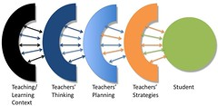
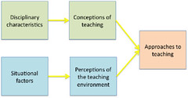

The following is an attempt to explain the initial description and rationale of an exploratory research project (perhaps ethnographic, [narrative inquiry](http://knowmansland.com/learningpath/?p=502) or some similar qualitative methodology) aimed at understanding what teachers/academics actually experience within a particular environment during a single term. The assumption is that by better understanding the lived experience of the teaching staff you can better understand why (or why not) teaching is likely to improve.

In terms of suggestions and advice, I'm really keen to hear from people who might have some insights to share around:

- methodology;  
    What good methods are there to gain the type of insight I'm interested in without being to onerous for the academics involved?
- related literature;  
    Where is the literature that talks about this sort of approach within university teaching, or perhaps more broadly in education?

### Why? - The personal aspect

I'm interested in this because I coming to the opinion that it is the quality, quantity and diversity of the connections within the network of people, policies, technologies and other system objects that enable or constrain the ability for a university to improve it's teaching and learning. In particular, the connections which surround the teaching staff and students define what they experience and that experience impacts what they are likely to do (or not). My bias is that I think the network/environment surrounding most staff/students is actively preventing improvement in learning and teaching.

In my [current job](/blog2/2009/08/20/elearning-and-innovation-specialist-report-1-4-20-august)/ I am expected to help improve the quality of teaching and learning. Much of what I do (e.g. [Moodle curriculum mapping](/blog2/2010/05/19/how-curriculum-mapping-in-moodle-might-work/), the [broader alignment project](/blog2/2010/05/13/more-thinking-about-the-alignment-project/), and [the indicators Moodle block](/blog2/2010/05/09/requirements-for-an-indicators-moodle-block/#comment-3164)) is aimed at modifying the environment/network around teaching staff to enable and encourage them to improve their teaching. But this is only half the equation.

_Aside:_ My focus is on teaching staff. It is not on students. While I agree 100% that student-centered approaches (there's a lot of "buzz word" around that phrase, I hesitate to use it) to learning are the most effective, I don't teach students. My job is to help other academic staff improve what they are doing, to create an environment in which they start to think that student-centered learning is not only a good thing (which many of them do) but that the environment actually helps them implement such approaches, rather than actively hinders it. I've seen too many attempts to encourage student-centered approaches that ignore the teaching staff and consequently get hamstrung from [reactance](http://en.wikipedia.org/wiki/Reactance_%28psychology%29).

The other half of the equation is getting a good understanding of the environment/network as experienced by the teaching staff. Up until now I've been relying on my recent experience of the same environment (which is now 3+ years old) and ad hoc discussions with colleagues (which is limited by all sorts of bias). This understanding is necessary because of the need to:

- Be more aware of what some of the potential problems or needs are that need addressing.
- Design the interventions to address those problems.
- Understand the impact and ramifications of those interventions.
- Provide evidence to others of the problems within the environment and the value of the interventions.

### Why? - the research perspective

So that's the personal perspective, what about the research perspective?

First off, one of the "buzzwords" within education fields at the moment is distributive leadership. Here's something I wrote describing distributive leadership in the [alignment project blurb](/blog2/2010/05/13/more-thinking-about-the-alignment-project/)

> Parrish et al (2008) define distributive leadership as the distribution of power through a collegial sharing of knowledge, of practice, and reflection within a socio-cultural context. Zepke (2007) argues that this is more than the delegation of tasks and responsibilities, and more than collaborative practice. Spillane et al (2004, p. 9) argue that, based on its foundations in distributed cognition and activity theory, distributive leadership is not limited to people, but can also be attributed to artefacts such as language, notational systems, tools and buildings. Leadership activity is distributed through an interactive web of actors, artefacts and situation (Spillane et al., 2004, p. 20).

Spillane et al (2004) go onto define leadership as

> the identification, acquisition, allocation, co-ordination, and use of the social, material, and cultural resources necessary to establish the conditions for the possibility of teaching and learning.

i.e. the identification of the social, material and cultural resources within an organisation is an important part of creating the conditions for teaching and learning.

Support for the importance of the environment in terms of its impact on learning outcomes comes from 30 years of empirical research by Prosser et al (2003) and Ramsden et al (2007) which has produced abundant empirical inquiry and theory that links the quality of student learning outcomes with: (1) the approaches to learning taken by students; (2) the students' perceptions of the learning context; and (3) the approaches to teaching practiced by teaching staff. In turn, this research confirms the findings of other leadership studies by illustrating that variation in teaching approaches is associated with perceptions of the academic environment (Ramsden et al., 2007).

In terms of models of what we know about teaching and learning, the importance of the environment and context is illustrated by Trigwell's (2001) model of teaching (click on the images to see larger versions)

And by Richardson's (2005) model of teachers' approaches to teaching

While pedagogue's are likely to adopt teaching approaches that are consistent with their conceptions of teaching there may be differences between espoused theories and theories in use (Leveson 2004). While pedagogues may hold higher-level view of teaching other contextual factors may prevent use of those conceptions (Leveson 2004). Environmental, institutional, or other issues may impel pedagogues to teach in a way that is against their preferred approach (Samuelowicz and Bain 2001). While conceptions of teaching influence approaches to teaching, other factors such as institutional influence and the nature of students, curriculum and discipline may also influence teaching approaches (Kember and Kwan 2000). Prosser and Trigwell (1997) found that pedagogue's with a student-focused approach were more likely to report that their departments valued teaching, that their class sizes were not too large, and that they had control over what was taught and how it was taught. Other contextual factors that frustrate pedagogues' intended approaches to teaching may include senior staff with traditional teacher-focused conceptions raising issues about standards and curriculum coverage and students who induce teachers to adopt a more didactic approach (Richardson 2005). In addition, teachers who experience different contexts may adopt different approaches to teaching in those different contexts (Lindblom-Ylanne, Trigwell et al. 2006).

i.e. the perceptions of the environment in which they teach held by teaching staff have a direct effect on how they teach. If you want to improve the quality of teaching within a university you have to understand how the academics perceive/experience the environment.

Most of the literature I've seen to date by Prosser and his colleagues has been mostly survey based. I'm interested in a more detailed insight into the actual lived experience, rather than ad hoc recollections filtered through survey questions.

### What

To my way of thinking this has to be a exploratory, qualitative and ethnographic investigation. I'm looking to gain insight into the day to day lived experience of academics and how they react to that experience, what it does to them. I need to read up some more. What follows are some initial thoughts.

Murthy (2008) describes how good ethnography "effectively communicates a social story, drawing the audience into the daily lives of the respondents". This is what I'm trying to get to, I want the stories of the daily lives of the academics around learning and teaching. Murthy (2008) goes on to give an overview of digital ethnography, but nothing immediately helpful...but it seems connected to what I was thinking of doing. Hookway (2008) also looks promising but the site is down for scheduled maintenance.

### How

So, without much reading, I've been thinking about starting this with a small exploratory study along the following lines:

- Approach half a dozen academics from my current institution.  
    Selected to be somewhat diverse in terms of likely experience in terms of location, subject etc.
- Invite them to be co-researchers.  
    I'd rather they were collaborators than research subjects. I want them to have greater ownership and motivation to be involved. I want the value of their insight not just into the everyday experience of teaching, but also research.
- For a single teaching term, ask them to contribute to a blog stories about their experience with teaching.  
    Whenever they do something around teaching, something different, something frustrating etc. write a story on the blog. As short of as long as they like. It might be a personal blog, or it might be a group blog. It might well have to be a private blog.
- At the end of term, employ various methods to analyse the data.
- Present it locally and publish it.

### References

Biggs, J. (1996). "Enhancing teaching through constructive alignment." Higher Education 32(3): 347-364.

Kember, D. and K.-P. Kwan (2000). "Lecturers' approaches to teaching and their relationship to conceptions of good teaching." Instructional Science 28(5): 469-490.

Leveson, L. (2004). "Encouraging better learning through better teaching: a study of approaches to teaching in accounting." Accounting Education 13(4): 529-549.

Lindblom-Ylanne, S., K. Trigwell, et al. (2006). "How approaches to teaching are affected by discipline and teaching context." Studies in Higher Education 31(3): 285-298.

Hookway, N. (2008). "'Entering the blogosphere': some strategies for using blogs in social research." Qualitative Research 8(1): 91-113.

Murthy, D. (2008). "Digital Ethnography." Sociology 32(5): 837-855.

Parrish, D., G. Lefoe, et al. (2008). The GREEN Resource: The development of leadership capacity in higher education. Wollongong, CEDIR, University of Wollongong: 64.

Prosser, M. and K. Trigwell (1997). "Relations between perceptions of the teaching environment and approaches to teaching." British Journal of Educational Psychology 67(1): 25-35.

Prosser, M., P. Ramsden, et al. (2003). "Dissonance in experience of teaching and its relation to the quality of student learning." Studies in Higher Education 28(1): 37-48.

Ramsden, P., M. Prosser, et al. (2007). "University teachers' experiences of academic leadership and their approaches to teaching." Learning and Instruction 17(2): 140-155.

Samuelowicz, K. and J. Bain (2001). "Revisiting academics' beliefs about teaching and learning." Higher Education 41(3): 299-325.

Spillane, J., R. Halverson, et al. (2004). "Towards a theory of leadership practice: a distributed perspective." Journal of Curriculum Studies 36(1): 3-34.

Trigwell, K. (2001). "Judging university teaching." The International Journal for Academic Development 6(1): 65-73.

Zepke, N. (2007). "Leadership, power and activity systems in a higher education context: will distributive leadership server in an accountability driven world?" International Journal of Leadership in Education 10(3): 301-314.