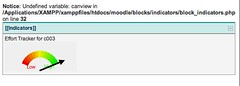
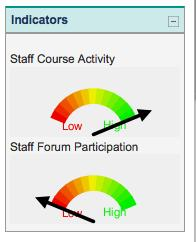
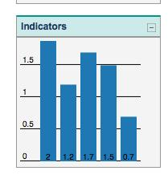

This post is a summary of work being done to update the [Moodle indicators block](/blog2/2010/05/09/requirements-for-an-indicators-moodle-block/) so that it can support multiple visualisation tools and approaches.

### Problem

The indicators block is aimed (at least for me) to be a way in which various visual insights (indicators) about what is going on within Moodle can be shown to students and staff. [Col](http://beerc.wordpress.com/) initial indicators within the block were generated using the [Google chart tools](http://code.google.com/apis/charttools/). This worked really well and I think we've only scratched the surface with those tools. However, there appears to be a need to support multiple visualisation approaches, reasons might include:

- the visualisation tool doesn't provide necessary functionality; and
- need for a multiple visualisations for the same data.

A simple example of this comes from the only "data" the indicators block currently visualises - the level of activity in a course site by staff or students. Currently this is shown as a "dial" or speedo (see below). The dial ranges from red through to green and a black arrow indicates the level of activity by the participant.

Alan [commented](/blog2/2010/05/13/getting-started-with-cols-indicators-block/#comment-3182) that he didn't like the dial/meter visualisation in that it seems to encourage a simplistic "more is better" perception. Alan would prefer some sort of traffic light visualisation. After a very quick look, I don't think the Google chart tools provide a traffic light visualisation. Regardless, you get the idea.

Rather than force someone to use only one visualisation, it would seem better if the Moodle indicators block allowed people to choose (and implement) the ones they preferred. i.e. support for multiple visualisations.

### What's been done

The aim here is to complete and describe three tasks that enable multiple visualisations. These tasks are:

1. Move the Indicators to a Model/View pattern.  
    The intent is to separate the calculation of the data from the visualisation. i.e. to allow multiple different visualisations.
2. Add support for an alternate visualisation tool.  
    In this the [protovis](http://en.wikipedia.org/wiki/Protovis) library.
3. Implement a couple of different visualisations of existing data.  
    Essentially to test and illustrate the use of the Model/View patterns.

Most of these have been done, but only in initial stages for staff.

### Model/View

For each indicator there are two main tasks it must perform:

1. Generate/retrieve the data to be visualised.
2. Generate the visualisation.

The aim here is to separate out those two tasks into two classes. A model and a view. This means that the existing indicator code that looks like this.

\[sourcecode language="php"\] $indicator = IndicatorFactory::create($context); $this->content->text = $indicator->generateText(); \[/sourcecode\]

Will get modified to something like this.

\[sourcecode language="php"\] $model = IndicatorFactory::createModel( $context ); $view = IndicatorFactory::createView( $model, $context ); $this->context->text = $view->generateVisualisation(); \[/sourcecode\]

The factory class is now responsible for generating both the model and the view. The above is likely to change overtime. For example, rather than passing just $context, there might be other information e.g. user preferences etc.

Let's see if I can get this to work with some testing.

### Adding a protovis visualisation

Aim here is to create a 2nd visualisation of the existing indicator using Protovis. Using the protovis view will initially be hard coded for some users, eventually to be replaced with some preferences or rotation approach.

Running out of time at the moment, so I'm going to put in a dummy protovis view that simply shows a bar graph. Doesn't use the data from the model at all.

So, here's what the staff indicator looks like with the google chart view.

The bit of the factory that generates this view looks like this

\[sourcecode lang="php"\] if ( has\_capability( 'moodle/legacy:teacher', $context ) || has\_capability( 'moodle/legacy:editingteacher', $context ) ) { require\_once( $CFG->dirroot.'/blocks/indicators/staff/activity/google\_view.php'); return new activityView( $model ); } \[/sourcecode\]

Eventually, rather than a straight use of require...google\_view this would eventually be replaced by some algorithm that figures out which view the user wants. But, for now, I've introduced the following which randomly selects which view to use.

\[sourcecode lang="php"\] $view = "/blocks/indicators/staff/activity/google\_view.php"; if ( rand( 0, 1 ) == 1 ) { $view = "/blocks/indicators/staff/activity/protovis\_view.php"; } require\_once( $CFG->dirroot.$view ); return new activityView( $model ); \[/sourcecode\]

The dummy protovis view looks like this

### To do

Need to update the student view to use this model, need to start generating some different models and views.

Also need to think about how the models can be used to do some "caching" of database content.