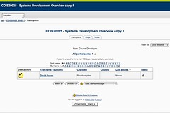

---
categories:
- bim
- moodle
date: 2010-05-28 10:22:31+10:00
next:
  text: Focusing on integration - chapter 5
  url: /blog2/2010/05/30/focusing-on-integration-chapter-5/
previous:
  text: Fixing BIM&#039;s back up and restore
  url: /blog2/2010/05/27/fixing-bims-back-up-and-restore/
title: One potential approach to provide a Moodle email merge facility
type: post
template: blog-post.html
comments:
    []
    
pingbacks:
    - approved: '1'
      author: The Weblog of (a) David Jones
      author_email: null
      author_ip: 66.135.48.183
      author_url: https://djon.es/blog/2010/05/30/2933/
      content: '[...] an attempt to use user/messageselect.php with BIM in an attempt
        to move towards implementing an email merge facility for [...]'
      date: '2010-05-30 21:34:04'
      date_gmt: '2010-05-30 11:34:04'
      id: '3056'
      parent: '0'
      type: pingback
      user_id: '0'
    - approved: '1'
      author: On the potential flexibility of open source LMS and its limits &laquo; The
        Weblog of (a) David Jones
      author_email: null
      author_ip: 72.233.61.94
      author_url: https://djon.es/blog/2011/02/13/on-the-potential-flexibility-of-open-source-lms-and-its-limits/
      content: '[...] to members of a group. There might even be a way to customise that
        email to some extent (there is a bulk email facility in Moodle 1.9, but, from
        memory, it seems somewhat limited). There is also probably a way to do a [...]'
      date: '2011-02-13 17:25:18'
      date_gmt: '2011-02-13 07:25:18'
      id: '3057'
      parent: '0'
      type: pingback
      user_id: '0'
    - approved: '1'
      author: Types of e-learning projects and the problem of starvation | The Weblog
        of (a) David Jones
      author_email: null
      author_ip: 192.0.101.73
      author_url: https://davidtjones.wordpress.com/2015/06/16/types-of-e-learning-projects-and-the-problem-of-starvation/
      content: '[&#8230;] and perhaps other details about their participation in the course.
        Moodle doesn&#8217;t appear to provide an email merge facility. In theory Office
        provides some functionality this way but I use a Mac and the Office stuff never
        [&#8230;]'
      date: '2015-06-16 10:56:31'
      date_gmt: '2015-06-16 00:56:31'
      id: '3058'
      parent: '0'
      type: pingback
      user_id: '0'
    
---
One of the issues I have to address with the [BIM Moodle module](/blog2/research/bam-blog-aggregation-management/) is the provision of an [email merge facility](http://github.com/djplaner/BIM/issues#issue/4). I (and a couple of other people I know) haven't been able to find how to do this within Moodle. The following outlines one proposal for how this might be done within Moodle 1.9.

I'm very keen to hear from more experience Moodle folk about whether or not this type of service already exists within Moodle.

It's likely that I will attempt to implement aspects of this approach in the next week to extend BIM.

### What is email merge

Essentially it is a method to send the same message to multiple recipients, however, each message can be customised to include information specific to each recipient. There are two/three main tasks to email merge:

- Selecting the recipients.  
    Specify the list of folk you want to send the message to.
- Create the message.  
    Enter the message, including support for specifying the information that will be specific to each person.
- Manage the sending/re-sending of the message.  
    Tracking who has received the message, specifying whether to try again automatically etc.

The following is a screen shot (click on it to see a bigger version) of the manage message screen from the Webfuse email merge facility originally implemented by [Nathaniel](http://au.linkedin.com/pub/nathaniel-fitzgerald-hood/11/263/2b2) in 2002.

. It has a simple textbox for the message and supports attachments. The "Add tag to message" component allows the user to select some "tags" from a drop box. In Webfuse the tags include parts of the students' name, email address, student id, and program they were studying.

### Why use it

For most teaching staff using Webfuse email merge was used to send messages to groups of students to welcome and orient them to the course, remind them that the assignment was due soon and pointing to resources, and asking them why they didn't submit the assignment. In my experience, an email merge appears to be more personal and that generates a greater level of connection with the student. Many, if not all, of the students realised it was a bulk email, but the private touch helped.

### What's available in Moodle?

I'm still fairly new to Moodle from a user perspective, and the only functionality I've been able to find that comes close is the "Message course users" functionality that is available under course participants. When you view the participants in a course you can select some of them and then choose to "add /send message" - see the following.

Then you see a typical HTML editor with some additional guidance, plus a list of selected users which you can further edit. See the following.

In terms of the main tasks for email merge there are some limitations:

- Selecting the recipients.  
    You can only select the recipients from the entire list of people within a course. This is limiting in two ways. First, you may wish to include recipients that cross a course boundary. Second, you may wish to start with an existing list of recipients, not select from the entire list of course participants.
    
    For example, you may wish to use email merge to send a message to all students who haven't completed an assignment. Hence, from the gradebook you'd like to be viewing those students and have a link "Mail merge" that allows you to select all those students.
    
- Create the message.  
    Two limitations here, no support for attachments, and no support for personalisation. Though it does have the HTML editor.
- Manage sending.  
    Doesn't appear to have support for this. So, you can't schedule the message to be sent at a specific time or on a specific event.

### Improving recipient selection

Going beyond a course boundary is a little more difficult, however, improving selection within a course could be possible. The form that displays the message takes the list of recipients as a parameter - it appears in session data - theoretically it might be possible for other Moodle extensions to generate this session data and call the form.

### Improving message creation

The main missing piece here is the ability to include "tags" and get them replaced with personal information for each recipient. There are three broad tasks here:

- Specifying the tags and where the information is.
- Providing an interface that allows message senders to include tags in a message.
- As each message is being sent, replace the tags with the actual personal information for the specific recipient.

The last two will likely require modifications to the file moodle/user/messageselect.php which seems to implement most of this

- message edit screen;  
    Need to add support to describe the available tags and allow the user to insert them in the message.
- preview screen;  
    Allows the user to see the message before it is sent. Add to this the ability to see the tags replaced with specific information from a user.
- sending the message.  
    i.e. where the tags get replaced with each recipients' information.

#### Specifying the tags

Two ways to do this, simple and complex.

The simplest way to do this would be to restrict it to just standard Moodle system information about users such as name, email address and more standard extensions such as the gradebook. This would mean a "simple" change to to moodle/user/messageselect.php

A more complicated approach would be to allow greater support for Moodle's extensibility. i.e. allow each activity/block define it's own set of tags and have moodle/user/messageselect.php be able to handle those. For example,

- BIM could define it's own set of tags (e.g. REGISTERED\_FEED for the student's registered blog feed).
- When a user clicks on email merge from BIM, it would call messageselect and pass the list of users selected from BIM (e.g. all students with unregistered blogs).
- messageselect will know which extension called it and check to see if that extension defines its own tags.
- messageselect would then use those tags (and how to get the information for each user) to modify the edit screen, the preview screen and the sending of the message.