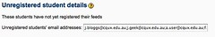
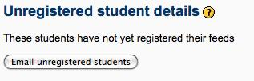

---
categories:
- bim
- elearning
- moodle
date: 2010-05-30 21:33:57+10:00
next:
  text: The need for a third way
  url: /blog2/2010/05/31/the-need-for-a-third-way/
previous:
  text: Institutional changes - 2000 and beyond - and their impact
  url: /blog2/2010/05/30/institutional-changes-2000-and-beyond-and-their-impact/
title: Adding email merge to BIM
type: post
template: blog-post.html
comments:
    []
    
pingbacks:
    - approved: '1'
      author: On the potential flexibility of open source LMS and its limits &laquo; The
        Weblog of (a) David Jones
      author_email: null
      author_ip: 72.233.69.93
      author_url: https://djon.es/blog/2011/02/13/on-the-potential-flexibility-of-open-source-lms-and-its-limits/
      content: '[...] the existing Moodle bulk-email facility (or perhaps adding a wrapper
        around it like I did with bim) to use this database table to send personalised
        emails to group [...]'
      date: '2011-02-13 17:26:16'
      date_gmt: '2011-02-13 07:26:16'
      id: '3063'
      parent: '0'
      type: pingback
      user_id: '0'
    
---
The following details an attempt to use user/messageselect.php with BIM in an attempt to move towards implementing an [email merge facility](/blog2/2010/05/28/one-potential-approach-to-provide-a-moodle-email-merge-facility/) for BIM.

### BIM passing users

The intent here is that BIM will be used to select the users and will pass it to message select. The first test will be to replace the current "unregistered users" section on "Your Students" which simply shows a list of email address which the staff member has to copy and paste into an email program. See the following screen shot (click on it to see it larger).

The idea is to replace it with a simple link that when clicked on will pass the details of the unregistered users to messageselect.php

### Parameters for messageselect

For this to work, I need to pass messageselect all the parameters it expects in the way it expects them.

First, the parameters is expects are:

- The list of user ids for the recipients.  
    This is done using checkboxes with parameter names **user_id_** where id is the Moodle user id.
- The course id.  
    **id** set to the Moodle course id.
- **formaction**  
    Seems to simply be the name of the messageselect script.
- **returnto**  
    path of script it's coming from.

### Parameter passing for message select

In terms of how to pass the data, I've tried a normal query string. But that didn't seem to create the necessary outcome.

It appears that messageselct uses the [PHP $\_POST](http://www.w3schools.com/php/php_post.asp) variable/function which is used for a form with the post method. So let's try that.

Yep, that seems to work. May be as simple as that.

Have been able to get that working, however, the "returnto" doesn't seem to work all the way done the various screens. Works on the first, but not on the last.

### bim\_email\_merge

The following is the function I've added to bim to enable the use of messageselect.php

\[sourcecode lang="php"\] function bim\_email\_merge( $ids, $course, $returnto, $button\_msg ) {

global $CFG;

print <<<EOF <form method="post" action="$CFG->wwwroot/user/messageselect.php" /> <input type="hidden" name="id" value="$course" /> <input type="hidden" name="returnto" value="$returnto" /> <input type="hidden" name="formaction" value="messageselect.php" /> <input type="submit" name="submit" value="$button\_msg" /> EOF;

foreach ( $ids as $id ) { print "<input type="hidden" name="user{$id}" value="on" />"; } print "</form>"; } \[/sourcecode\]

This function displays a submit button with a given message. If pressed the form sends a list of Moodle user ids ($ids) to messageselect. At this stage the user can create the message, choose to remove some users and then send the message. I think.

Implemented in BIM, it looks like the following.

