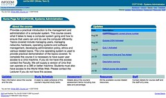

---
categories:
- chapter-5
- design-theory
- elearning
- phd
- thesis
- webfuse
date: 2010-06-07 16:29:19+10:00
next:
  text: Should academics manually create course websites?
  url: /blog2/2010/06/07/should-academics-manually-create-course-websites/
previous:
  text: The confusion of small and big changes
  url: /blog2/2010/06/07/the-confusion-of-small-and-big-changes-input-versus-output-and-types-of-systems/
title: Default course sites and wizards
type: post
template: blog-post.html
comments:
    []
    
pingbacks:
    - approved: '1'
      author: Should academics manually create course websites? &laquo; The Weblog of
        (a) David Jones
      author_email: null
      author_ip: 74.200.247.107
      author_url: https://djon.es/blog/2010/06/07/should-academics-manually-create-course-websites/
      content: '[...] The Weblog of (a) David Jones Another voice in the blogosphere    &laquo;
        Default course sites and&nbsp;wizards [...]'
      date: '2010-06-07 20:36:44'
      date_gmt: '2010-06-07 10:36:44'
      id: '3087'
      parent: '0'
      type: pingback
      user_id: '0'
    - approved: '1'
      author: Course websites and &#8220;libertarian paternalism&#8221; &laquo; The Weblog
        of (a) David Jones
      author_email: null
      author_ip: 72.233.96.144
      author_url: https://djon.es/blog/2010/06/08/course-websites-and-libertarian-paternalism/
      content: '[...] model that evolved in the early part of this decade could be described
        as a &#8220;libertarian&#8221; paternalist [...]'
      date: '2010-06-08 09:28:34'
      date_gmt: '2010-06-07 23:28:34'
      id: '3088'
      parent: '0'
      type: pingback
      user_id: '0'
    - approved: '1'
      author: Academics, course websites and power laws &laquo; The Weblog of (a) David
        Jones
      author_email: null
      author_ip: 72.233.104.119
      author_url: https://djon.es/blog/?p=3009
      content: '[...] focuses on statistics about how often an academic modified a course
        site. The Webfuse model was to automatically create a default course site for
        every course offered by the faculty. Academics could then modify that site as
        much, or as [...]'
      date: '2010-06-14 21:42:45'
      date_gmt: '2010-06-14 11:42:45'
      id: '3089'
      parent: '0'
      type: pingback
      user_id: '0'
    - approved: '1'
      author: Default course sites and wizards &#8211; version 2.0 &laquo; The Weblog
        of (a) David Jones
      author_email: null
      author_ip: 74.200.243.222
      author_url: https://djon.es/blog/2010/06/25/default-course-sites-and-wizards-version-2-0/
      content: '[...] course sites and wizards &#8211; version&nbsp;2.0  This is the second
        version of an earlier post. As I wrote more of the chapter I felt the need to
        revisit and expand the idea (though the [...]'
      date: '2010-06-25 11:06:38'
      date_gmt: '2010-06-25 01:06:38'
      id: '3090'
      parent: '0'
      type: pingback
      user_id: '0'
    - approved: '1'
      author: What might the 3 levels of organisational culture reveal about university
        e-learning | The Weblog of (a) David Jones
      author_email: null
      author_ip: 66.155.38.18
      author_url: https://davidtjones.wordpress.com/2015/01/20/what-might-the-3-levels-of-organisational-culture-reveal-about-university-e-learning/
      content: '[&#8230;] 1997 through 2004 I helped design, implement and support one
        approach to an institution doing something about this. Since then I&#8217;ve made
        the argument for this. [&#8230;]'
      date: '2015-01-20 10:54:19'
      date_gmt: '2015-01-20 00:54:19'
      id: '3091'
      parent: '0'
      type: pingback
      user_id: '0'
    
---
There is now [a version 2.0](/blog2/2010/06/25/default-course-sites-and-wizards-version-2-0/) of this section.

The following is the next section from chapter 5 of [my thesis](/blog2/research/phd-thesis/). This one describes attempts made to provided a functionality within Webfuse that improved the quality of the default course websites, without increasing workload for academic staff and while retaining some elements of autonomy.

Sadly (to me anyway) the institution in which this work evolved has gone backwards.

#### Default course sites and wizards

As described in chapter 4, the initial assumptions built into Webfuse was that a course website would simply be an empty page. From this single, empty page it was assumed that each individual teaching staff member would then draw on the variety of page types (hypermedia templates) provided as course website building blocks by Webfuse to construct their course website. Very quickly it became obvious that the majority of academics did not have the time, inclination, or skills to engage in this sort of design and construction process. Those staff that did have this combination of skills often wanted to use other tools or approaches with which they were already familiar.

In addition, it became obvious that a significant percentage of the tasks associated with creating a course website were fairly low-level tasks, often involving reuse of information and resources already provided. These observations led to the practice where support staff created initial default course sites by manually editing the initial empty course sites and uploading standard information (e.g. course synopsis, staff contact details etc). However, these course sites were of limited quality, failed to encourage further enhancement from academic staff, and required significant workload from faculty administrative staff. It is within this context that it became necessary to better support the concept of a course and encourage greater engagement with course sites from academic staff.

During 1999 an initial attempt at addressing this problem was commenced as the "Wizard" project. Briefly described in Jones and Lynch (1999) the Wizard project planned to provide an interface based on the Wizards common to Widows programs of the late 1980s. Such an interface would walk the academic through a series of questions about their course, the provided answers would be combined with the Webfuse page types to create a course site. A particular focus of this plan was an adopter-focused development approach, however, due to organisational uncertainty and limited development resources, this project did not move beyond the prototype and planning stage.

The next attempt to address this problem was the creation of an automated and expanded default course site approach for the second term of 2001. This coincided with the broader roll out of CQU's new student records system. This new default course site approach was made possible by the expanded Infocom web team, the improvements in the Webfuse process and code-base described in previous sections, and was the primary task of the author during the first half of 2001. The automated and expanded default course site approach evolved to consist of the following components:

1. An expanded default course site;  
    As described in more detail below, the single empty page default course site was replaced with a much expanded site consisting of five separate sections, containing a range of course related data and services within a re-designed interface. Each offering of every course offered by Infocom would have a new default course site.
2. Integration with existing data sources;  
    Much of the data used in the creation of the default course site was drawn upon from existing, organisational data sources created by other processes.
3. Automatic creation;  
    The creation and population of all default course sites was performed by running a script that, given the details of a specific term and year, would existing information, Webfuse page types, and related scripts and create default course sites for all courses offered by Infocom.
4. A copying process; and  
    Teaching staff could further modify the default course site by adding additional course information and services. Rather than re-add these additional features for each subsequent term a copying process was developed by which staff could specify what they would like to copy to the new course site.
5. Support for a real course site.  
    There continued to be a number of teaching staff who wished to create their own course website with other tools. Each default course site had support for an optional "real" course site This added another area of the default course site in which the staff member could place their own course site.

Figure 5.1 is the home page for a default course site from July 2001. This home page formed the top of the hierarchical structure of the default course site. Underneath the home page there were five sections:

1. Updates;  
    The updates section provided a function that allowed teaching staff to provide and store course wide updates or announcements. The titles and post dates of the most recent updates were also visible from the home page.
2. Study schedule;  
    This section provided a week by week breakdown of the course, its topics, content and assessment.
3. Assessment;  
    Provided access to details about the course assessment. By default this would summarise for each assessment item, the title, due date and percentage of the overall assessment.
4. Resources; and  
    All remaining course resources and services were made available via this section. By default this included a link to the course profile (syllabus) document, details of the course textbook(s) (including a link to the university bookshop, and, if used, a discussion forum or mailing list.
5. Staff.  
    This provided both the personal details of the staff teaching the course as well as an area restricted to the teaching staff used for discussion or sharing resources. The personal details of teaching staff included name, contact details and where available a photo. If the teaching staff in charge of a course decided to create a real course site, then a sixth section was added under the default course site home page. The teaching staff could upload and manage their real course site within this section.

Figure 5.1 – Home page for a Webfuse default course site (July 2001) - click to make bigger

.

As identified in chapter 4, since Webfuse was a faculty system, not an institution system, there were organisational, political and technical limits on how well it could be integrated with institutional systems. These limitations continued to exist post 2001. Consequently, the default course site creation process included a number of work arounds and could not achieve all of the automation and integration desired. For example, study schedules had to be manually entered, even though the course profile (syllabus) already contained such a schedule. It was not until 2008 that CQU's distance education publications process included a semi-automated process for the provision of electronic versions of course study guides.

The default course site process did create some initial and on-going disquiet around questions of academic independence, consistency and institutional identity. This was particularly a problem for academic staff wanting to create their own course sites. Of the 99 course sites created in the first term of the expanded default course site approach, 8 courses had a real course site. Table 5.4 summarises the total number of default course sites versus real course sites created by Webfuse from 2002 through 2009.

Table 5.4 - Comparison between default course sites and real course sites (2002-2009)
| Year | Total courses | Real course sites | % Real course sites |
| --- | --- | --- | --- |
| 2002 | 313 | 27 | 8.6% |
| 2003 | 305 | 29 | 9.5% |
| 2004 | 329 | 16 | 4.9% |
| 2005 | 299 | 15 | 5.0% |
| 2006 | 297 | 15 | 5.1% |
| 2007 | 251 | 4 | 1.6% |
| 2008 | 225 | 2 | 0.9% |
| 2009 | 211 | 0 | 0 |

One advantage provided by the expanded default course site approach was the ability for the institution to exercise some control over the minimum level of service provided to students. Changes to the expanded default course site occurred through two means:

1. Institutional or strategic direction; and  
    If the faculty identified some information or a service that it thought should be part of the minimum level of service to students it could implement this minimum standard across all courses via the default course site process. For example, from the second half of 2001 through 2002 all Infocom courses were required to have a course barometer (Jones 2002) to provide a mechanism to capture student feedback during a term.
2. Adopter-focused and emergent development.  
    The Infocom web team modified the default course site operation in response to lessons learned from supporting academics using the system and observing what innovative staff added to the default site. This is in line with the adopter-focused and emergent development practices discussed in previous sections.

Due to the foundation provided by the Webfuse page types and templates it was not necessary for all default course sites to have the same structure or the same look and feel. Theoretically, every course site could be completely different. The flexibility of the default course site idea was tested in 2007 with the creation of a "Web 2.0" course site (see Figure 5.2). This "Web 2.0" course site was implemented as a Webfuse default site using Webfuse page types, however, using a different appearance and structure to a normal default site. This site is a "Web 2.0" site because all of the functionality (discussion, wiki, blog, portfolio and resource sharing) were provided by freely available Web 2.0 tools hosted on external sites. Webfuse used RSS feeds generated by these external tools to create and maintain the course site. Students used these RSS feeds to remove the need to visit the course site at all.

Figure 5.2 – Web 2.0 Course site (2007)