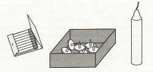
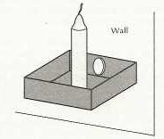

See also: [[blog-home | Home]]

A [blog post](http://www.gilfuseducationgroup.com/academic-analytics-data-rich-information-poor) on the website of [Gilfes Education Group](http://www.gilfuseducationgroup.com/) (apparently a "network of independent education experts") picks up on the [Indicators project](http://indicatorsproject.wordpress.com/) and its take on academic analytics. The post seems to largely in agreement with what we're doing and the reasons behind it.

The following seeks to pick up on a point made in the [Gilfus post](http://www.gilfuseducationgroup.com/academic-analytics-data-rich-information-poor) about the problem arising from ownership of the data and some of the other [barriers that have been proposed](/blog2/2009/12/02/barriers-to-harnessing-academic-analytics/). The argument I develop in the following that [functional fixedness](http://en.wikipedia.org/wiki/Functional_fixedness) is a major barrier to the effective appropriation of academic analytics to help improve learning and teaching.

### But first, an experiment

Imagine if you will that we're in a room together. I'm going to set you a task. Here's some matches, a box of tacks and a candle (see the image below). Your task is to attach the candle to a cork board on the wall in way that means that wax from the candle does not drip onto the table that is underneath the cork board.

How do you do it?

The solution is given an image at the end of this post.

Apparently, if I rephrase the problem solution a little to the following, it might improve your chances of success.

Here's some matches, a **box** of tacks and a candle (see the image below). Your task is to attach the candle to a cork board on the wall in way that means that wax from the candle does not drip onto the table that is underneath the cork board.

### Functional fixedness

If you're anything like my brother-in-law on whom I tested this out in person, you did not arrive at the solution quickly, if at all. This experiment is called [the candle problem](http://en.wikipedia.org/wiki/The_Candle_Problem) and has been used to demonstrate the problem of [functional fixedness](http://en.wikipedia.org/wiki/Functional_fixedness).

Functional fixedness suggests that you have fixated on the design function of the object - i.e. the box of tacks is designed to hold the tacks - so much that you cannot see how it might be put to a different use to solve this problem. To put it in the words of German and Barrett (2005)

> Problem solving can be inefficient when the solution requires subjects to generate an atypical function for an object and the object's typical function has been primed

In other words, the problem description above had the box's typical function primed as holding the tacks, hindering your ability to see another use for the box.

### Academic analytics, the LMS and functional fixedness

For most universities there is an existing set of information systems. There's the learning management system (LMS) in which learning takes place, and there is the data warehouse and associated business intelligence tools for providing reports and information. The people within these organisations, especially those already supporting (the IT folk) and using (management) the data warehouse, have been primed to see a typical use for these systems. They are fixated on using the LMS and data warehouse in a particular way.

Add into this mix the typical under resourcing/inefficient management of IT, and the typical top-down, techno-rational approach to management and it is simply too difficult for organisational members to see the case for moving aspects of academic analytics into the LMS.

### It doesn't help that it's messy

The matter isn't helped much by the benefits of moving aspects of academic analytics into the LMS are somewhat uncertain and messy. Being uncertain and messy aren't characteristics of an approach likely to overcome functional fixedness. Especially in organisational environments where being efficient (defined as doing what we already do or have strategically planned to do) is the main intermediate goal. But then this is why innovation is hard in organisations, [innovation is messy.](http://bobsutton.typepad.com/my_weblog/2010/06/innovation-will-always-have-messy-parts-wisdom-from-ideos-david-kelley-and-3ms-bill-coyne.html)

[

### References

German, T. and H. C. Barrett (2005). "Functional fixedness in a technologically sparse culture." Psychological Science 16(1): 1-5.

### Solution

](http://bobsutton.typepad.com/my_weblog/2010/06/innovation-will-always-have-messy-parts-wisdom-from-ideos-david-kelley-and-3ms-bill-coyne.html)

The solution to the [Candle problem](http://en.wikipedia.org/wiki/The_Candle_Problem) is represented in the following image.

