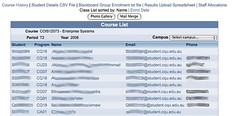
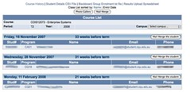
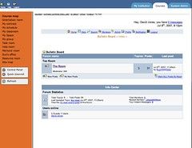

The following is a first draft of the next section of chapter 5 of [my thesis](/blog2/research/phd-thesis/). The aim here is to try and illustrate how the combination of the [agile](/blog2/2010/06/05/emergent-and-agile-development/) and [adopted-focused](/blog2/2010/06/04/adopter-focused-development-and-diffusion-theory/) development process of Webfuse, when combined with the [design of Webfuse](/blog2/2010/06/07/object-orientation-and-design-patterns/) enabled the rapid development of "workarounds" that enabled the system to adapt to changes in the environment and requirements of the systems users.

### Workarounds

The interventions described in the previous sections provided the foundation through which a large number of contextually specific interventions arose during the period from 2000 through 2004 and beyond. The majority of these interventions were not strategic projects identified by management. Instead, the majority of the interventions were workarounds that arose in response to factors or changes that arose during the emergent and adopter-focused design and support of Webfuse. These interventions range from low-level technical changes, through ad hoc combination and integration of existing workarounds, to the implementation of large and complex applications that were later adopted as official, institutional information systems. The breadth and diversity of these interventions illustrate how Webfuse was able to respond quickly to local problems and opportunities.

#### Student numbers and usernames

CQU, like many other universities, has adopted the practice of assigning students usernames for accessing institutional information systems based on the unique student number assigned to each student as they enrol at the university. Due to CQU specific reasons this has created problems. As of 2001, CQU has two different types of student number: (1) pre-PeopleSoft student numbers that are 9 characters long; and (2) post-PeopleSoft student numbers that are 8 characters long. Circa 2000 authentication systems provided by Windows operating systems, the basis for most institutional systems, could only recognise usernames 8 characters. Consequently, students with 9 character student numbers were told to leave off the last digit. With the advent of PeopleSoft in 2001 and its 8 character student numbers, this advice had to be modified to distinguish between the different types of username. Subsequently, it was common for this to cause problems for new students until they became familiar with the limitations. The design pattern-based, OO design of the Webfuse authentication system enabled Webfuse to work effectively with whatever version of the student number students used.

#### Evolution of Webfuse user authentication and access control

Jones, Lynch and Jamieson (2003) use the evolution of the Webfuse user authentication sub-system to illustrate the design for repair, not replacement, ethos adopted by Webfuse. Table 5.5 is a summary of the changes made to the user authentication system. All these changes occurred without any apparent change from the users' perspective and limited change in the Webfuse programming interface (Jones, Lynch et al. 2003).

Table 5.5 - Changes in the Webfuse authentication system (adapted from Jones, Lynch et al. 2003)
| Stage | Description |
| --- | --- |
| Webfuse specific accounts | With no access to institutional systems, students had to have special Webfuse accounts. |
| Student records passwords | With access granted to the CQU student records system, students could use the same username/password combination to access student records and Webfuse. |
| CQU domain accounts | The advent of and access to a central Windows NT domain infrastructure allowed CQU staff to access Webfuse via their domain accounts. |
| PeopleSoft | The adoption of PeopleSoft in 2001 meant a change in how student account details were checked. Including working with both 8 and 9 character usernames. |
| Cached student information | In the initial months, the PeopleSoft database was barely available from 9-5 on week days. To enable 24x7 access to Webfuse, student account details were cached on the Webfuse server. |

#### GUI editors

From the start Webfuse used HTML forms as the main authoring environment. This meant that if potential authors (staff or students) wished to use anything beyond simple text, they had to know HTML. This was a significant barrier for many staff and was a mismatch with their growing experience and expectation of GUI word processors and editors. By 2004 a solution to this problem was identified through one of the increasingly available Javascript components that would convert a HTML form text area into a GUI HTML editor. Initial testing of this workaround commenced around the time the author moved back to teaching and was never implemented.

#### Staff MyCQU, student records and results upload

Prior to the implementation of Peoplesoft, CQU provided academic staff with InfoWeb, a simple web-based application that provided access to the student records system. InfoWeb allowed staff to search for information on particular students such as contact details, to download course lists and upload results at the end of term. For various reasons, the PeopleSoft implementation project did not provide an InfoWeb replacement and when PeopleSoft went live, Infoweb was replaced with use of the PeopleSoft desktop interface (Jones, Behrens et al. 2004). This interface was time consuming, confusing and difficult, restricted to use on the CQU network, only usable via a computer running Microsoft Windows, and was seen by academic staff as a significant step backwards (Jones 2003).

By mid-October 2001, near the end of the first term after the PeopleSoft go live, there were significant concerns within Infocom about the significant workload implications and potential for human-error of the results upload process proposed by PeopleSoft. This concern resulted in the development of a Webfuse results uploading system designed to be significantly simpler to use than the equivalent PeopleSoft process, provide support for faculty specific requirements, and integrate with the PeopleSoft Higher Education system (Jones, Behrens et al. 2004). The system was developed in just over a month and was used for the first time in November 2001. By the end of 2009, over 340 different staff have uploaded final results for over 58,000 distinct students in over 3800 course offerings.

By the end of 2001 it became obvious that the PeopleSoft access to student records was causing significant problems. For example, to generate a list of student details for a course required a 26-step process, two separate applications on a Windows computer, knowledge of internal data representations not in common use by academics, and a time investment of over 20 minutes (Jones 2003) In early 2002, a new member of the Infocom web team was given the task of developing a Webfuse interface to the student records system as a training task. Within a month the interface was available and being used by staff (Jones, Behrens et al. 2004). Initially known as MyInfocom, the system evolved to act as the staff portal and provide access to a range of faculty features and services.

By August 2002, another faculty requested access to MyInfocom for their staff. The integration of MyInfocom with specific Infocom services, meant that access to MyInfocom would be confusing for non-Infocom staff. Instead, the design patterns-based, OO design of the Wf framework made it possible to provide MyCQU, a version of MyInfocom with the Infocom specific features removed. By 2005 the distinction between MyInfocom and MyCQU was removed and MyCQU increasingly became a key centrally supported, university system. As of 2010 MyCQU is still functioning as the staff portal for CQU academic and general staff.

#### Other Wf applications

A key reason for the continued support of MyCQU was the use of the Wf framework to develop a number of institutional systems from 2005 onwards. These institutional systems were accessed via MyCQU and included the following systems:

- Academic Misconduct Database; Used to store, track and manage incidents of student misconduct.
- Academic Staff Allocations; and Used to store, track and manage details of which staff were teaching which courses and which campuses.
- Assignment Extensions System. Used to request, manage and track student requests for extensions to assignments.

Other previous, similar Wf framework applications included, but not limited to:

- Timetable generator; Automatically produced a personalised timetable based on the courses a student or staff member was involved with for a given term. Also allowed the selection of specific courses. The generator worked for staff and students on all CQ campuses. Only available for a few years, the generator replaced an institutional timetable system that was different depending on which campus you attended, was not integrated with the student records or teaching responsibilities database, required additional knowledge and was time consuming (Jones 2003).
- Email merge; and Given a list of student numbers, would allow staff to create and send an email message to all selected students. The content of the message could be modified based on information specific to each student.
- Informal Review of Grade (IROG). A web-based system developed within 3 weeks to replace an inefficient and error-prone paper-based process by which students across all of CQU's campuses could request an informal review of their grade.

#### OASIS

The provision of timely, meaningful feedback on student assessment is a key component of teaching and can influence student results (Jones and Jamieson 1997). It is typical for the submission, marking and management of student assignments to be performed using physical submission. As a multi-campus institution with significant numbers of distance education students this typical approach creates a range of problems including (Jones and Jamieson 1997): slow delivery time; human error; difficulties in timely moderation of marking (especially for overseas campuses); process duplication; and a number of others. For this reason, the development and use of online assignment submission and management systems has been a significant component of Webfuse under the title OASIS (Online Assignment Submission, Infocom System). Arising out of early attempts using email to reduce turnaround times on the assignments for distance education students (Jones and Jamieson 1997), OASIS went through five different generations of development as described by Jones and Behrens (2003) with the last generation described as evolutionary development (aka emergent development as described above). The evolutionary/emergent development of OASIS was through "an on-going process of discussion with the users allowing the system to grow and meet their needs as they arise" (Jones, Cranston et al. 2005).

#### Combinations and integration

A major benefit of the Wf framework and its design pattern-based, object-oriented design was that it enabled rapid development of new applications. A second benefit of this design was that it also enabled the mix and match of different applications, technologies and views. The Web 2.0 course site described above is one example of this. The following provides two additional examples: grouping students by date of enrolment; and, supporting multiple discussion forums in Blackboard.

Figure 5.3 shows a part of the standard class list page provided by Webfuse. This page shows a range of details of students enrolled in a particular course and was commonly used by teaching academics. As it stands, Figure 5.3 contains a number of examples of the Webfuse ability to combine and integrate different services. For example, at the top of Figure 5.3 there is a button "Mail Merge". The email merge facility described above was designed to be able to take a list of student numbers from any application. Once the email merge facility was completed the "Mail Merge" button was added to the class list page allowing staff to email all students in the course. In addition, if staff were to narrow the class list to a particular campus, the "Mail Merge" button works as expected.

By 2006, some academic staff were using this facility to send a "welcome to the course" email to students in the course. The purpose of such an email was to create an initial social connection with the students and provide some initial guidance on what they should be doing. This "welcome" email approach was somewhat complicated by the likelihood that students could enrol in a course at times ranging from months before the start of term until two weeks (and sometimes more) after the term had started. Sending the email too early would miss some students, too late and students may already have started feeling lost and sending multiple messages may overwhelm.

In Figure 5.3, the Class list is sorted by name. Prior to 2006, there was no choice, sorted by name was the only option. In 2006, the Model-View-Controller architecture of the Wf framework allowed the creation of a different view for the class list page that displayed student details sorted by date of enrolment in the course (Figure 5.4). The Wf framework's pattern-based, object-oriented design enabled the link to "Mail Merge" to work on this new view with no code modification.

In 2007, a CQU curriculum design created an instructional design for course using the Blackboard LMS that required the division of hundreds of students into small groups with each group having its own portion of the Blackboard site containing a number of different discussion forums serving very different instructional purposes. This instructional design could not be implemented with the Blackboard LMS due to an in-built limitation around the number and location of discussion forums per group. The solution adopted was to create the discussion forums for these groups within Webfuse and integrate them into Blackboard. Figure 5.5 shows the Blackboard course site and one of the Webfuse discussion forums used by one of the groups.

### References

Jones, D. (2003). How to live with ERP systems and thrive. 2003 Tertiary Education Management Conference, Adelaide.

Jones, D. and S. Behrens (2003). Online Assignment Management: An Evolutionary Tale. 36th Annual Hawaii International Conference on System Sciences, Hawaii, IEEE.

Jones, D., S. Behrens, et al. (2004). The rise and fall of a shadow system: Lessons for enterprise system implementation. Managing New Wave Information Systems: Enterprise, Government and Society, Proceedings of the 15th Australasian Conference on Information Systems, Hobart, Tasmania.

Jones, D., M. Cranston, et al. (2005). What makes ICT implementation successful: A case study of online assignment submission. ODLAA'2005, Adelaide.

Jones, D. and B. Jamieson (1997). Three Generations of Online Assignment Management. ASCILITE'97, Perth, Australia.

Jones, D., T. Lynch, et al. (2003). Emergent Development of Web-based Education. Proceedings of Informing Science + IT Education, Pori, Finland.