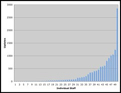
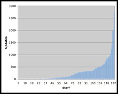

Last week I was thinking [that academics shouldn't manually create course sites](/blog2/2010/06/07/should-academics-manually-create-course-websites/). That arose out of the process of writing up the why/what behind what we did with Webfuse from 1999 through 2004. Today, I've been continuing that and looking at the usage statistics from that period.

The following focuses on statistics about how often an academic modified a course site. The Webfuse model was to [automatically create a default course site](/blog2/2010/06/07/default-course-sites-and-wizards/) for every course offered by the faculty. Academics could then modify that site as much, or as little as they wanted. The following two graphs (first in 1999 and then in 2005) shows how many staff were editing Webfuse course sites and how many times they made page updates. Staff are ordered on increasing number of updates. What is striking to me is the similarity of the curves - both look like a ["power law".](http://en.wikipedia.org/wiki/Power_law) Some rambling on implications below.

1999

2005

In terms of the 2005, the top 22 academic staff performed 21,298 updates on course sites. That's over 8,000 more updates than the remaining 127 academic staff (13,472 updates in total). 17% of the academic staff performed 61% of the updates of course websites.

### Implications

With [the Indicators Project](http://indicatorsproject.wordpress.com/) we've been using three questions to frame investigations of LMS usage:

1. What?  
    What is actually going on within LMS usage? What are the patterns that can be identified?
2. Why?  
    Why do these patterns exist? Can we identify why this pattern has arisen?
3. How?  
    How can this insight be used to improve practice?

#### What?

The [Wikipedia page on "power law"](http://en.wikipedia.org/wiki/Power_law) states "Power-law relations characterize a staggering number of naturally occurring phenomenon". With the Webfuse data shown above, which is spread over a 6 year time period during which there were significant changes, there is a fair indication that this might be leaning towards a "natural phenomenon". It would be interesting to perform a similar analysis on more recent data and more "traditional" LMS to see how "natural" this if this might represent a more widespread, "natural" phenomenon.

Based on my experience, and without looking at the data, I suspect that this type of pattern is likely to exist in most universities around use of their LMS.

#### Why?

So, why do you think this pattern exists? Suggestions?

My suspicion is based on Geoghegan's (1994) identification of [a chasm](/blog2/2009/08/09/the-chasm/) - a la Moore (2002) - in the adoption of instructional technology. i.e. that there is a chasm/difference between two groups of academics - innovators/early adopters and the pragmatists. It's the innovators/early adopters that are the big users of instructional technology.

So, one interpretation of the above figures is that the majority of academics are pragmatists. This is not necessarily a negative. They want to do a reasonable job of teaching (as measured by the institution, themselves and their students) but aren't going to allow other work (mostly research) to suffer. My suspicion is this "pragmatic" perspective is the dominant perspective amongst academics. It's the type of perspective that environment within universities encourages.

#### How?

So, if you found support for this perspective, how might it be used to improve learning and teaching?

If it is the university teaching environment that creates this "pragmatic" approach, perhaps it needs to be changed.

If a majority of academics aren't editing course sites, this suggests that these course sites aren't that great. Perhaps it also suggests that the quality of the student learning experience isn't all that great. If this is the case, then continuing the practice of academics having to create course sites within an LMS may not be the way to go. Perhaps, it is time to investigate alternatives ranging from the evolutionary - [provided a default course site](/blog2/2010/06/07/should-academics-manually-create-course-websites/) for academics to build upon - to the revolutionary - such as PLEs etc.

### Postscript - Implications for LAMS?

[LAMS - Learning Activity Management System](http://www.lamsinternational.com/) has for quite some time been positioned as a better, alternative to the LMS model. From the "About" section on the LAMS site

> LAMS is a revolutionary new tool for designing, managing and delivering online collaborative learning activities. It provides teachers with a highly intuitive visual authoring environment for creating sequences of learning activities. These activities can include a range of individual tasks, small group work and whole class activities based on both content and collaboration.

LAMS must be good, [it has won a gold medal](http://mq.edu.au/newsroom/control.php?page=story&item=3770)

Does LAMS usage - within institutions that have adopted it - follow the same "power law"?

The question of how to do an apples versus apples comparison between LAMS and a LMS would be interesting as they follow very different models.

If this could be done appropriately, then my prediction is that yes, in a university environment LAMS would follow this pattern, possibly even more pronounced because LAMS is that much more different to past practice for academics than the LMS.

Also, from the perspective of a typical teaching academic (and perhaps even students?), there's a lot more to an "online course" than learning activity design. Most of which LAMS doesn't support directly, hence the need to integrate it with LMSs.

### References

Geoghegan, W. (1994). Whatever happened to instructional technology? 22nd Annual Conferences of the International Business Schools Computing Association, Baltimore, MD, IBM.

Moore, G. A. (2002). Crossing the Chasm. New York, Harper Collins.