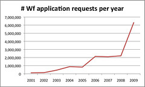

---
categories:
- chapter-5
- design-theory
- elearning
- indicators
- phd
- thesis
- webfuse
date: 2010-06-17 14:09:47+10:00
next:
  text: Further analysis of wf application usage
  url: /blog/2010/06/18/further-analysis-of-wf-application-usage/
previous:
  text: Academics, course websites and power laws
  url: /blog/2010/06/14/academics-course-websites-and-power-laws/
title: Some rough Webfuse usage statistics - 2001 through 2009
type: post
template: blog-post.html
comments:
    []
    
pingbacks:
    - approved: '1'
      author: Further analysis of wf application usage &laquo; The Weblog of (a) David
        Jones
      author_email: null
      author_ip: 66.135.48.169
      author_url: https://djon.es/blog/2010/06/18/further-analysis-of-wf-application-usage/
      content: '[...] The Weblog of (a) David Jones Another voice in the blogosphere    &laquo;
        Some rough Webfuse usage statistics &#8211; 2001 through&nbsp;2009 [...]'
      date: '2010-06-18 15:48:41'
      date_gmt: '2010-06-18 05:48:41'
      id: '3102'
      parent: '0'
      type: pingback
      user_id: '0'
    
---
In terms of the [thesis](/blog/research/phd-thesis/), my current focus is on chapter 5. This chapter seeks to describe what we did from 2000 through 2004 and beyond. I'm currently working on the evaluation section, a major component of the evaluation is looking at the usage statistics of Webfuse during this period. It's slow going and there is still a fair bit of analysis to go, but some initial figures are available.

### What analysis has been done?

The statistics shown below show raw hit counts on various "parts" of Webfuse. That is, I've taken the raw Apache access logs and extracted relevant hits into the following Webfuse "parts":

- Course site access;  
    A request for a file from a course website. This could include images, documents and web pages. This one needs to be refined the most.
- Course updates;  
    To modify a course website a member of the teaching staff did a course update. This represents the number of times that happened.
- FM;  
    To upload Word documents etc staff used FM - a file manager.
- Wf applications;  
    From about 2000, a range of interactive web applications including a staff and student "portal", online assignment submission, quiz management, etc were developed. This represents the number of hits on those applications. Each hit represents a single page.
- Course profiles.  
    For a year or so, CQU course profiles were available from Webfuse as PDF documents. These numbers represent the number of times they were downloaded.

### Course sites and updates

First, let's look at course sites, number of times data was requested, number of times updated and number of times the file manager was used.

These figures are somewhat dependent on the number of courses and students. The following table shows the raw figures and then a ratio with the number of course sites. i.e. in 2001, there were 244 course sites in Webfuse, there were almost 6.5M requests on those course sites for an average of about 26,000 per course site.

Webfuse course statistics 2001-2009  
**\*** - 2005 logs for Jan through Apr are missing
| Year | \# of courses | Site requests | Site updates | Fm |
| --- | --- | --- | --- | --- |
| 2001 | 244 | 6,491,238   26,603 | 4523   19 | 5679   23 |
| 2002 | 313 | 5,346,867   17,082 | 19,483   62 | 37,874   121 |
| 2003 | 304 | 4,686,393   15415 | 21,869   72 | 14,395   47 |
| 2004 | 328 | 4,469,301   13,625 | 19,230   59 | 12,593   38 |
| 2005 **\*** | 299 | 2,422,395   8101\* | 11,217   38 | 7010   23 |
| 2006 | 297 | 3,278,221   11,038 | 17,752   60 | 10,625   36 |
| 2007 | 249 | 1,891,192   7595 | 9646   39 | 8296   33 |
| 2008 | 225 | 1,848,491   8216 | 6448   29 | 8547   38 |
| 2009 | 211 | 1,958,401   9281 | 9286   44 | 7963   38 |

There needs to be more analysis on this data:

- Why does 2001 have such a large number of requests per website?  
    My first guess is that there a small number of courses in that year were generating requests, or a drop in student numbers.
- What is the spread of these requests per course site?  
    e.g. are one or two course sites dominating? Do they go away after 2001?
- Generate a ratio with student numbers  
    There was a drop in student numbers between 2001/2002. Were there simply more students in 2001?
- What's the source of the significant increase in site updates per site in 2002 and 2003, why?  
    The default course sites were introduced in the 2nd half of 2001, was this the reason?
- What is the spread between staff in site updates and use of fm?
- There's another spike in updates in 2006, why?
- The drop in site request ratio drops after 2006, why?  
    Is this because of the movement of the "real course site" courses. Sites liable to be used a great deal.

### Wf applications

One of the major developments in Webfuse from 1999/2000 was the development [of the Wf framework](/blog/2010/06/07/the-wf-framework/) which provided the basis for "Webfuse" interactive web applications. There were a broad array of very different applications - ranging from a course barometer and BAM, through to an institutional academic misconduct system - that were implemented with this framework.

The following graph (click on it to make it bigger) summarises requests for these application. The 2009 figure of 6M+ requests, is a bit suspect and requires greater analysis (Further analysis reveals a lot of 401s - the real figure is just over 2M).

The increase in usage (doubling) in 2003 shows the spread of these applications into institutional systems. More analysis needs to be done on these figures to:

- Identify the reason for the drastic increase in 2009;
- Identify how much each application is being used;
- Examine the number of users of these applications and how heavy their use is.