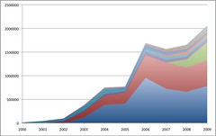
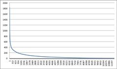
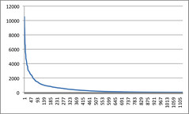

In [the last post](/blog2/2010/06/17/some-rough-webfuse-usage-statistics-2001-through-2009/) I outlined some early rough usage figures for Webfuse from 2000-2009. The following goes into a bit more detail with the usage of the wf applications.

### Breakdown by application

The following graph (click on it to see bigger version) breaks the usage of wf applications down into the separate applications. In the period from 2000 through 2009, there were 54 or so wf applications that were used. However, as the graph shows, two or three applications were dominant in terms of usage.

The top three applications by usage as shown in the above graph (in descending order) are:

1. the student "portal" (the large blue area);
2. the staff "portal" (the red area); and
3. student photo (the green area at the end).  
    Student photo is a kludge to enable the staff "portal" to still show staff student photos from the institutional student records system. So strictly speaking, its part of the portal.

### Breakdown of student "portal" usage

In 2009, usage of the student "portal" could be broken down into the following:

- 54% of requests for ViewAssessment;  
    The page that shows a student the assessment detail for a given course.
- 23.5% for Home;  
    The "home" page for the student "portal".
- 14.5% for StartSubmit and ShowReturnedAssignment;  
    Students starting to submit an assignment or checking the comments/results on a returned assignment.
- 7% for checking on an assignment or viewing assessment results.

i.e. By 2009, this was no longer a student "portal", but almost entirely associated with online assignment submission and management. 0.7% of requests for 2009 were associated with viewing quiz results.

In 2009, 11,482 students logged into the student "portal".

### Come back of the power law

I [recently talked about](/blog2/2010/06/14/academics-course-websites-and-power-laws/) the similarity between the 1999 and 2005 graphs representing how often academics had modified Webfuse course sites. Even though the 2005 graph showed more staff editing course websites more, both years had the same basic pattern. A [power law](http://en.wikipedia.org/wiki/Power_law).

The following graph represents the number of times each student used the "student portal" in 2009. See the similarity?

Yet another power law. There's a trend developing here. I'm wondering if this can be thought of as evidence for [the chasm](/blog2/2009/08/09/the-chasm/).

### Breakdown of staff "portal" usage

A quick breakdown of the 2009 usage of the staff "portal" reveals the following most used services:

- ~36% of requests to view details about a particular student;
- ~25% to find a student
- ~17% to get a class list
- ~8% finding a course
- ~5% the "portal" home page.

There are another 17 services provided by the "portal". 15 of which have less than 1% use.

### Staff "portal" usage by staff

So, does the power law hold for staff users of the "portal"?

There are over 1100+ users during 2009. The following graph shows how many requests of the staff "portal" were made by each user. The graph is sorted in descending order on the number of requests.

Thar she blows! Yet another power law distribution.

### Implications

I am increasingly intrigued by this prevalence of the power law distribution in Webfuse usage, regardless of the application, the time or the users. I'm particularly interested in its implications in terms of how e-learning should be supported and designed. Not to mention why it happens this way.

I'm increasingly interested in whether or not this distribution exists with other systems. Both within the "Webfuse" institution and also at other institutions.