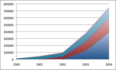
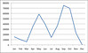
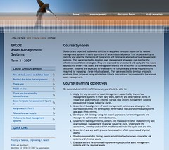

---
categories:
- chapter-5
- design-theory
- elearning
- phd
- thesis
- webfuse
date: 2010-06-21 13:28:45+10:00
next:
  text: Webfuse as a web publishing tool - 2000 through 2004
  url: /blog2/2010/06/22/webfuse-as-a-web-publishing-tool-2000-through-2004/
previous:
  text: Further analysis of wf application usage
  url: /blog2/2010/06/18/further-analysis-of-wf-application-usage/
title: Flexible and support diversity
type: post
template: blog-post.html
---
This is one part of the Evaluation section of Chapter 5 of [my PhD thesis](/blog2/research/phd-thesis/). It's actually the fourth section, but it's the first to have reached a rough first draft stage. The basic aim is to show how the Webfuse interventions from 2000 through 2004 (and beyond) increased the flexibility and diversity of the system.

By itself this may not make much sense without some knowledge of prior sections/chapters of the thesis and/or CQU experience.

### Flexible and support diversity

As described in Section 4.3.4, this original design guideline for Webfuse was based on the recognition that diversity and continual change were inherent in web-based learning. As described in Chapter 4, from 1997 through 1999 Webfuse aimed to achieve this through a range of approaches including "provide the tools, not the rules". While these were somewhat successful, it was recognised that the flexibility of Webfuse, while allowing for more diversity, also required more skill and experience from academic staff and that this, along with other factors, limited widespread use of Webfuse. For example, Table 4.20 showing that during 1999, just two course sites accounted for 47.2% of requests and 75.4% of page updates.

In the lessons learned section (Section 4.7) of Chapter 4, it was identified that limitations associated with both the product – in terms of design, architecture, programming etc – and the design and support process – in terms of ability to respond to changing needs – were effecting the ability for Webfuse to be flexible and support diversity. The foundation to addressing these limitations was provided by the adoption of an emergent (Section 5.3.2), adopter focused (Section 5.3.1) process. Arising out of that process were two main interventions – interactive, web applications and the default course sites – which illustrate an increase in the flexibility and diversity supported by Webfuse.

#### Wf applications

Development of Wf applications commenced in 2000 with a single application providing a simple student "portal", primarily providing students with access to online assignments submission and return, and quiz results. Table 5.18 shows the growth from 2001 through 2004 in the number of Wf applications, the number of people using them and how much they were using them. Figure 5.8 is a graph showing the amount of usage for individual Wf applications. Both the table and the graph show rapid increase in the amount of usage by both staff and students, especially in 2003 and 2004. The doubling in staff users in 2003, represents the spread of Wf application usage beyond Infocom into the broader CQU community.

Table 5.18 - Wf applications: number, requests and users (2000-2004)
| Year | \# Wf applications | \# Requests | \# student users | \# staff users |
| --- | --- | --- | --- | --- |
| 2000 | 1 | 13,908 | 519 | 8 |
| 2001 | 14 | 52,210 | 4194 | 178 |
| 2002 | 22 | 99,688 | 4738 | 297 |
| 2003 | 26 | 384,445 | 6629 | 577 |
| 2004 | 24 | 753,795 | 9116 | 570 |

In terms of the application usage shown in Figure 5.8 and the total number of wf applications shown in Table 5.18 it is noticeable that the majority of Wf application usage is dominated by a few applications. For example, in 2004, 94.9% of Wf application requests arose from just 4 applications: student "portal" (51%); staff "portal" (24.9%); the take quiz application (13.5%); and, assignment management (5.5%). Of the remaining 20 Wf applications used in 2004, all but one contributed less than 1% of overall Wf application usage.

The significant disparities in the amount of usage between the Wf applications, is indicative of the diversity of the applications and how they are used. The Results Upload application mentioned in Section 5.3.6 handled only 4956 requests during 2004, or just 0.7% of all Wf application requests. Unlike a general purpose, regular use application like a "portal", the results upload application is only used at certain times by a small sub-set of users – teaching staff in charge of a course offering. In addition, the upload application's comparatively small overall use hides a significant saving in time on the part of academic staff.

Figure 5.8 offers a comparison between three different Wf applications: student portal, take quiz, and results upload. It shows how much each application was used per month during 2004 (Note: usage data for December 2004 is not included). All three applications have two main peaks, representing CQU having two main terms in which the majority of students are enrolled. However, the peaks appear at different times of the year for the different applications. Student portal usage peaks towards the final weeks of the two main terms, as students submit and complete final assessment. Usage of the quiz application peaks earlier in term, especially in the first term, as quizzes were being used mostly as formative assessment items (though usage is much flatter in Term 2). The upload application peaks at the very end of the two major terms (actually in the first few weeks of the next term).

Figure 5.8 – Comparison of annual usage peaks for student portal, take quiz, and upload Wf applications in 2004 \* \* - missing usage data from December
|  by David T Jones, on Flickr") |  |  |
| --- | --- | --- |

The Blog Aggregation Management (BAM) Wf application briefly mentioned in Section 5.3.6 represents a different type of diversity. Before BAM, all software services used by Webfuse were hosted on institutional computers. BAM assumed students would use external hosted blog engines of their own choice and register them with BAM. BAM would use the RSS files generated by the blogs to mirror and track student blog posts. In reviewing BAM in the ELI Guide to Blogging, Coghlan et al (2007) suggest that

> One of the most compelling aspects of the project was the simple way it married Web 2.0 applications with institutional systems. This approach has the potential to give institutional teaching and learning systems greater efficacy and agility by making use of the many free or inexpensive—but useful—tools like blogs proliferating on the Internet and to liberate institutional computing staff and resources for other efforts.

#### Default course sites

As described in Section 5.3.5, Webfuse – like most other LMS – essentially supported only the one method for creating course websites. That method could be called the minimum support method, where academics are given a set of tools and left to construct course sites with a minimum of professional support. Initially, Webfuse supplemented the minimum support method by using administrative staff to manually construct sites for academics. The default course site alternative was introduced as part of the adopter-focused development approach with the intent of increasing use of course sites. The results of this in terms of statistics are described in the next section (Section 5.4.5). This section seeks to argue that the default course site approach also evolved to increase flexibility and support for diversity.

The default course site approach ensured that an organisationally approved default course site was automatically available for every course offered by the Faculty. The make up of this default course site – in terms of the appearance, structure and tools used - could be modified for different groups of courses. For example, three very different Webfuse course sites can be seen in: Figure 5.1, the original 2001 default course site home page; Figure 5.2, the home page for the 2007 Web 2.0 course site; and Figure 5.9, the home page for a commercial course offered by CQU at the end of 2007.

In addition, make up of a default course site could evolve over time in response to organisational priorities or other changes. Examples of the changes to default course sites that could be performed automatically based on organisational requirements, included:

- Changes in colour based on term;  
    At various times CQU had 3, 4 or 5 terms in which courses could be offered. Given that default course sites always remained open, it was necessary to distinguish between different terms. This was achieved by using different colour sets for different terms.
- Changes based on the current term;  
    Once a new term commenced, old course sites were retained for historical and administrative reasons. To ensure students were not confused by old course sites, all old default course sites were modified at the end of their term through the automated addition of an "this is an old term course" message.  
    
- Changes due to organisational restructures and other institutional changes; and In 2005, Infocom was disbanded and became part of the Faculty of Business and Informatics (FBI). In 2009, Central Queensland University re-branded itself as CQUniversity. The default course sites were modified in response to these changes.
- Improvements in the look and feel.  
    In 2005, the default course sites used by the majority of courses were re-designed.

Beyond the flexibility and diversity supported by creation of different default course sites, there was additional diversity for academics in terms of the authoring approach they could adopt. Rather than the single approach assumed in the "minimum support" method, the default course site approach provided academics with three different approaches:

1. do nothing;  
    The default course site automatically create the minimum standard as expected by the organisation. Academics didn't need to modify the default course site beyond participating in discussions.
2. make changes with Webfuse; or  
    To move beyond the default, academics could modify and add to the default course site by using the Webfuse page types.
3. create a real course site.  
    Lastly, academics could choose to use their own web publishing tools to create a real course site that was separate from the default course site.

A further example of the flexibility of the default course site approach is provided by special topic courses. At CQU, a special topic course has a single course code in which students can enrol. However, the topic of the course would depend on the staff member they had reached an agreement with. Students enrolled in the same special topic course could be studying with different staff on different topics. The course centric design of most e-learning, which assumes that each course has one course web site isn't a good match of a special topic course. The Webfuse solution to this problem was to have a single default course site for a special topic and then use the real course site area to host a default course site for each topic. Each topic would be have a special course code – created only in Webfuse – and the Webfuse "temporary enrolment" feature would be used to enrol students in that special course code.

Another example of the flexibility and support for diversity offered by the default course site approach is the Web 2.0 course site mentioned in Section 5.3.5. The Web 2.0 course site embraces and extends the BAM idea that increasingly universities do not need to provide all of the e-learning tools to be used by staff and students. Increasingly, staff and students are using a range of readily available online tools for a variety of tasks and wanting to use some of them in their learning and teaching. Created using the same technology as other Webfuse default course sites, the Web 2.0 course site displays content created by staff and students using external applications such as Wordpress.com RedBubble.com. Instead of visiting the course website, students and staff can receive notifications of new course activity and contents through a news-reader application of their choice. The news-reader draws on the same feeds used by the course site to display the content. The Web 2.0 content site provided an institutionally branded home for the course, but staff and students never need to use it.

### References

Coghlan, E., J. Crawford, et al. (2007). ELI Discovery Tool: Guide to Blogging, EDUCAUSE.