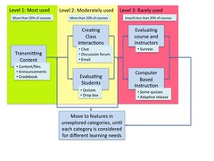

I'm in the throws of finalising the second last bit of data analysis [for the thesis](/blog2/research/phd-thesis/). For this I'm trying to examine the level of feature adoption within courses supported by the Webfuse system (the main product for the the thesis). The following describes an attempt to formalise the process for this evaluation.

This has been under construction for almost a week. It's complete. The following just documents what was done. Probably not all that interesting. Will present some results in the next post.

The main outcome of the below, is that I now have a database that has abstracted Webfuse feature adoption data from 1997 through 2009.

### Rationale

There are three reasons to do this:

1. Improve the process;  
    So far, I've been doing this with a collection of UNIX scripts and commands, text files and the odd bit of a database. It works, but is not pretty.
2. Record what I do; and  
    I need to document what I'm doing so that I can re-create/check it later on. I could do this in a Word document but this way I can share what I'm doing.
3. Move the [Indicators project](http://indicatorsproject.wordpress.com/) along a bit.  
    Given contextual reasons, not sure how much further the project might go, but this might help a little.

### The problem

The aim is to understand what features of an e-learning system are being used. i.e. how many courses are using the discussion forum, the quiz system etc. The aim is not to just understand this in the context of a single term, single institution or a single e-learning system. The idea is to examine feature adoption across systems, time and institutions in order to see if there are interesting patterns that need further investigation. This is the underlying aim of the [Indicators project](http://indicatorsproject.wordpress.com/) and more immediately important for me, what I have to do for my thesis around the Webfuse system.

So, I need to gather all the information about Webfuse feature adoption and turn it into a form that can be compared with other systems. I've done this before. It was first [blogged about](/blog2/2009/08/28/comparisons-between-lms-the-need-for-system-independence/) and then became part of an [ASCILITE paper](http://indicatorsproject.wordpress.com/2009/10/09/the-indicators-project-identifying-effective-learning-adoption-activity-grades-and-external-factors/) (Beer et al, 2009)

But since that work, I've gotten some additional Webfuse data and also had the opportunity to revisit the design and implementation of Webfuse through writing this second last chapter. I've also come up with a slightly different way to interpret the data. This means I need to revisit this usage data with some new insights.

One of the problems is that the original calculations in the ASCILITE paper did not draw on the full set of Webfuse features that fit into the Malikowski et al (2007) categories (represented in the diagram below). I need to add a bit more in and that means trawling a range of data sources. I need to have this done through a single script.

In some ways, this need to have a "single script" encapsulates a key component of what the indicators project needs, an LMS independent computer representation of feature adoption of e-learning systems. A representation that can be queried and analysed quickly and easily.

What follows is my first attempt. I believe I'll learn just by doing this. Hopefully, this means that when/if the indicators project does this in anger, it will be better informed.

### The plan

I'm essentially going to create a couple of very simple database tables

- courses: period, year, course, lms  
    Which courses were offered in which period by which LMS. I'm using a very CQU centric period/year combination as I'm not going to waste my time and cognition establishing some sort of general schema. That's for the next step, if it ever comes. I want to solve my problem first.
- feature\_adoption: period, year, course, category, feature  
    Which features (in terms of specific feature and the Malikowski feature category) have been used in which courses.

It's neither pretty, complex or technically correct (from a relational database design perspective), but it should be simple and effective for my needs.

To populate this set of tables I am going to write a collection of scripts that parse various databases, course website archives and Apache system logs to generate feature adoption figures.

Once populated, I should be able to write other scripts to generate graphs, CSV files and various forms of analysis to suit my purpose or that of others.

The rest of this post documents the implementation of these plans.

### Create the tables

#### courses

Simple (simplistic?), straight-forward. Have used an enum of LMS and included the list I'm likely to use at my current institution.

\[sourcecode lang="sql"\] create table courses ( period char(2) not null, year int(4) not null, course varchar(10) not null, lms enum ( 'webfuse', 'blackboard', 'moodle' ), index offering (period,year,course) ) \[/sourcecode\]

#### feature\_adoption

Another simple one, the category values "match" the 5 categories proposed by Malikowski et al (2007)

\[sourcecode lang="sql"\] create table feature\_adoption ( period char(2) not null, year int(4) not null, course varchar(10) not null, category enum ( 'transmitContent', 'interactions', 'evaluateStudents', 'evaluateCourses', 'cbi' ) not null, feature varchar(20) not null, index offering (period,year,course) ) \[/sourcecode\]

### Fill the database tables

With the database tables in-place it is now time to fill them with data representing feature adoption within courses using Webfuse. I'm going to do this via Perl scripts because Webfuse is written in Perl and so, I'm very comfortable with Perl and Webfuse provides some classes that will help make this process a bit simpler. Am going to work through this Malikowski category by category. Will leave out the computer-based instruction category as Webfuse never provided this feature. But first, have to populate the courses table.

#### courses

There is an existing database table that tracks Webfuse course sites, however, I'm going to use a slightly different track based on some existing text files I've generated for earlier analysis. These text files contain lists of Webfuse course sites per year. I'm simply going to use vi to turn them into SQL commands and insert them into the database. This took three commands in vi and is working.

Done.

#### Interactions

For each of these following sections, the process is:

- Identify the features within Webfuse that fit this category.  
    Webfuse provides features via two means: page types and Wf application. Calculating usage of each is somewhat different. They'll need to be considered differently.
    - Page Types - WebBBS, YaBB, Etutes, CourseGroup, EwgieChat, WWWBoard. **DONE**  
        For some years, splitting page types into categories has already been done. Just a matter of doing the vi translation into SQL.
    - Wf applications - EmailMerge : DONE  
        The problem with email merge is that while it generally originates from a specific course, it is implemented via list of student ids. This makes it hard to associate emailmerge usage with a course. Attempts to find a solution to this is described below.
- Identify percentage adoption of these features per year.
- Stick it in the database

The attempt to associate use of EmailMerge with a course used the following steps:

- Look at referer in Apache log  
    This gives a range of courses that have used email merge. So, some data could be retrieved. There's also mention of JOBID - i.e. mail merge stores information about jobs in a database table.
- Look at email merge database tables;  
    One has the username of the staff member associated with the job and the date created. This could be used to extract the course, but a bit ad hoc.

Solution is to parse out the refers that mention course/period/year and convert that into SQL for insertion. This should capture some of the uses of MailMerge, but won't get them all.

#### Evaluating students

- page types **DONE**  
    All done using the
- Wf applications **DONE**  
    Need to write a script to extract info from various databases and updates stats. The additional Wf applications are:
    - BAM - EAST:BAM\_CONFIGURE
    - IROG - DATA:IROG
    - AES - EAST:REQUEST
    - AMD - Plagiarism:PlagCase

#### Evaluating courses

- page types: UnitFeedback, FormMail and Survey
- Wf applications: Barometer

#### Transmitting content

This category is a bit more difficult. All Webfuse course sites transmit content, there's a basic level incorporated into all sites. What I need to calculate here is the percentage of courses that have additional content, beyond the default, added by the teaching staff. Evidence of this could include used of the following by teaching staff (not support staff):

- course updates **DONE**  
    This generates an RSS file, which I think is mostly put into CONTENT file of the course site. Each element as a dc:creator tag with the name of the user.
    
    One approach would to be find all updates content files, grep for creator (including course/period), remove creators that are support staff. From 2002, this is done in a separate RSS file, but all good.
    
- fm **DONE**  
    This is recorded in the apache logs. Will need to parse that.
- page update  
    Again, parsing of apache log files

### Calculating adoption

Once the data is in the database, the next step is to calculate the adoption rate, which is essentially:

- Get the total # of courses in a year.
- For each Malikowski category
    - calculate percentage of courses adopting features in the category

Show the results in the next post

### References

Beer, C., D. Jones, K. Clark. (2009). [The indicators project identifying effective learning, adoption, activity, grades and external factors.](http://indicatorsproject.wordpress.com/2009/10/09/the-indicators-project-identifying-effective-learning-adoption-activity-grades-and-external-factors/) ASCILITE'2009. Auckland, NZ.

Malikowski, S., M. Thompson, et al. (2007). "A model for research into course management systems: bridging technology and learning theory." Journal of Educational Computing Research 36(2): 149-173.