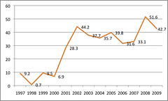

---
categories:
- chapter-5
- elearning
- indicators
- phd
- thesis
- webfuse
date: 2010-07-01 13:19:57+10:00
next:
  text: The VLE model and the wrong level of abstraction
  url: /blog2/2010/07/04/the-vle-model-and-the-wrong-level-of-abstraction/
previous:
  text: Examining feature adoption - slightly better approach
  url: /blog2/2010/07/01/examining-feature-adoption-slightly-better-approach/
title: Webfuse feature adoption - 1997 through 2009
type: post
template: blog-post.html
---
The following presents details of feature adoption by courses using the Webfuse system from 1997 through 2009. It presents the data generated by the work [described in the last post](/blog2/2010/07/01/examining-feature-adoption-slightly-better-approach/).

No real analysis or propositions, mostly just the data. Analysis is next step.

### How features are grouped

To provide some level of Webfuse independence I've used the model developed by Malikowski et al (2007) and represented in the following image.

Essentially, each Webfuse feature was assigned to one of four categories:

1. Transmitting content.
2. Interactions.
3. Evaluating students.
4. Evaluating courses.

### Feature adoption

The following table shows the results. The adoption rate is shown as a percentage of Webfuse courses that used a particular feature category.

| Year | \# course sites | Transmit content | Interactions | Student eval | Course eval |
| --- | --- | --- | --- | --- | --- |
| 1997 | 109 | 34.9 | 1.8 | 0.9 | 9.2 |
| 1998 | 138 | 38.4 | 48.6 | 1.4 | 0.7 |
| 1999 | 189 | 46.0 | 9.0 | 2.1 | 9.5 |
| 2000 | 174 | 46.6 | 43.7 | 24.7 | 6.9 |
| 2001 | 244 | 51.6 | 32.4 | 47.1 | 28.3 |
| 2002 | 312 | 69.6 | 63.8 | 57.7 | 44.2 |
| 2003 | 302 | 69.2 | 68.5 | 93.7 | 37.7 |
| 2004 | 328 | 61.3 | 61.9 | 91.8 | 35.7 |
| 2005 | 299 | 64.2 | 69.2 | 93.6 | 39.8 |
| 2006 | 297 | 70.0 | 68.7 | 105.1 | 31.6 |
| 2007 | 251 | 68.5 | 102.0 | 168.1 | 33.1 |
| 2008 | 225 | 72.9 | 110.7 | 192.0 | 51.6 |
| 2009 | 211 | 69.2 | 105.7 | 211.4 | 42.7 |

### When is a course a Webfuse course?

The most surprising aspect of the previous table is that some of the percentages are greater than 100%. How do you get more than 100% of the Webfuse courses adopting a feature?

Due to the nature of Webfuse, its features, and the political context it is possible that a course could use a Webfuse feature without having a Webfuse course website. Webfuse was never the official institutional LMS, that honour fell upon WebCT and then Blackboard. However, a number of the features provided by Webfuse were still of use to folk using WebCT or Blackboard.

For the purpose of the above, a Webfuse course is a course that has a Webfuse course site.

### Discussion

Each of the following will show a graph of each feature category and offer some brief notes and initial propositions based on the data.

Click on the graphs to see them bigger.

#### Transmit content

Background

- 100% of Webfuse course sites had content transmission.
- From the 2nd half of 2001 these were automatically created.
- Feature adoption above only includes where teaching academics have placed additional content onto the course site.
- Main Webfuse features in this category are: course web pages, uploading various files and using the course announcements/update features.

Observations and propositions:

- The automated and expanded default course site introduction in 2001 appears correlated with an increase in use. However, that could simply be broader acceptance of the Web.
- Even at most accepted, almost 30% of staff teaching courses did not place additional content on the course site. This could be seen as bad, 30% didn't do anything, or good, 30% could focus on other tasks.

#### Interactions

Background:

- Percentage adoption in 1997 through 1999 is probably higher as significant numbers of courses used Internet mailing lists. However, records of these aren't tightly integrated with Webfuse course sites.
- The 1998 archives have been found, so the table above shows 48.6% of courses having mailing lists.
- From 2000 onwards Webfuse default sites included a web-based mail archive of mailing lists.

- Features include: interactive chat rooms, web-based discussion forums, email-merge, [BAM](/blog2/research/bam-blog-aggregation-management/) and web-based archives of mailing lists.
- The push over 100% in 2007 onwards comes from a combination of more widespread use of mailing lists/discussion forums in default course sites and broader adoption of the email merge facility by non-Webfuse courses.

#### Evaluate students

Background:

- Main traditional features are online quizzes and online assignment submission and management.
- Other non-traditional student evaluation features include an academic misconduct application, assignment extension system, informal review of grade system etc.
- About 2005 onwards some of the non-traditional features became institutional systems.

#### Evaluate courses

Background:

- 2000 and before primary evaluation is via web-based forms with a bit of course barometer usage.
- Post 2001 course barometer becomes standard in all Webfuse courses.
- But not all courses have contributions. The percentages only include a barometer feature if someone has posted a comment to it. If measured as having a course barometer, then figure would be 100% from 2001 through 2004/5.
- Spike in usage in 2008 comes from small institutional project using barometer in non-Webfuse courses.
- Similar spike in 2002 comes from active enouragement of barometer idea.