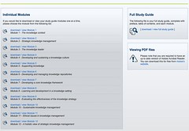

I'm currently trying to formalise the information systems design theory for e-learning that is meant to be the contribution of [my thesis](/blog2/research/phd-thesis/). i.e. what is the model, set of principles etc that I think is important.

As it happens, I recently came across [this post](http://vle.barkingcollege.ac.uk/techblog/?p=3312) on models around the use of VLEs/LMS from Barking College. It's part of a discussion involving a group of folk ([James Clay](http://elearningstuff.wordpress.com/2010/03/20/a-five-stage-model-for-using-the-vle/), [David Sugden](http://eduvel.wordpress.com/2010/06/09/building-vles/), and [Louise Jakobsen](http://loujak78.wordpress.com/2010/02/19/from_repository_to_interactivity/)) talking about models for getting academics to use the complete functionality of the VLE/LMS.

This is interesting for two reasons. First, it helps me see what others are thinking in this sphere. Second, it provides a spark for me to think about my "model". As an example there is an interesting point made on the [Barking College post](http://vle.barkingcollege.ac.uk/techblog/?p=3312) that I want to pick up on in the following.

The basic idea is that the functionality of a bog-standard VLE/LMS - like Moodle - embodies the wrong level of abstraction. At least in terms of encouraging and enabling effective use of the VLE/LMS within a university by academics. A traditional VLE model is at a very low level of abstraction which means lots of flexibility, but also lots of problems. I think there is some value (also some dangers) in moving the level of abstraction up a few notches.

### Moodle document management and the wrong level of abstraction

The [post from Barking College](http://vle.barkingcollege.ac.uk/techblog/?p=3312) makes the point that uploading and maintaining document content on Moodle "is one of the most round-about and time consuming things anyone can do". I agree. But it doesn't end there. Even when academics understand and engage in the uploading process, their are more problems.

> Then we teach staff to upload files to the VLE … and in no time they have transferred their heap and bad habits onto the file areas of VLE courses. If, in addition to their own unique ways of filing things, they are not the only editing teacher on a course then total chaos is almost guaranteed.

There are some exceptions. There are folk who are well organised and anally retentive enough that they have their files organised into well thought out directory structures with meaningful file names. But most academics don't. As pointed out, this causes enough problems when it is just that originating academic having to deal with the resulting chaos, but when a course is taught by multiple academics....

This highlights one of the major flaws I see in most VLEs/LMS. They are design at the wrong level of abstraction. The file upload capability is very basic, it simply provides the ability to manage files. It provides no additional cognitive support for structuring content and certainly none that connects with the act of learning and teaching. The file management capability can't tell the difference between a course synopsis, a tutorial sheet, a trial exam, a set of solutions or a set of lectures. Most can't even tell you if it's a PDF file, a Powerpoint file or a Word document.

This low level of abstraction is necessary to enable the broadest possible flexibility in use. The more abstraction you build into a system, the more specific you make it.

### The CQU eStudyGuides

One example of what I mean here is the [CQU eStudyGuide Moodle block](/blog2/2009/07/28/bam-into-moodle-7-an-estudyguide-block/) I played with last year. Some brief context:

- [CQU](http://www.cqu.edu.au/) has a long history of being a print-based distance education provider.
- A print-based study guide was a standard component of the package of materials traditionally provided to distance education students.
- The study guide was written by CQU academics and intended to guide the distance education student through the learning materials and activities they were meant to complete.
- The production of the study guides was a formal process involving a central "desktop publishing unit" which would produce "professional" quality documents that were then printed.
- The "desktop publishing" group is part of the [unit](http://cddu.cqu.edu.au/) I work with.
- Back in 2007/2008 the unit modernised the study guide production process so that it improved the quality of the final document and produced both a print and electronic version.

The electronic version was long over due. For a long time academic staff wanted to provide electronic versions of the course study guide on the course website. Some had done this via an ad hoc, manual process, but it was time for something better.

Producing the electronic version of the study guide was only the first step. We also had to produce an automated process that would allow academics place the eStudyGuide on their course website. Requiring academics to do this manually was inefficient and likely to result in less than professional outcomes. This connects with the observation about file management made in the [Barking College post](http://vle.barkingcollege.ac.uk/techblog/?p=3312) about file management.

So, we implemented the automatic generation of an eStudyGuide web page for every course. The following image is one example, click on it to see it in a bigger size.

The eStudyGuide page for a course was produced by a script. The script was aimed at a much higher level of abstraction. The script knew about CQU courses, it knew about the format we used for the eStudyGuide and it was able to use that knowledge to produce the file. e.g. it pulled the title of each part of the eStudyGuide from the eStudyGuide.

### The CQU eStudyGuide Moodle block

By 2010 CQU had moved to Moodle as its LMS. As part of learning Moodle development I played with the creation of an Moodle eStudyGuide block. A block that would embody the same greater level of knowledge about CQU's eStudyGuide than a more general Moodle block. Consequently, significantly simplifying the process of uploading an eStudyGuide to a Moodle course site. The following table compares and contrasts the eStudyGuide block approach with the more traditional manual appproach.

| eStudyGuide block | Moodle file upload |
| --- | --- |
|   1. Login to Moodle and go to course site. 2. Turn editing on. 3. Choose "eStudyGuide" block from "Add a block menu" 4. Position it where you want.   |   1. Get a zip file containing the eStudyGuide from somewhere. 2. Login to Moodle and go to course site. 3. Go to the "Files" link under administration. 4. Create a directory for the eStudyGuide. 5. Upload the zip file containing the eStudyGuide. 6. Unzip it. 7. Return to the course site. 8. Turn editing on. 9. For each of the chapters (usually 10 to 12) of the eStudyGuide     - Manually add a link to the chapter     - To make sure each link is meaningful you may have to open the chapter PDF to remember what the title of the chapter was. 10. Add another link to the PDF containing the entire eStudyGuide. 11. Add the blurb about how to use PDF files and where to get a copy of Acrobat or other PDF viewer.   |

### The trade-off

There isn't a perfect solution. Both low and high levels of abstraction involve a tradeoff between different strengths and weaknesses.

A low level of abstraction means the solution is more flexible, can be used in more institutions and for unexpected uses (good and bad). It also means that the user need to have greater knowledge. If they do, then good things happen. If they don't, it's not so good. It also means that the user has to spend a lot more time doing manual activities, which increases the likelihood of human error.

A high level of abstraction, especially one that connects with practices at a specific institution reduces workload on the part of the users, reduces the chance of errors and perhaps allows users to focus on other more important tasks. But, it also limits portability of the practice. i.e. the CQU eStudyGuide process probably wouldn't work elsewhere. Which means it requires additional resources to implement and maintain.

A greater level of abstraction also removes some flexibility from what the user can do. The simple solution to this is not to mandate the higher level of abstraction. e.g. at CQU we provided the automated eStudyGuide page, but academics weren't required to use it. They could do their own thing if they wanted to. Most didn't.

### Other examples

Providing a high level of abstraction to the VLE is almost certainly going to be a component of my ISDT, of my model. This is exactly what the [default course site](/blog2/2010/06/25/default-course-sites-and-wizards-version-2-0/) approach attempted to do. Provide a much higher level of abstraction on top of the VLE.

Into the future, it's also a key part of what I'm interested in investigating. I think the addition of a "default course site" approach to Moodle, especially one that increases the level of abstraction but at the same time can be used at multiple institutions, is especially interesting.