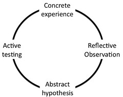

See also: [[blog-home | Home]]

I'm off to the [2001 Australian MoodleMoot](http://moodlemoot.org.au/) next week. The [conference program](http://moodlemoot.org.au/mod/resource/view.php?id=128) includes a collection of 3 minute show and tell sessions on the Tuesday afternoon. The following is a summary of what I think I'm going to talk about and a call for suggestions.

I'm starting to add all the associated resources with the presentation to this post.

### More information

Other resources/information around this idea include:

- A [blog post](/blog2/2010/05/19/how-curriculum-mapping-in-moodle-might-work/) introducing how curriculum mapping might work in Moodle.
- A [detailed, draft grant proposal](/blog2/2010/05/13/more-thinking-about-the-alignment-project/) for a broader project around embedding mapping/alignment into a university.  
    This proposal includes a fairly long reference list which points to some of the literature that informed this idea.

### Video

The following video is a slightly extended version of the talk, using the same slides, recorded after the Moodlemoot.

\[vimeo http://www.vimeo.com/13499422\]

### Slides

!!! warning "Outdated content no longer available"

    Presentation from Slideshare no long available

### The purpose

The title of this post is probably going to be the title of the talk. From that you can assume that this is not a show and tell of something that is working, but instead a proposal of an idea. The aim is to find out if there are other people interested in this project or already working on something similar. The aim is to start a conversation. The talk is also request for interest (an RFI). I'm keen to hear from folk interested in working on this idea, especially in terms of a potential ALTC grant for next year.

The proposal is based on previous ideas posted here. At the core is the idea of [how curriculum mapping might work in Moodle](/blog2/2010/05/19/how-curriculum-mapping-in-moodle-might-work/). However, the intent is to do much more than simply modify Moodle. The broader aim is to modify the environment and processes within which teaching academics work in order that consideration of alignment (be it constructive, instructional, curriculum or graduate attributes) is part of every day practice.

A more detailed description of this idea is [available here](/blog2/2010/05/13/more-thinking-about-the-alignment-project/). The rest of this is a written summary of what I think the 3 minute show and tell will cover next week at the Moot.

### The problem

Within Australian Universities, the alignment of what happens within a course (sometimes known as a unit) against some outcomes or graduate attributes is becoming widespread, even standard practice. For example, there's [a presentation](http://moodlemoot.org.au/course/view.php?id=27) at the Moot with the title "Translating Learning Outcomes in Moodle". This presentation draws on Bigg's (1996) idea of constructive alignment, which is probably the most common, currently used concept of alignment. The push toward graduate attributes for everything is perhaps the other common application of alignment within Australian higher ed.

The [Moot presentation](http://moodlemoot.org.au/course/view.php?id=27) identifies as a problem the difficulty of translating learning outcomes into an effective course design within an LMS. The problem which I'm interested is connected to this, but is also a little different. The problem I'm interested in is that the every day, regularly experience of an academic doesn't require them to think about alignment. More broadly, the everyday experience of teaching academics doesn't encourage nor enable them to think about learning and teaching from an educational perspective. Instead the focus on low level tasks like uploading documents because of the [low-level of abstraction in most LMS](/blog2/2010/07/04/the-vle-model-and-the-wrong-level-of-abstraction/).

### Experience is important

What people experience is important. There's a growing body of literature from neuroscience (e.g. Zull, 2002) and psychology (e.g Bartunek and Moch, 1987) that suggests your experiences shape who you are, what you think and how you see the world. Which in turn is related to insights like Kolb's learning cycle.

If alignment is not something academics experience regularly, and experience within a context that encourages and enables them to reflect and experiment with alignment, then how are they expected really to learn and adopt alignment?

### The proposal

The proposal aims to modify the environment in which academics operate such that they are encouraged and enabled to consider alignment as a regular component of their everyday teaching experience. To provide an environment in which they can move through all of the stages of Kolb's learning cycle. The proposal is based on the following assumptions and propositions:

- The most common teaching experience for university academics is teaching and slightly tweaking a course that has been taught before.
- It is fairly simple to modify Moodle to enable the [mapping of alignment relationships](/blog2/2010/05/19/how-curriculum-mapping-in-moodle-might-work/) between Moodle activities and resources and outcomes or graduate attributes.
- Once this alignment information is being maintained, an ecosystem of services can be added to Moodle that enable reflection, abstraction, and active testing of ideas around alignment in a collaborative and open way.
- If such an ecosystem enabled and encouraged effective, on-going use, then the quality of learning and teaching would improve.
- On-going use of such an ecosystem would raise interesting questions about the design and operation of Moodle.

Disclaimer: I have some reservations about alignment, however, it's almost become a requirement within Australian higher education and I do believe that consideration of alignment could provide a useful [McGuffin for learning and teaching](/blog2/2010/07/04/mcguffins-learning-teaching-and-universities/).

The 3 minute show and tell will focus on showing some proposed screen shots of how curriculum mapping might work within Moodle and some initial ideas of how the resulting alignment information could be used to create an ecosystem of services.

### Request for interest

Effectively implementing something like this is not easy. It would be improved by having a good combination of skills and perspectives. I'm keen to work with people who are interested in trying to further develop and eventually implement this idea.

I'm especially interested in hearing about projects that are related to, or already implementing something like this.

### References

Bartunek, J., & Moch, M. (1987). First-order, second-order and third-order change and organization development interventions: A cognitive approach. The Journal of Applied Behavoral Science, 23(4), 483-500.

Biggs, J. (1996). Enhancing teaching through constructive alignment. Higher Education, 32(3), 347-364.

Zull, J. (2002). The art of changing the brain. Stirling, Virginia: Stylus Publishing.