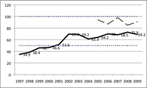
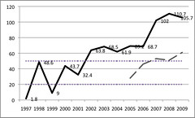
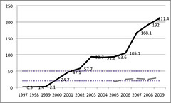

Time to get back into the thesis. The following is the next completed section from the evaluation part of chapter 5 of [my thesis](/blog2/research/phd-thesis/). A result of much data munging and some writing, still needs a bit more reflection and thought, but getting close.

### Features used in course sites

The previous sub-section examined the number of pages used in default course sites from 2000 through 2004. This sub-section seeks to examine in more detail the question of feature adoption within the Webfuse courses sites. In particular it seeks to describe the impact of the introduction of the default course sites approach and compare its results with feature adoption in course websites from other systems at other institutions. This is done using the Malikowski et al (2007) model introduced in Chapter 4, which abstracts LMS features into five system independent categories (see Figure 4.8). This sub-section first describes the changes in the available Webfuse features – both through new Webfuse page types and Wf applications – from 2000 onwards in terms of the Malikowski et al (2007) model. It then outlines how Webfuse feature adoption within course sites changed over the period from 2000 through 2004 and compares that with other systems at other institutions. Finally, it compares and contrasts feature adoption during 2005 through 2009 at CQU between Webfuse and Blackboard.

As described in Chapter 4, the fifth Malikowski et al (2007) category – Computer-Based Instruction – is not included in the following discussions because Webfuse never provided features that fit within this category. In addition, it is a category of feature rarely present or used in other LMS, especially from 2000 through 2004. Table 5.12 lists the remaining four Malikowski et al (2007) categories and lists the Webfuse features within those categories from 1997-1999 and 2000 onwards. The 2000 onward features included features provided by both page types and Wf applications.

Table 5.12 - Allocation of Webfuse page type (1996-1999) to Malikowski et al (2007) categories
| Category | Page Types (1997-1999) | Webfuse features (2000-) |
| --- | --- | --- |
| Transmitting content | Various content and index page types Lecture and study guide page types File upload and search page types | CourseHome CourseResources CourseSchedule CourseStaff CourseAssessment RSSUpdates LectureRepository Timetable generator (Jones 2003) |
| Creating class interactions | Email2WWW EwgieChatRoom WWWBoard and WebBBS | Yabb CourseGroup, CourseGroups CourseMailingLists Email Merge Etutes |
| Evaluating students | AssignmentSubmission | Quiz Assignment extension management Academic misconduct database OASIS (Jones and Behrens 2003) BAM (Jones and Luck 2009) Plagiarism detection IROG (Jones 2003) Peer Review Topic Allocation |
| Evaluating course and instructors | Barometer UnitFeedback/FormMail | Survey |

Table 5.13 shows the percentage of Webfuse courses that adopted features in each of the categories proposed Malikowski et al (2007) from 1997 through 2009. The "Malikowski %" row represents the level of feature adoption found by Malikowski et al (2007) in the LMS literature for usage reported before 2004. The "Blackboard %" row represents feature adoption within Blackboard by CQU courses during 2005. Blackboard was adopted as the official institutional LMS by CQU in 2004. The subsequent rows show the level of feature adoption within Webfuse courses from 1997 through 2007. The following describes some limitations and context for the data in Table 5.13 after which some additional visualisations of this data are shown and then some conclusions are drawn.

Table 5.13 – Feature adoption in Webfuse course sites (1999-2004)
| Usage | Transmitting content | Class interactions | Evaluating students | Evaluating courses and instructors |
| --- | --- | --- | --- | --- |
| Malikowski % | \>50% | 20-50% | 20-50% | <20% |
| Blackboard % | 94% | 28% | 17% | 2% |
| 1997 | 34.9% | 1.8% | 0.9% | 9.2% |
| 1998 | 38.4% | 48.6% | 1.4% | 0.7% |
| 1999 | 46.0% | 9.0% | 2.1% | 9.5% |
| 2000 | 46.6% | 43.7% | 24.7% | 6.9% |
| 2001 | 51.6% | 32.4% | 47.1% | 28.3% |
| 2002 | 69.6% | 63.8% | 57.7% | 44.2% |
| 2003 | 69.2% | 68.5% | 93.7% | 37.7% |
| 2004 | 61.3% | 61.9% | 91.8% | 35.7% |
| 2005 | 64.2% | 69.2% | 93.6% | 39.8% |
| 2006 | 70.0% | 68.7% | 105.1% | 31.6% |
| 2007 | 68.5% | 102.0% | 168.1% | 33.1% |
| 2008 | 72.9% | 110.7% | 192.0% | 51.6% |
| 2009 | 69.2% | 105.7% | 211.4% | 42.7% |

A variety of contextual factors and limitations are necessary to understand the data presented in Table 5.13. These include:

- Missing course sites;  
    As mentioned in previous tables both the course website archives for 1998 and 2000 are each missing course sites for a single term. The percentages shown in Table 5.13 represent the percentage of courses offered in the terms for which archival information is available.
- Missing mailing lists;  
    For most of the period shown in Table 5.13 a significant proportion of courses made use of electronic mailing lists for course communication. These lists, while supported by the Webfuse team, did not have an automated web interface until after the introduction of the default course sites. Information about the use of mailing lists before the default course sites is somewhat patchy. With none available before 2000 and only some information for 2000 and the first half of 2001.
- Optional versus compulsory content transmission;  
    All Webfuse courses sites, including both manually produced sites (pre 2nd half of 2001) and the default course sites (post 2nd half of 2001) included content. Rather than simply show 100%, Table 5.13 shows the percentage of courses where additional content was transmitted through the course site by teaching staff. This was an optional practice.
- The definition of adoption and the course barometer;  
    From 2001 through 2005 the presence of a course barometer was part of the Infocom default course site. This means that 100% of all Webfuse course sites had a course barometer. However, this is not represented in the figures for "evaluating courses and instructors" in Table 5.13. Instead, Table 5.13 includes the percentage of courses where the course barometer was actually used within the course.
- Greater than 100% adoption.  
    From 2006 onwards, both the class interactions and evaluating students columns suggest that greater than 100% of Webfuse course sites had adopted features in these categories. This arises due to the ability of courses to use a number of the Webfuse provided features (e.g. email merge and results upload) without using Webfuse for course sites.

The following graphs enable a visual comparison between the level of feature adoption within Webfuse and are also used to draw some conclusions about that adoption. These graphs use almost the same data as shown in Table 5.13 only separated into the four Malikowski et al (2007) categories. The only difference is that the following graphs also show how feature adoption for Blackboard changed over the period 2005 through 2009, rather than simply showing the level of adoption for 2005 as in Table 5.13. The Blackboard figures for 2009 only include data from the first CQU term, not for the entire year.

Figure 5.9 provides a visualisation of the percentage of courses using features associated with content transmission. The Malikowski et al (2007) range is identified by the dotted lines and represent that as of around 2004, it was common to find between 50% and 100% of course sites using content transmission features. The dashed line in Figure 5.9 shows that from 2005 through 2009 between 80% and 100% of CQU Blackboard course sites were using content transmission features. The thicker black line that includes data labels represents the percentage of Webfuse course sites using the option of adding content transmission features to the default course sites.

_Figure 5.9 - Percentage course sites adopting content transmission: Webfuse, Blackboard and Malikowski et al (2007)_ (click image to enlarge)

From Figure 5.9 it is possible to see that there was an increase from in the optional use of content transmission features when the default course site approach was introduced during the second half of 2001. In 2002, the first full year of operation for the default course site approach, there was an increase of over 20% use of content transmission features over 2000, the last full year without the default course site approach. From 2002 the adoption rate stayed above 60%. Figure 5.10 shows the percentage of course websites adopting class interaction features such as discussion forums, chat rooms etc. As of 2004, Malikowski et al (2007) found that it was typical to find between 20% and 50% of course sites adopting these features. From 2005 through 2009, the percentage of Blackboard courses adoption class interaction features increased from 28% through 61%. The data series with the data labels represents the adoption of class interactions within Webfuse course sites and highlights some of the limitations and contextual issues discussed above about Table 5.13.

_Figure 5.10 – Percentage course sites adopting class interactions: Webfuse, Blackboard and Malikowski et al (2007)_(click image to enlarge)

As mentioned in the previous chapter, the Department of Mathematics and Computing (M&C) - in which the Webfuse work originated - had started using email lists in 1992 as a way of interacting with distance education students. These lists arose from the same place as Webfuse. As outlined above prior to 2001, the archives of these mailing lists were kept separate from the Webfuse course sites and records are somewhat patchy. For example, there are archives of the mailing lists for 1998, hence the peak of 48.6% in 1998. The 1.8% and 9% adoption figures for 1997 and 1999 represent years for which mailing list data is missing. In addition, the greater than 100% adoption rates in 2007-2009 arise from increased use of the email merge facility by courses that did not have Webfuse course sites. These courses accessed the email merge facility through Staff MyCQU.

Figure 5.10 shows that adoption of class interaction features were significantly higher within Webfuse than both the Malikowski averages and in Blackboard. Given that once adopted, it was unusual for a course mailing list to be dropped, unless replaced by a web-based discussion forum. It is thought that complete archives of the pre-2001 mailing lists archives would indicate that as early as 1997, almost 50% of Webfuse course sites had adopted some form of class room interaction. Most of this adoption arose from M&C courses continuing use of mailing lists. The increased adoption of class interaction features post 2002 arise from the increased prevalence of Web-based discussion, especially amongst non-M&C courses.

Figure 5.11 shows the percentage adoption of features related to student assessment – typically quizzes and online assignment submission. It shows that the typical Malikowski et al (2007) adoption rate is expected to be between 20% and 50%. It shows that CQU Blackboard adoption from 2005 through 2009 ranged between 17% and 30%. On the other hand, Webfuse adoption after a minimal adoption in 1997 through 1999, increased to levels of over 90% from 2003 through 2005 before exceeding 100% from 2006 onwards.

_Figure 5.11 – Percentage course sites adopting student assessment: Webfuse, Blackboard and Malikowski et al (2007)_(click image to enlarge)

The almost non-existent adoption of student assessment features within Webfuse from 1997 through 1999 represents the almost non-existent provision of these features. A primitive online assignment submission system was used in a small number of courses during these years, mostly those taught by the Webfuse designer. From 2000 onwards an online quiz system became available and a new assignment submission system began to be developed. From this stage on adoption grows to over 90% in 2003. The use of Webfuse student assessment features far outstrips both the Malikowski ranges and those of CQU Blackboard courses.

Figure 5.12 shows the adoption of course evaluation features. It shows that the expected Malikowski et al range (2007) to be between 0% and 20%. The adoption of course evaluation features by CQU Blackboard courses ranges from 2% in 2005 through to 5% in 2009. Prior to 2001, the Webfuse adoption rate is less than 10%, but then increases to range between 28% and 52% from 2001 on. This increase is generally due to increase availability of the Webfuse course barometer feature (see Section 5.3.6).

_Figure 5.12 - Percentage course sites adopting course evaluation: Webfuse, Blackboard and Malikowski et al (2007)_(click image to enlarge)

Two of the peaks in the Webfuse adoption of course evaluation features from Figure 5.12 coincide with concerted efforts to encourage broader use of the course barometer. The 2002 peak at 44.2% coincides with the work of a barometer booster within Infocom during 2001 and early 2002 as described in Jones (2002). The 2008 peak of 51.6% coincides with a broader whole of CQU push to use the barometer for student evaluation purposes.

The above suggests that, in terms of feature adoption by courses, Webfuse and the default course site approach has been somewhat successful. It ensured that 100% of all courses offered by the organisational unit using Webfuse had a course site with some level of content transmission. With a significant additional level of content added to the course sites. Overall, there was a broader adoption of content transmission with less effort required by academics. In terms of course interactions, student assessment and course evaluation features, the services provided by Webfuse after 2001 has results in levels of adoption greater than broadly expected (as indicated by the Malikowski model) and than found in the use of the Blackboard system at the same institution.

### References

Jones, D. (2003). How to live with ERP systems and thrive. Paper presented at the 2003 Tertiary Education Management Conference, Adelaide.

Jones, D., & Behrens, S. (2003). Online Assignment Management: An Evolutionary Tale. Paper presented at the 36th Annual Hawaii International Conference on System Sciences, Hawaii.

Jones, D., & Luck, J. (2009). Blog Aggregation Management: Reducing the Aggravation of Managing Student Blogging. Paper presented at the World Conference on Education Multimedia, Hypermedia and Telecommunications 2009. from http://www.editlib.org/p/31530.

Malikowski, S., Thompson, M., & Theis, J. (2007). A model for research into course management systems: bridging technology and learning theory. Journal of Educational Computing Research, 36(2), 149-173.