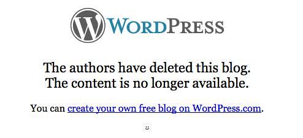

---
categories:
- bim
- bimerrors
date: 2010-08-02 13:31:57+10:00
next:
  text: No messiness here thanks - SNAFU all the way
  url: /blog/2010/08/03/no-messiness-here-thanks-snafu-all-the-way/
previous:
  text: Usage of Webfuse course sites
  url: /blog/2010/08/01/usage-of-webfuse-course-sites/
title: CQU problem with BIM and RSS feeds
type: post
template: blog-post.html
---
This is the first post in a new tradition. Any problems folk report with [BIM](/blog/research/bam-blog-aggregation-management/) and the subsequent diagnosis and solution I undertake will get reported here on the blog and hopefully mirrored in some way onto the BIM [github page](http://github.com/djplaner/BIM).

It is somewhat ironic that the first problem in this tradition comes from the [institution](http://www.cqu.edu.au/) I finished working at last Friday.

### A problem with cron?

The problem becomes apparent during the BIM cron process, the error BIM is reporting is

> Error getting _url for feed here_

### Locating the problem

This appears to be a problem with the BIM mirror process (the process by which BIM checks the feed for each registered blog feed to see if there are new posts). There's some problem retrieving the feed.

Exactly where is the problem?

\[sourcecode lang="bash"\] $ cd moodle/mod/bim/lib $ grep "Error getting" \* bim\_rss.php: mtrace( "Error getting $student\_feed->feedurl" ); \[/sourcecode\]

If I go look in bim\_rss.php, this occurs in the function _bim\_process\_feed_. This function is called for each registered blog feed and is meant to retrieve the feed, check it for new posts, and if detected, handle them. It does this using [the Simplepie library](http://simplepie.org/).

\[sourcecode lang="php"\] // get the RSS file $feed = new SimplePie(); $feed->set\_feed\_url( $student\_feed->feedurl ); $feed->enable\_cache( true ); $feed->set\_cache\_location( $dir ); $feed->init();

if ( $feed->error() ) { mtrace( "Error getting $student\_feed->feedurl" ); return false; } \[/sourcecode\]

This function is not only called during cron. It is also called every time a student visits the BIM activity. In this situation, bim\_process\_feed is called only for the logging in student. This makes sure that bim always shows the student the most up to date information about their feed.

### Diagnosing the problem

I'm guessing that the problem is one or more of the following, all associated with the failure of Simplepie to get the feed:

- There's a problem with a proxy setting and the institutional network configuration preventing access to the feed url.
- There's a problem with file permissions or similar on the institutional server preventing Simplepie writing to the cache directory.
- The student's blog doesn't exist any more.

### The problem

I have to admit, I was immediately thinking of some of the more complicated reasons for the problem. Then I remembered the last one above and decided I'd better type in the URL for the student's blog and see if I could access it. The following is what I found.

So it appears that the student has removed the blog, this would seem to indicate that the student needs to re-register the blog or perhaps has simply moved on.

### Potential Solutions

Is up to the institutional folk, the options I can see are:

- Ignore it.
- Find out what course/BIM activity the blog was registered for  
    Look for the feedurl in the bim\_student\_feeds table.
- Check the situation with the academic in charge of the course and perhaps do one of the following
    - Turn mirroring off for the BIM activity, if the course is finished.
    - Ask the teaching staff to follow up with the student.
    - Remove or modify the feed registration.  
        Check the table mdl\_bim\_student\_feeds