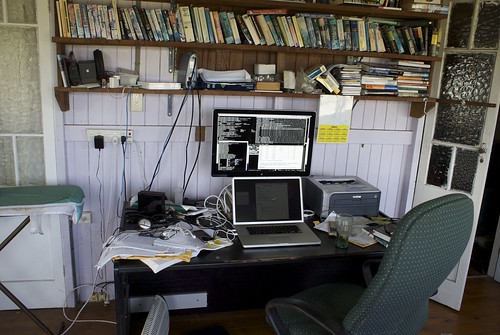

See also: [[blog-home | Home]]

Today has not been a good day for progress on the thesis. Have posted a few things I've already written and there are some folks reading bits of it thanks to Stephen Downes and OLDaily. That these folk find the work vaguely interesting enough to click on the link is a comforting thing, if not a motivating one for today.

### Entering a nascent meme?

So, instead of writing, I thought I'd procrastinate a bit more and attempt to enter what might be a nascent meme. Lisa Lane started it by [posting this](http://lisahistory.net/wordpress/?p=634) annotated photo of her office. I came across this, via Mike Bogle's [post showing off his more spartan office](http://techticker.net/2010/09/14/my-office/). Not sure if there are other examples, but it's enough of an excuse for me to waste some time.

So here it is, a photo of where I'm sitting at the moment not working on the thesis. Unlike Mike and Lisa, I'm in the very lucky position of not having an office at work, as I'm not currently working. An experience I'm increasingly enjoying, but realise will have to end soon. Which is a bit like the PhD only that I'm not really enjoying it at all.

Of course one of the reasons for doing this was to play with [mbedr](http://www.elsewhere.org/journal/archives/2008/02/23/mbedr/), but it won't work on this blog as wordpress.com strips object and iframe tags. You'll have to [go here to see the mbedr version](http://www.elsewhere.org/mbedr/?p=4997407027&s=1.25) or [the Flickr original](http://www.flickr.com/photos/david_jones/4997407027/).