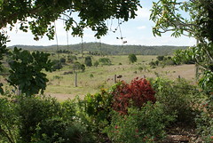
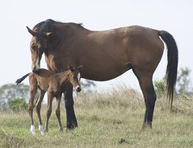

As work on the thesis is slowly finishing, I'm increasingly starting to think about the next chapter. What am I going to do post-PhD? The answer, potentially surprising for some, is probably going to high school teaching.

### Some context

After 20 years working as an academic for a local university, around August this year my position was made redundant. With not a little relief I left the institution eager to complete the thesis and see what the next chapter would bring.

As part of this process I did apply for a few jobs around university L&T support, mostly around e-learning, but a few months down the track nothing has come of them. I don't necessarily recommend this type of process as it can do some interesting things to your self-confidence. That said, there were some folk who were very nice. But, in the end, there was always a problem with those potential jobs, they required a move away from where we live.

While there's something to be said for living in some of those places. The family is quite settled where we are and it's a brilliant place to bring up the kids in a rural setting. Not to mention that the wife has a hobby that isn't easy to translate to other settings, breeding race horses.

More importantly, there are my two young sons (3 and 5). Being away from them at this time, would not be fun by any measure.

### What can I do?

So the question becomes what type of career can I build while staying in the local area. I'm legally not able to work at the one university in the local area until at least late next year. Even then I'm not sure going back as a member of staff would be a good thing. Not to mention the fact that the local university is being effected as much, if not more so, by the downturn in overseas student enrolments that is currently impacting many Australian universities. So, there aren't likely to be jobs at that institution, and even less likely folk who would want to appoint me. It is interesting and somewhat related that, as I found when applying for some jobs, I'm not really "technical enough" for some jobs and not really "educational enough" for some others.

That said, I like to teach. So high school teaching is an option. It requires me to return to study for a one year graduate diploma. Thankfully that's easily possible. Though returning to the same local institution as a student, after 20 years as a staff member will be very, very interesting.

High school teaching doesn't pay well, but that's not a problem for us. It has great holidays that provide the opportunity to spend more time with the boys. It hopefully allows us to stay where we are, and it enables me to become a bit more "educational". I also think that through this career change, I can make some sort of contribution to teaching and the local community, at least in some small way.

### What will I do?

I've started talking to a few local high school teachers who I know in various ways to get a better feel for the life style. So far so good, but I have a few more to talk with and who knows what might happen. It's another four or five months until any study would commence, a lot can happen in that time.

So, if you have any insights about high school teaching as a second career, or have a brilliant high-paying job to offer me, feel free to share.