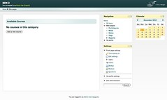

This might seem like a bit of procrastination preventing progress on BIM 2.0, but it's part of the whole Moodle 2 familiarisation process and also checking out the work of a [friend](http://rolleys.wordpress.com/). What follows is an attempt to install the [universite](http://rolleys.wordpress.com/2010/12/03/a-moodle-2-theme-universite/) theme for Moodle 2 onto a local instance.

### Zip files and mac GUI users

So, am unpacking the [theme zip file](http://files.me.com/rolleytickner/i11sol) into the right place and discover Rolley is still suffering from us Mac GUI background. Apart from the expected _universite_ directory, I also get the good old \_\_MACOSX directory. There's got to be a switch that turns that off.

### Configuration

Okay, so the theme appears in the right place in the Moodle 2 admin settings. Let's choose it and configure it. Okay, have to read a file on from the desktop. Is this common for Moodle themes? Or do they more often use online/web-based help? Should they?

The header is up and it all looks nice. So, I get to choose colours. Given I'm illiterate around colour schemes, I'll leave the defaults.

So, that's it. Not much there. Must need to read that config file. Mmm, not a lot of information there. Did I have the right file? Ohh, can't check again. Time to trawl the files. Ahh, and I quote

> ses the JQuery theme roller to allow the administrator to re-skin the background images. For instructions/notes please see the config.php file

No instructions in config.php though. Am at a loss, my ignorance of things CSS and JQuery is showing. Would like to put in some custom images. Not sure how.

Ahh, appears I have to use a [jQuery theme roller](http://jqueryui.com/themeroller/#ffDefault='Avant+Garde'%2C+Tahoma%2C+Arial%2C+Helvetica%2C+sans-serif&fwDefault=normal&fsDefault=1.1em&cornerRadius=6px&bgColorHeader=d9e8e8&bgTextureHeader=21_glow_ball.png&bgImgOpacityHeader=75&borderColorHeader=b4caca&fcHeader=222222&iconColorHeader=346060&bgColorContent=ffffff&bgTextureContent=01_flat.png&bgImgOpacityContent=100&borderColorContent=dddddd&fcContent=2b3636&iconColorContent=346060&bgColorDefault=fdf3b4&bgTextureDefault=02_glass.png&bgImgOpacityDefault=80&borderColorDefault=f7d845&fcDefault=222222&iconColorDefault=346060&bgColorHover=f7d845&bgTextureHover=02_glass.png&bgImgOpacityHover=100&borderColorHover=f7d845&fcHover=222222&iconColorHover=346060&bgColorActive=f8af2a&bgTextureActive=02_glass.png&bgImgOpacityActive=50&borderColorActive=f7d845&fcActive=222222&iconColorActive=222222&bgColorHighlight=fef8d2&bgTextureHighlight=21_glow_ball.png&bgImgOpacityHighlight=100&borderColorHighlight=f7d845&fcHighlight=346060&iconColorHighlight=346060&bgColorError=e2eeee&bgTextureError=07_diagonals_small.png&bgImgOpacityError=100&borderColorError=137771&fcError=e11b19&iconColorError=e11b19&bgColorOverlay=1f3838&bgTextureOverlay=21_glow_ball.png&bgImgOpacityOverlay=0&opacityOverlay=80&bgColorShadow=000000&bgTextureShadow=01_flat.png&bgImgOpacityShadow=70&opacityShadow=33&thicknessShadow=7px&offsetTopShadow=-7px&offsetLeftShadow=-7px&cornerRadiusShadow=8px)

This is what it looks like

So Rolley, what have I missed/screwed up?