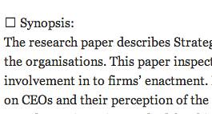
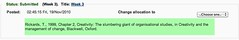
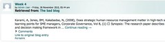

---
categories:
- bim
- bim2
- bimerrors
date: 2010-12-10 20:12:18+10:00
next:
  text: First coding steps for bim2
  url: /blog/2010/12/19/first-coding-steps-for-bim2/
previous:
  text: Becoming aware of the existence of different perceptions
  url: /blog/2010/12/06/becoming-aware-of-the-existence-of-different-perceptions/
title: A solution for BIM and special characters?
type: post
template: blog-post.html
---
The main long term issue in the use of BIM has been student's creating blog posts that contain ["special" characters](/blog/2010/09/05/more-problems-with-bim-and-special-characters/). This is typically done when they create their post in Word and then copy and paste it into their blog. The interaction between BIM, [SimplePie](http://simplie.org) and database engines has not been a good one. It results in blog posts either not being stored in the Moodle database or being cut off at the special character.

A couple of days ago I got a report of this type of problem from a course using BIM. Previously, all of the recent problems associated with special characters have been specific to this university's version of Postgres. I couldn't re-create the problems with my test Moodle install with MySQL or Postgres. This latest report is different. It causes problems on my install using MySQL.

More interestingly, it also doesn't cause a problem with Moodle 2's external blog feature. This is interesting because Moodle 2's feature is using SimplePie, just like BIM. It appears that Moodle and/or the install of Moodle 2 I have is doing something that addresses the special character problem. The aim is to investigate and identify what this is and see if it can be incorporate into BIM.

In the end, this evolved into a solution for BIM v1 that has been put into the git repository. Now onto BIM v2.

### The problem

Some evidence of the problem. First, what the problem post looks like on the student's blog. Note the little square.

[](http://www.flickr.com/photos/david_jones/5245275498/ "The problem post by David T Jones, on Flickr")

This causes the a problem in BIM, once the special character is reached, nothing else is stored. The same post above in BIM. (Click on the image to see a larger version).

[](http://www.flickr.com/photos/david_jones/5244675363/ "The problem post in BIM by David T Jones, on Flickr")

And evidence that it is working in Moodle 2. Note: Moodle 2 only stores a sub-set of the post, not the complete content. But you can see that it does include the square and some of what follows.

[](http://www.flickr.com/photos/david_jones/5245275614/ "Problem post in Moodle 2 by David T Jones, on Flickr")

### Is Postgres making the difference?

My Moodle 2 install is using Postgres, so there's a chance that this is the source of the different outcome. Must test that.

No, it appears that it does fail in Moodle 1.9 + BIM + Postgres. However, it fails differently than for MySQL. As above, MySQL only cuts off everything after the first special character. It still inserts an entry for the post. Moodle 1.9 + BIM + Postgres doesn't create an entry at all for the post.

So there appears to be a real difference in how Moodle 2 is doing this, what is it?

### How does Moodle 2 do it?

So, the aim here is to go through the Moodle 2 code and try and determine what it is doing that is making this work.

Registering an external blog is starts in Moodle 2 with the ~/blog/external\_blog\_edit.php file. This presents the form to enter the details of the external blog. It also processes the form. It uses a Moodle class that wraps around SimplePie to get the data.

The first step is to look at the data it gets to check if this is where the special character handling occurs?

```php
$rss = new moodle\_simplepie($data->url);

print "<xmp>"; 
print\_object( $rss ); 
print "</xmp>"; 
die;
```

Without the _die_ this code simply updates the database and reports back success on a different page without giving a chance to see the dump. Looking at the dump, you can see that SimplePie is getting the complete posts from the feed.

Which is also what happens in Moodle 1.9 + BIM + Postgres. So the question is what is different about the Moodle 2.0 database queries that result in ignoring the special characters?

This is done in the function _blog\_sync\_external\_entries_. Which as expected, loops through the entries in the feed and inserts them in the database. It does this by creating an object, setting up the fields and using the _insert\_record_. This is essentially the same as BIM. So where's the difference?

Is it in the _insert\_record_ function?

The abstract classs is in _~/lib/dml/moodle\_database.php_. There are then separate implementations for each database type, including pgsql.

It appears to be using a PHP function [pg\_query\_params](http://php.net/manual/en/function.pg-query-params.php) to populate the parameters into the SQL statement, possibly handling quoting. Two questions

- Is this where it happens?
- Is it used in Moodle 1.9?

### The final solution?

This post has been on the go for a few days as real life intrudes on BIM v1.0 work. In the end folk needed a solution for v1 and it looks like I found one and it has been committed into git. 

```php
$content = iconv( "ISO-8859-1", "UTF-8//IGNORE", $raw\_content );
```

Which, as I understand it, essentially ensures that all the characters in the content string (content of a blog post) are in the UTF-8 character set. i.e. the character set being used by the database. Doing this ensures that the database doesn't complain or fail on insert.

The drawback of this solution is that when the content is displayed it shows up (on many?all? browsers with funny characters. The advantage is that it appears to work. Even on the problem posts used above.

Let me know if you have any problems. Am waiting for a local university to try this in production, if it works there, I'm hoping it will work anywhere.