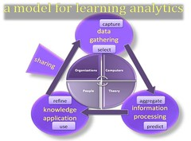

The following is the summary of my first reading for the [LAK11 MOOC](http://www.learninganalytics.net/) and follows on from [my initial thoughts](/blog2/2011/01/10/a-start-to-the-introduction-to-learning-and-knowledge-analytics-mooc/).

I decided to start with the paper title [Learning analytics: Definitions, processes and potential](http://learninganalytics.net/LearningAnalyticsDefinitionsProcessesPotential.pdf) as it appeared from the combination of the data published (Jan 2011) and title to give the more current overview. It's also written by one of the course facilitators, so should have some connection to the course.

### Summary

The paper essentially

- Defines some terms/concepts;
- Abstracts from some published "analytics processes" a common set of 7 processes/tasks.
- Identifies four types of resources; and
- combines them in the following model.

The paper closes with what seems to be the ultimate goal of most of the folk involved with learning analytics - automated, individualised education. I'm not sure that this is a helpful aim. First, because I have my doubts that it can ever be achieved in the real world as opposed to a closed system (i.e. laboratory experiment). Second, because I think that there is a chance that having this as the ultimate aim will result in less focus on, what I think is the more fruitful approach of, working out how analytics can supplement the role of human beings in the teaching process.

Mm, that's probably got a few assumptions within it that need to be unpicked.

The following is a slightly expanded summary of the paper.

### Introduction

It starts with defining learning as "a product of interaction". With the nature of the interaction being broadly different depending on the assumptions underpinning the learning design.

Regardless, we want to know how well things went. Traditional methods - student evaluation, grade analysis, instructor perceptions - all have limitations and problems.

**Question:** What are the limitations and problems with learning analytics? There is no silver bullet.

As more learning is computer facilitated, there's interest in seeing how data accumulated can be used to improve L&T...leading to learning analytics. The application of statistics to rich data sources to identify patterns is already being used in other fields to predict future events.

The paper aims to review literature on analytics and define it, its processes and potential.

### Learning analytics and related concepts defined

The cynic in me finds the definition of business intelligence particularly frightening/laughable. I do need to learn to control that.

| Term | Definition |
| --- | --- |
| Learning analytics | "emerging field in sophisticated analytic tools are used to improve learning and education"..drawing from other fields of study |
| Business intelligence | established process through which decision makers in the business world integrate strategic thinking with information technology to synthesize vast amounts of data into powerful decision making capabilities |
| Web analytics | using web site usage data to understand how well the site is achieving its goals. |
| Academic analytics | application of the principles and tools of business intelligence to academia   Or more narrowly by other authors, is to examine issues around student success |
| Action analytics | greater emphasis on generating 'action', i.e. applying data in a "forward thinking manner" |

Does mention the problems faced when implementing these type of strategies with existing institutional arrangements, especially around data/system ownership. Suggests that learning analytics is intended more specifically to address these issues. Especially in terms of providing the data/analysis to students/teachers within the teaching context. Right up to some of the automated/intelligent tutoring type approaches.

> Thus, the study and advancement of learning analytics involves: (1) the development of new processes and tools aimed at improving learning and teaching for individual students and instructors, and (2) the integration of these tools and processes into the practice of teaching and learning.

I can live with that. It's what I'm interested in. Sounds good.

### Learning analytics processes

Essentially a collection of four different models/abstractions of how to do this stuff and then a synthesis into a common 7 processes of learning analytics

1. select
2. capture
3. aggregate and report
4. predict
5. use
6. refine
7. share

#### Knowledge continuum

This is the DIKW (Data/Information/Knowledge/Wisdom) stuff which some of the KM folk, including [Dave Snowden](http://www.cognitive-edge.com/blogs/dave/2010/05/its_information_to_data_we_nee.php), don't have a lot of time for. In fact, they [argue strongly against it](http://arizona.openrepository.com/arizona/bitstream/10150/105670/1/The_Knowledge_Pyramid_DList.pdf) (Fricke ??).

**TO DO:** There is much of interest in Fricke (2007), I have not read it through and some appears heavy going, I should take the time. An interesting reference/quote is this one

> Results from data mining should be treated with skepticism

drawn from some work that and [describe more here](http://abcn.ws/gOIOcM)

The DIKW stuff is connected to learning analytics through some work that suggests things like "Through analysis and synthesis that (sic) information becomes knowledge capable of answering the questions why and how".

**Another to do:** Snowden's thoughts on DIKW and his work suggest another "process" for learning analytics. Should take some time to look at that.

#### Web analytics objectives

From Hendricks, Plantz and Pritchard (2008), "four objectives essential to the effective use of web analytics in education:

1. define the goals or objectives;
2. measure the outputs and outcomes;
3. use the resulting data to make improvements; and
4. share the data for the benefit of others.

#### Five steps of analytics

Campbell and Oblinger (2008)

1. capture
2. report
3. predict
4. act
5. refine

#### Collective application model

Summary of a Dron and Anderson model

### Learning analytics tools and resources

Draws on various source to suggest that "learning analytics consists of"

- Computers;  
    Includes an interesting overview of the different bits of technology (and their limitations) that are currently available. Including some references criticising dashboards.
- People;  
    Interestingly, this is the smallest section of the four, but perhaps the most important. In particular, the observation that developing effective interventions remain dependent on people.
- Theory;  
    Points to the various "kernel theories" for analytics and the observation by MacFadyen and Dawson (2010) that there's little advice which of these work well from a pedagogical perspective.
- Organisations.  
    Importance of the organisation in developing analytics and some of the standard "leadership is important" stuff