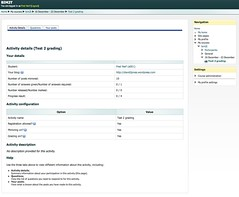
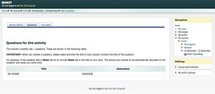
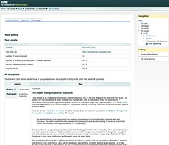

The purpose of this post is to make concrete the status and future plans around bim2. The update of [bim](/blog2/research/bam-blog-aggregation-management/) for Moodle 2.0.

### Current status

I have missed the initial deadline (31/01/2011) for a working bim2. <excuses>A combination of [the PhD](/blog2/research/phd-thesis/) being more important, [procrastination](http://www.amazon.com/Girl-Dragon-Tattoo-Stieg-Larsson/dp/0307454541/) and a post-thesis malaise.</excuses>

I've just finished the first major stage of bim2 development tonight. The [code for bim2 on github](http://github.com/djplaner/bim2) will

- Support creation of a bim2 activity.  
    Though I've just discovered a minor bug. Will fix that.
- Implements the complete student interface including registering and processing a new blog and viewing details. Some images follow (click on the images to see a larger version).

This doesn't sound much, that's because the more important stuff is what has gone on behind the scenes, including

- Design and implementation of a new OO design for bim2. 
    This is perhaps the most questionable part of the changes for bim2. In theory, the changes should make it easier to evolve, but the ad hoc, half-forgotten OO design skills employed may put pay to that.
- Get bim2 to use the Moodle 2 version of simplepie.  
    The biggest problem reported by folk hosting Moodle is that bim required an external module called simplepie which was quite large. Moodle 2 has simplepie baked in. bim2 is using that version.
- Feed processing.  
    Beyond the use of Simplepie, bim has to be able to process and mirror student feeds. This has been done as part of the student interface and will be re-used elsewhere.
- Get around changes in Moodle 2. 
    Mostly fairly minor, but still changes to become aware of.

What's important is that the rest of bim2 will essentially be re-using all of the above. There's little brand-new to learn. Hopefully this means things will go quickly from here.

### Planning

In terms of getting a reasonable working version of bim2 available for folk, the major steps are

1. Implement the coordinator interface.  
    The coordinator is responsible for a bim2 activity and is able to configure the activity, manage questions, allocate markers, manage marking, search for students and mark students.
2. Implement the marker interface.  
    Markers are teaching staff who can't do some of the more advanced coordinator tasks, just the subset of marking students. This task should simply be a "re-badging" of the coordinator code.
3. Look at the various background/support tasks.  
    The main one is probably going to be the backup and restore process.
4. Clean up and test.  
    There are some minor, fiddly tasks I'm leaving until this stage (beyond a detailed testing of the code) such as getting all of the help text working well.
5. Add new features.  
    There are plans to add a range of features to bim2 that were not in bim (e.g. working with Moodle groupings etc.). These additions will be left to last.
6. Get feedback from others.  
    There are a couple of groups eager to test out the mess I've made of bim2. They will almost certainly have good feedback that will need to be incorporated.
7. Work out how to release bim2 more formally.  
    Mostly this is to do with the Moodle plugins database and/or its replacement.

The plan is that the first 4 tasks will be done sequentially. The last three might happen in parallel or in different orders. It might take me a good week of work to get the coordinator interface going, but it might go much faster. All depends on how quickly the porting of bim into bim2 OO goes. After that, however, the marker interface should just about write itself. The background stuff might drag or might go quick, don't know enough yet.

So, it's probably 3 or 4 weeks. Time to get cracking.