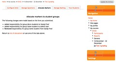

---
categories:
- bim
- bim2
date: 2011-02-13 23:17:19+10:00
next:
  text: Getting an overview of the term ahead
  url: /blog/2011/02/15/getting-an-overview-of-the-term-ahead/
previous:
  text: On the potential flexibility of open source LMS and its limits
  url: /blog/2011/02/13/on-the-potential-flexibility-of-open-source-lms-and-its-limits/
title: '"bim2: Some more coordinator tabs"'
type: post
template: blog-post.html
---
The [last work](/blog/2011/02/13/bim2-starting-on-the-coordinator-models/) on bim2 ended up with the first 2 of 5 tabs for the coordinator interface completed. This post continues on with that development.

### Allocate markers

This is the tab which allows the coordinator to allocate different teaching staff to different groups of students. This structure arises from the context of the first institution to use BIM/BAM. In that context, it was not unusual for a course to have 10+ academic staff teaching the course, each responsible for a different cohort.

The basic algorithm for this tab is/was

- If there are no teaching staff listed for the course, display a message and stop here.
- If there are no groups for the course, display a message and stop here.
- Otherwise, get all of the current bim marker allocations (stored in a bim table).
- Display a form that contains a select menu for each marker. The menu contains all groups and highlights those that are allocated to the marker.
- On submission, check the allocation to each marker and update database appropriately.

To a large extent this follows the same structure as the manage questions tab developed in the [last post](/blog/2011/02/13/bim2-starting-on-the-coordinator-models/). This implies I'll need to implement the following classes:

1. allocate\_markers - model.  
    The data needed includes
    - List of all teaching staff for the course.
    - List of groups for the course.
    - List of bim2 marker allocations for this activity.
2. allocate\_markers\_view - view.  
    Which will implement much the same "structure" as the manage markers view in terms of displaying and processing the form.
3. marker\_allocations - object.  
    Simple class to retrieve list of current marker allocations.
4. bimtwo\_allocation\_form - the form.  
    Moodle form class extension that implements the form.
5. bimtwo\_process\_allocation\_form - object.  
    Processes the form on submission.

_To do:_ The intent is that bim2 will recognise groupings, an aspect of Moodle's operations that I have yet to grok. For now, I plan to ignore this and get a version of bim2 up and going. Given the OO structure, in theory it should not be difficult to come back and add support or groupings at a latter date.

Okay, that looks like it is working. The initial Allocate Markers page is very simple

Just a list of teaching staff with a select menu full of course groups. The results of any processing are given a simple unordered list.

There is a small problem with these images in that there are some missing images from the theme. They weren't missing in the Manage questions dumps from earlier in the day. So I'm assuming there is some minor problem with the theme rather than a fundamental mistake in how I'm doing something in Moodle.

### What's next?

Hopefully tomorrow will see the last two coordinator tabs completed. Manage marking is a fairly simple in terms of form processing. "Your Students" is more complex, but it also serves as the interface for markers.

So, I'm hoping that the complete staff interface should be finished by Tuesday. i.e. most of bim2 will be working.

Then I move onto backups and other background tasks. Won't be able to predict deadlines for those tasks until I take a closer look at the changes in backups for Moodle 2.