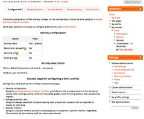
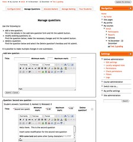
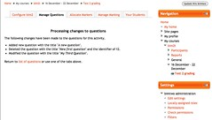

See also: [[blog-home | Home]]

The [last bit of work](/blog2/2011/02/06/bim2-the-greater-coordinator-conversion/) on bim2 set up the structure for the coordinator interface and operations. This post documents the work of implementing the models, i.e. starting the process by which the coordinator interface actually starts actually working. Most of this should be a reasonably straight translation/update of bim into the OO structure of bim2.

This post gets the first two tabs done. Three to go.

### Configure

The aim here is to display basic configuration information and link to the standard configuration form. This is somewhat simpler because there's already a class for doing this that is used by the student. So, will have to borrow that and perhaps add a bit more beside.

Yep, all done. Also discovered that the problem with help buttons was due to the theme I was using, not my use of Moodle. Progress!

Time to double check and get the actual configure process working. First, a win with the help buttons, finally figured out what I was doing wrong. Next was a bug in the database table to hold the configuration and now there is a problem with the description being saved. Yep, another transition mistake in moving to Moodle 2. Fixed. (Click on the screenshot below to see it larger).

[](http://www.flickr.com/photos/david_jones/5439685195/ "configure by David T Jones, on Flickr")

### Manage questions

Most of the remaining tabs for a coordinator (except Manage marking) require the use of forms. Manage questions presents a form that contains space to add a question and form elements for each existing question. It's used to modify, add and delete questions. Handling forms in this structure is a little different - and more complex - than what has happened so far. So, first step here is to re-acquaint myself with the kludge I used for the student form for registering a new blog.

The process is that the controller method remains essentially the same - create model, create view, pass model to view and use view's display method - the difference is that the view embodies the Moodle form process. Which is essentially

- Create a form object;
- Implement 3 or so different options based on a value from the form object including: display the form, handle a cancellation and process the form contents (i.e. update the database).

Actually, that's not too different. First step is to create the model. In this case the model has to know all about the questions for this bim2 activity. For which there is already a class, but it will need to be embedded in a model object. So, copy a model from the student over and update it to use the questions class. Done that was quite simple and the view is dumping its contents.

The step now is to use the data in the model to display and handle the form. The rough, initial version of the code looks like this 

```php
function display() {

global $OUTPUT; global $CFG;

// construct the form $cm\_id = $this->model->factory->cm->id; $form = new mod\_bimtwo\_questions\_form( "view.php?id=$cm\_id" );

if ( $form->is\_cancelled() ) { 
  $this->view\_header( "questions" ); 
  echo $OUTPUT->heading( "Manage questions" ); 
  $form->display(); 
} else if ( $from\_form = $form->get\_data() ) { 
  echo $OUTPUT->heading( "Process the form" ); 
} else { 
  $this->view\_header( "questions" ); 
  echo $OUTPUT->heading( "Manage questions" ); $form->display(); 
}

//print\_object( $this->model->questions ); 
$this->view\_footer(); 
```

What's left to do is create the bimtwo\_questions\_form class and put in the real code to process the form.

The form class should be a straight copy and slight update of the form used in bim. Yep, that's working fairly simply. Most of the work was involved with updating the language strings.

One extra bit of work is that the questions form from bim does assume the existence of an additional bit of information for each question, i.e. a status array showing number of students in each state. The question class in bim2 doesn't support this, but I should be able to simply add a method, implement status and Robert is a parental male sibling. Done.

Now to process the form and update the database. First, the outline of the process from bim

- If a title and post for a new question then add a new question.
- Loop through each of the existing questions and do a range of checks for changes
- Re-display the manage quesitons form.

In bim this is implemented as quite a long winded procedural function. Probably a candidate for methods or perhaps a new class. I'll go the new class, don't want to muddy the "view" waters with stuff that is manipulating questions.

Forgot the function to add the question data into the form.

Okay, so have a processor object that is doing the form processing. Have implemented the checks for a new question and deleting questions. Also have adopted the approach where the view (which creates the processor) figures out how to display what was done. Time to move onto the handling of modification of existing questions. The process will be for each existing question

- for each existing question
    - check if there has been any change;
    - if so, make a copy of the changes in "changed\_question"
- update the database with the changes;

Question: what happens if a question has already by deleted when it comes time to update? At the moment the question will have already been deleted from the database as deletion is handled first. So will prevent "deleted" questions from being modified.

Okay, now there is a problem with the update\_record method, "update\_record\_raw() id field must be specified." Appears for some reason that the structure being passed in is having all the fields cleared before insertion! Ahh, silly user error and unhelpful error message. I was using an old bim v1 table name, not the new version and Moodle wasn't giving an error that suggested this as the problem.

With that fixed, manage question is working. Based on my naive understanding of good Moodle 2 practice I can no longer do the automatic redirect that bim v1.0 used. Instead, you start Manage Questions with the following page that shows a list of all existing questions and space to add a new one.

[](http://www.flickr.com/photos/david_jones/5439685739/ "Manage Questions by David T Jones, on Flickr")

You make your changes on that page and hit one of the submit buttons. bim2 then processes the changes and displays details about what happened.

[](http://www.flickr.com/photos/david_jones/5440289364/ "Manage questions update by David T Jones, on Flickr")

There is a link at the bottom of that page to return to the first Manage Questions page. In bim1, this would have been where the automatic re-direct would've happened.

### What's next?

Well, that's two of the coordinator tabs down. Another three to go. Will start another post for those.