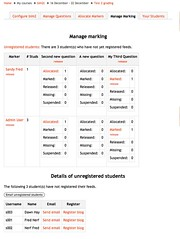

The next step in bim2 development is implementation of the manage marking tab.

### What is it?

bim arises from an institutional context where it is common for courses to have at least a couple hundred students and greater than 10, sometimes greater than 20, teaching staff. The model at this institution was to have one or two of the teaching staff to take on the role of "coordinator". The one in charge. One of the tasks for a coordinator is to manage and moderate the marking performed by other staff. Moderation is intended to ensure some consistency in marking.

To do this, the coordinator needs some way to observe how each other staff member is going with their marking and also to be able to access and view specific comments and marks awarded by the other staff. This is the purpose of the manage marking tab.

Another bim specific task was the releasing of marked posts. Since the coordinator had to moderate all marking before release, bim was designed so that only a coordinator can release marked posts. Students cannot see the mark and comments for their post until it is released.

In bim, the manage marking tab shows:

- Unregistered students.  
    This is a list of students who have not yet registered their feed with bim. bim provides a mechanism by which these unregistered students can be contacted via email using the Moodle bulk mail service.
- Marking summary.  
    A table with a row for every marker and columns for each question. In each question column it would show how many of the marker's students have posts in the different states (i.e. submitted, marked, suspended, released, missing). Each of the different states is a link that will show the details of the students that have posts in that state. It also provides various links to release sets of posts.

### What's required?

There will four main pages for manage marking

1. Main page.  
    This shows the information described above.
2. Results of release page.  
    Showing the success (or otherwise) of an attempt to release posts.
3. Details page.  
    Shows the details of students with posts that meet certain criteria.
4. Change blog registration.  
    A way in which the coordinator can register a blog for unregistered students. This will be a page used in a number of other spots.

Each of these will have to be implemented separately, will attack them in order.

### Main page

This is going to be a fairly straight-forward typical model/view combination. No form processing with this one. The only "difficult" aspect will be on deciding exactly how to create the support classes to get some of this information, rather than build it straight into the Model. Most of this data could/will be used elsewhere.

#### Model

The data required for this page includes

- To calculate unregistered students
    - List of all student users for the course.
    - List of all registered feeds.
- List of all questions for the activity.
- List of all the markers for the course/activity and also a list of the students that are allocated to those markers.  
    This is quite a complex task requiring a combination of a range of information. In bim, this was implemented as a hash where the keys were the userid for the markers and the value was another hash consisting of
    - marker - the markers id.
    - students - a hash of user details for all students allocated to the marker keyed on user id.
    - details - the markers user details.
    - statistics - a hash of stats for markers progress. i.e. how many posts are in the various states. The keys for this hash were either the question ids (which gave stats for that question) and "total" (which gave the overal total stats).

Current planning is to implement the above using the following classes

- bimtwo\_students - get all student details, including unregistered etc.
- bimtwo\_questions - this is an existing class.
- bimtwo\_markers - for the markers details.  
    It has the following data members
    
    - DATA - hash of hashes, key is marker id, each element contains
        - firstname/lastname
        - students - hash of hashes, key is student id, value is entry groups\_members
        - statistics - hash of hashes, key is question id, value is status and num in that status.
    - questions point to questions for activity
    
    #### View
    
    As implemented there are two main parts to the view
    
    1. Manage marking
        - Link to unregistered students and indication of how many there are. **DONE**
        - Main table for overview of marking stats for each marker. **DONE**
    2. Unregistered students - implement this with new view class
        - Another message about how many there are.
        - A button to email unregistered students.
        - Table listing the unregistered students and their details.
    
    There are also some gotchas, cases where special displays are required
    
    - No questions - the manage marking table doesn't come with question columns **DONE**
    - No markers - no manage marking table **DONE**
    - No students - can't do anything **DONE**
    
    #### Implementing unregistered students view
    
    This is a separate class as it will be used again.
    
    First, is there still a bulk email message service in Moodle 2? Yep, hasn't changed. Same place. That works.
    
    So, now for the message and details table. Done. Here's what it looks like
    
    
    
    ### What's left
    
    In terms of display, Manage marking is done. What's left, however, are the various "services" which are linked to from manage marking. These include
    
    - Releasing marked posts.
    - Displaying student details that match certain criteria.
    - Registering a blog.
    
    I'll leave these until the next post.