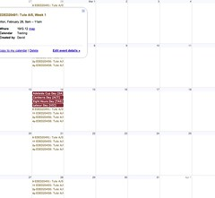

Apparently, it is [too complex](/blog2/2011/02/15/getting-an-overview-of-the-term-ahead/#comment-3835) to create a personalised class timetable for students at the institution I'm attending. I have [previously described](/blog2/2011/01/30/institutional-information-systems-and-the-problems-of-service-provision/) what I (as a student) have to currently do to create my class timetable as well as explaining that I helped implement a personalised class timetable system at the same institution about 10 years ago.

The purpose of this post is to find out just how difficult it would be to do it today.

### The context

The institutional context includes:

1. A collection of [static web pages](http://timetabling.cqu.edu.au/FCWViewer/view.do?page=9894) that contain class timetabling information.
2. A newly introduced Google Apps for Education for students (i.e. students all have institutionally provided individual Google calendars).

### The plan

The [previous personalised timetable system](/blog2/2011/01/30/institutional-information-systems-and-the-problems-of-service-provision/) at this institution was a stand-alone web application. With some input it created a one week summary timetable as a single HTML page. Given the change in context, in particular the availability of Google calendar, the plan is to respond to this change. Rather than having a stand-alone institutional application, the plan is to integrate with what students are using.

That is, the plan is

1. [Web scrape](http://en.wikipedia.org/wiki/Web_scraping) the institutional web page to get the data.
2. Use the data to create an [iCalendar](http://en.wikipedia.org/wiki/ICalendar) file or similar with the timetable information.

The idea is that the student can then important the iCal file into Google Calendar or any other calendar program that supports that file format (which is most). If this were an institutional system, it might be able to automatically pre-populate all students' individual Google calendars with their class timetable.

### Missing access

The last time I implemented a system like this I was within the institution, this time I'm not. This means I don't have access to information such as

- The list of courses a student is enrolled in.  
    For the test I'll hard-code it with the four courses I'm enrolled in. Wouldn't be hard to taken any list of courses and generate a calendar.
- The dates for each week in the University calendar (e.g. week 1 is Feb ?? to Mar ??)  
    I'll also have to hard-code this.
- Assessment due date information which could be added to the file.  
    I'll leave this data out of this little test.
- Ability to automatically import information into the institutional Google calendar.  
    Not sure if this is possible. If it were the institution could automatically insert into a student's Google calendar their timetable.

### Web scaping

I don't think the web page format for the timetable has changed too much. Am hoping that I still have the code that can easily web scape the appropriate web pages.

Yep, there's a bit of code from a couple of years ago, let's see if that will work.

I think the hardest part here will be getting this ancient Perl code to run on my new computer when I haven't done anything with it for years. Yep, get that working and hey presto it is extracting the information.

One of the limitations of the old Perl install is that the database stuff isn't working. This is okay as I don't need it for this little exercise. So, remove the database stuff and create a hashed data structure that allows manipulation.

Done.

### Create an iCalendar file

Can this be done in Perl? Yes, a quick Google reveals [the Data::ICal Perl module](http://search.cpan.org/~alexmv/Data-ICal-0.16/lib/Data/ICal.pm) and some code that used Data::ICal to do something similar as I've planned (though only for the 2010 FIFA World Cup).

Say what you like about Perl, but CPAN rocks. Simple single statement and Data::ICal and all other necessary files are installed and working.

A couple of hours later (including a stop for lunch) and I have produced an ical file that will get imported into Google calendar. Main problem at the moment is that the timezone isn't quite correct. Google calendar is showing the events 10 hours after they should have been - I think this is timezone related.

The big question now, "is there an easy way to delete all these entries?". A google search reveals an option under setting for Google calendar.

Yep, slight change in the timezone setting and the times are okay. What about the dates?

Oops, week 12 dates showing up early (typo in hard-coded start date). Week 8 on a Tuesday, not Monday. Ahh, public holiday that Monday. So official week start date is the Tuesday. My code assumes the Monday. A more detailed version of this would need to figure out the public holidays. Same for week 9.

### It's all working

So, what's been implemented is a script that

- Automatically scrapes the institutional web page with timetabling information.
- Extracts only the courses being taken by a student.
- Generates an iCal file with the weekly personal class timetable.

Week 1 for me looks like the following. Click on the images to see a larger version.

The monthly view on Google calendar, with one of the events highlighted looks like this

### Concept proven, work to do

It took me just over 3 hours to complete this. There was a break for lunch and most of the time was spent remembering how to interact with Perl and the Webfuse code.

This is not an "enterprise" solution, not yet. But it wouldn't be that difficult to do. It's certainly not impossible.

If you have followed some of [my previous work](http://www.slideshare.net/davidj/alternatives-for-the-institutional-implementation-of-elearning-lessons-from-12-years-of-webfuse) or [blog posts](/blog2/2011/02/13/on-the-potential-flexibility-of-open-source-lms-and-its-limits/) it will not be a surprise that I believe there are significant barriers in the processes around institutional IT systems that limit the possibility of these types of innovations.