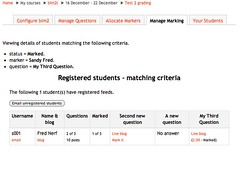

As per [the last post](/blog2/2011/02/16/bim2-coordinators-manage-marking-tab/) time to complete some support services for manage marking.

- Releasing marked posts.
- Displaying student details that match certain criteria.
- Registering a blog.

### Getting the controller going

First step is to set up the controller to start processing.

The current plan is that the processing will be done within the manage marking function, so tab is the same. The parameter op specifies which of the three services to execute. The view base class is already set up to allow sub-operations via the methods hash which originally looks like this for manage marking 
```php
"marking" => array( "default" => "manage\_marking" ),
``` 
which suggests only the one method. If the op URL parameter is set, then it will look for alternatives, so it changes to 
```php
"marking" => array( 
  "default" => "manage\_marking", "view" => "view\_details", 
  "release" => "release\_posts", "register" => "register\_blog" 
),
```

All that's left is to define the methods such as **view\_details**. Initially all with simply print statements, but subsequently with models and views.

Done.

### View details

So, this should be a standard model/view combination

#### Model

The process here is

- Check the additional parameters which specify which group of students to display.
- Get the data for those students.
- Display the details for those students.

There's already a class that gets details for all students, seems to make sense to modify that to handle the ops. Now have to get list of students for a marker, there is already a markers class, but it does it for all. Can it be made to work for just a single marker? Yep, that works, much the same approach as above.

So, the basic model is working. Needs a bit more work on the missing value, but will do for now.

#### View

The idea is to display the student details that match the chosen values. Students can be either registered or unregistered, so treat them differently.

While I wish to display it as part of manage marking, this display will also be required elsewhere. So, will implement with two views

1. bimtwo/coordinator/view\_details\_view.php - responsible for the header/footer and getting the navigation to fit within manage marking.
2. bimtwo/lib/students\_view.php - to display the actual body of the page, the student data. This can be re-used elsewhere.

In fact, there is already a bimtwo\_unreg\_students\_view class that takes care of the unregistered students.

Add in a bimtwo\_reg\_students\_view and we're just about there. However, it's a little more complex as it wants to show information about the student's feeds (how many marked, how many posted etc) and also progress against each question for the activity. This will take some time, however, it will be re-used as it serves a major component of the next tab to be implemented.

There is a bimtwo\_posts class that gets all the posts for an activity, this could be modified to do the same

So, that's basically working. It's displaying information for both unregistered and registered students. But there's a problem. It's only showing details for one student and he is being listed as both registered and unregistered. Indicates a bug somewhere in the model code.

So, the model is passed to the view. It is a bimtwo\_students class. This is passed to two separate views

- unreg\_students\_view - which loops through an array unregistered to display details
- reg\_students-view - which loops through an array feed\_details to display student details.

This is the correct behaviour. So, these are being populated incorrectly. Yep, the user is appearing in both. They shouldn't be in the unregistered array. Ahh, unregistered is formed by this bit of code 
```php 
$this->unregistered = array\_diff\_key( $this->user\_details, $this->feed\_details ); 
```

The problem is that the keys for the two different arrays (user\_details and feed\_details) are the ids for different objects. So, construct a hash with the right keys, use it and hey presto it's working.

Time to put in the criteria blurb at the top, basically tells the user what criteria is being used to search for students. So, that's working. Here's an example, the breadcrumb navigation will need looking at.

[](http://www.flickr.com/photos/david_jones/5452716083/)

### What's next

Will post this, still have to implement

- Releasing marked posts.
- Registering a blog.