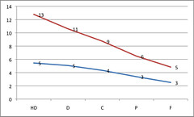
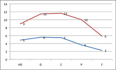
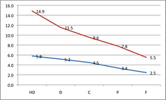

---
categories:
- indicators
date: 2011-02-19 23:45:47+10:00
next:
  text: How many pages of a course profile are necessary?
  url: /blog/2011/02/20/how-many-pages-of-a-course-profile-are-necessary/
previous:
  text: 'bim2: manage marking services - Part II'
  url: /blog/2011/02/19/bim2-manage-marking-services-part-ii/
title: A proposed link between academic involvement and student evaluation response
  rate
type: post
template: blog-post.html
comments:
    []
    
pingbacks:
    - approved: '1'
      author: "Tweets that mention A proposed link between academic involvement and student\
        \ evaluation response rate \xAB The Weblog of (a) David Jones -- Topsy.com"
      author_email: null
      author_ip: 208.74.66.43
      author_url: http://topsy.com/davidtjones.wordpress.com/2011/02/19/a-proposed-link-between-academic-involvement-and-student-evaluation-response-rate/?utm_source=pingback&utm_campaign=L2
      content: "[...] This post was mentioned on Twitter by Paulo Sim\xF5es and David\
        \ Jones, Digital Fingerprint. Digital Fingerprint said: RT @pgsimoes: A proposed\
        \ link between academic involvement and student evaluation response rate http://dlvr.it/H19tc\
        \ #elearning [...]"
      date: '2011-02-20 00:13:40'
      date_gmt: '2011-02-19 14:13:40'
      id: '3263'
      parent: '0'
      type: pingback
      user_id: '0'
    - approved: '1'
      author: Instructor participation and evaluation response rates &laquo; Col&#039;s
        Weblog
      author_email: null
      author_ip: 74.200.247.41
      author_url: http://beerc.wordpress.com/2011/02/20/instructor-participation-and-evaluation-response-rates/
      content: '[...] participation and evaluation response&nbsp;rates David raised an
        interesting point in a recent blog post where he wondered about the possible correlation
        between academic participation in a course and the [...]'
      date: '2011-02-20 13:46:32'
      date_gmt: '2011-02-20 03:46:32'
      id: '3264'
      parent: '0'
      type: pingback
      user_id: '0'
    
---
In the following I ruminate on a possible correlation between academic participation in a course and response rates on end of term student evaluation. There are two points:

1. It should be an relatively easy correlation to test.
2. It would offer support for ways in which student evaluation response rates can be increased.

Understanding low response rates for student evaluation is important, at least for some institution, because they are expending significant resources in an attempt to increase response rates. Personally, I think they are generally barking up the wrong tree and that this sort of work might reveal a better tree.

### Background - LMS, analytics, correlation and student participation

One aspect of the [Indicators project](http://indicatorsproject.wordpress.com/) has been using the data that is available from information systems such as an LMS to test correlations.

For example, in [an early publication](http://indicatorsproject.wordpress.com/2009/10/09/the-indicators-project-identifying-effective-learning-adoption-activity-grades-and-external-factors/) one of the correlations we explored was the link between student participation - measured with clicks on the course site or better yet with posts or reading of the course site discussion forum - within the LMS and student grade. Some work by Dawson (sorry don't have the reference) had established the pattern that the greater the student LMS participation then the greater the student result. i.e. HD or A students used the LMS more.

We found this pattern with distance education students. As shown in the following graph that shows the connection between participation in a course discussion forum and student grades. (Click on the graph to see it bigger)

HD (high distinction - the top grade) distance education students were, on average, posting 13 replies per course discussion forum compared to 11, 9, 6, 5 and 3 for the lower grades.

But we didn't find that on-campus, international students. As shown in the following graph using the same measure.

The HD AIC students were actually making, on average, less replies than all other students except those that failed.

It should be remembered that we don't know why this is happening, we've simply established an interesting pattern.

Another interesting pattern we established was that increase staff participation in the LMS course site also influences the correlation between student grade and student LMS participation.

Students in courses with high staff participation (staff clicked on the course site more than 3000 times in a term) gave this pattern.

Students in courses with super-low staff participation (staff clicked on the course site less than 100 times in a term) gave this pattern.

### Student evaluation response rates

For various reasons it has become important to some university folk to increase response rates on student evaluations. These are the anonymous, generally end-of-term, evaluation forms that ask the student about their course experience.

One institution I'm aware of [is reporting figures](http://content.cqu.edu.au/FCWViewer/view.do?page=13718) that suggest an average response rate across all courses of about 16%. 3 of the courses has 100% response rates, but they all had 6 or less students. The highest response rate for a decent size course (n=99) was 68%.

The most visible strategy being used to increase response rates is lots of visible encouragement from the Vice-Chancellor and a 825x305 "banner" image on the LMS home page when students login.

If they want to increase response rates, I think they are barking up the wrong tree.

### The right tree?

Based on my experience, observations and the above results, I believe there's a strong correlation between the sense of responsiveness/participation students get from the academic staff teaching their courses. After all, one (but not the only one) of the reasons why I think it's easy to get 100% response rates for a course with 6 students is that with 6 students a teacher can be very responsive.

It's hard to get a computable indicator of that sense of responsiveness from a face-to-face classroom situation, but the above patterns from the indicators project suggest that a proxy figure - though I do admit that it is a somewhat flawed proxy - can be generate from the LMS.

I think it would be interesting to map the response rate on student evaluations with the level of staff participation in the LMS course site. If I'm right, then the best response rates should come from those courses with high staff participation.

There will be confounding situations, but in general I think the pattern would hold. In fact, the confounding situations would be interesting to investigate. What is different about those situations? What lessons might an institution learn? It might be interesting to survey some or all of these staff in order to find out what is the thinking behind their practice, is being responsive high up the list?

### Of course, it's still the wrong tree

In the end, however, there's no getting away from the problem that such student evaluations are [broken](/blog/2009/01/25/somethings-that-are-broken-with-evaluation-of-university-teaching/) and not really worth it.

At the very least, the results of the above might just encourage a few staff to think about how they can improve student perceptions of their level of responsiveness and participation.