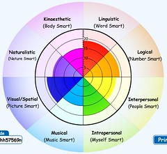

---
categories:
- eded20491
- teaching
date: 2011-02-28 10:40:22+10:00
next:
  text: The dissonance between the constructivist paradigm and the implementation
    of institutional e-learning
  url: /blog/2011/03/02/the-dissonance-between-the-constructivist-paradigm-and-institutional-e-learning/
previous:
  text: Thoughts and applications of connectivism
  url: /blog/2011/02/28/thoughts-and-applications-of-connectivism/
title: ICTs for learning design - the first week
type: post
template: blog-post.html
comments:
    - approved: '1'
      author: kwilco
      author_email: kevin.wilcoxon@unlv.edu
      author_ip: 131.216.14.1
      author_url: null
      content: 'Ref: Learning Styles
    
    
        I recently came across an article you should like.  I got it at http://psi.sagepub.com/content/9/3/105.full.pdf+html
    
    
        Pashler, H., McDaniel, M., Roher, D., and Bjork, R. (2008). Learning styles: Concepts
        and evidence. Psychological science in the public interest, 9(3), 105-119.
    
    
        I quote a part of their conclusion:
    
    
        "The contrast between the enormous popularity of the learning-styles approach
        within education and the lack of credible evidence for its utility is, in our
        opinion, striking and disturbing."
    
    
        Kevin'
      date: '2011-03-01 03:09:55'
      date_gmt: '2011-02-28 17:09:55'
      id: '3267'
      parent: '0'
      type: comment
      user_id: '0'
    - approved: '1'
      author: davidtjones
      author_email: davidthomjones@gmail.com
      author_ip: 58.165.183.0
      author_url: https://djon.es/blog/
      content: 'Thanks for the link Kevin. It looks like that''s another copy of an article
        that I linked to in another post.  The link I used <a href="http://www.psychologicalscience.org/journals/pspi/PSPI_9_3.pdf"
        rel="nofollow">is here</a> and appears to be freely available. Four Professors
        of Psychology are in some agreement.
    
    
        Of course, they used a very specific, correct and strict definition of learning
        styles and their application. One that assumes you are going to cater instruction
        specifically for each learners style and that will generate positive outcomes.
        One that assumes this is supported by appropriate experimental evidence, of which
        they found none and some that suggested otherwise.
    
    
        At the moment, the only use I think I''ll be putting learning styles to is as
        a way to encourage students to recognise the diversity within the class, the diversity
        of ways of learning and that different approaches are more appropriate in different
        situations. From the teaching perspective there isn''t the time/resources to customise
        different pedagogies for different styles, it''s just a case of not necessarily
        always using the same one and perhaps highlighting to the students the type being
        used now.
    
    
        Of course, I doubt that there''s experimental evidence to support that efficacy
        of that approach. The article, however, does suggest that there is "plentiful
        evidence arguing that people differ in the degree to which they have some fairly
        specific aptitudes for different kinds of thinking and for processing different
        types of information".'
      date: '2011-03-01 08:05:21'
      date_gmt: '2011-02-28 22:05:21'
      id: '3268'
      parent: '3267'
      type: comment
      user_id: '1'
    - approved: '1'
      author: VRBones
      author_email: vrbones@hotmail.com
      author_ip: 118.208.106.224
      author_url: http://www.vrbones.com
      content: "<blockquote>I\u2019m still feeling somewhat overwhelmed. In particular,\
        \ I have this feeling that there are activities or tasks that I need to complete\
        \ that I\u2019m not aware of. I feel I\u2019m missing something.</blockquote>\n\
        Sounds like the first step of the <a href=\"http://www.vrbones.com/2009/09/intern-rollercoaster.html\"\
        \ rel=\"nofollow\">rollercoaster</a>. (1/2 year creative piece on what is an intern.\
        \ Something to look forward to)"
      date: '2011-03-07 03:50:02'
      date_gmt: '2011-03-06 17:50:02'
      id: '3269'
      parent: '0'
      type: comment
      user_id: '0'
    
pingbacks:
    []
    
---
So, it's the end of O-Week and a four day residential school for Graduate Diploma of Learning and Teaching Students - a post-graduate, pre-service, teaching qualification. About 100 students got a lot thrown at us for four days, now it's time to get into some work. The following is an attempt to get some idea of and reflect upon the work I need to do with the "e-learning" course. Others will probably follow.

This course actually requires use to use a blog for reflections, so there will be more of that as well. This is a rough and ready summary of what I was doing.

### Overwhelmed and Moodle

It's the nature of this week and starting a new program that people will feel overwhelmed. Especially when there are some students who aren't gung-ho technology users. Especially when one of the courses is around the use of Information and Communication Technologies (ICTs) in learning and teaching.

Given my background, I'm not one of those students, but I'm still feeling somewhat overwhelmed. In particular, I have this feeling that there are activities or tasks that I need to complete that I'm not aware of. I feel I'm missing something. That's part of the reason for this post, to try and develop a list of the tasks I need to complete over the next week or so.

Beyond just the nature of starting a new program, I'm also wondering how much of this is connected with Moodle and, in particular, the design of course sites within Moodle. More on this as I generate the list.

### The list

- Add entry to "My profile" wiki (students placed in groups).  
    Had some troubles with the Moodle wiki, got there in the end. Currently only two members of the group with entries. Have already experienced the problem with differentiated messaging. i.e. the other group member asked a question about the Moodle Wiki using the Moodle messaging system. I didn't see that message until days later, long after seeing the person at the residential school.
    
    It is interesting that the course isn't using some sort of aggregator to bring student blogs together, we're being asked to add blog addresses to a wiki page.
    
- Readings
    - Expert jigsaw;  
        Contact one of the profile wiki members and choose a reading (about learning theories) each and use a PMI to present findings on the wiki.
    - Read the "study guide" - 3 or 4 pages
        - Do the F&S learning style test and reflect in a blog post.
        - Do a MI test and compare result with other students in a discussion forum.
        - Blog about 21st century students and Prensky.
        - Blog about some of the challenges arising from connectivism.
- Create blog and add it to the blog list.

### Blogs

### The "study guide"

Most of the work for this course seems to be described in a "study guide". A single web page within the Moodle course with some blurb, a reading/activity, and some more blurb. So here's a summary and some reflection.

#### Are leaners different?

From the guide

> Today's students are fundamentally different from the learners of 40 years ago.

Mmm, not sure I agree. Sure, there is probably a greater percentage/diversity of learners at schools, especially secondary schools. But are students **fundamentally** different? That's a pretty strong statement.

#### There is no difference

Suggestion that whether f-t-f or e-learning, that knowing the learner and their needs is a key element.

This highlights one of the misassumptions around ICTs/e-learning. People seem to think that it is different. That they haven't been teaching and learning with technology all along. Most of the face-to-face activities we engaged with at the residential school were mediated by some form of technology. Examples included: paper handouts, sheets of paper cut up and distributed in a bag, whiteboards, rooms and furniture configured in different ways etc. I do wonder when (or perhaps if) we'll ever get over this tendency to treat ICTs as different?

#### Learning styles

And so, we're into learning styles, multiple intelligences etc as the way to know students. I have a vague disquiet about these approaches. My concerns arise from two parts. First, the tendency for these approaches to be used to pigeon hole people into a small number of categories rather than celebrate the true diversity of people. Second, the attention these approaches take away from the more complex and nuanced approaches to understanding diversity. i.e. we apply the test, identify the categories and feel satisfied that we know the students. Perhaps that's just one source of disquiet intermixed.

Okay, so now I'm doing [the survey](http://www.engr.ncsu.edu/learningstyles/ilsweb.html) and finding myself saying "neither a nor b", "it depends", "sometimes a bit of a and a bit of b". Another concern I have about these instruments.

Seems I have to [post another entry](/blog/2011/02/25/learning-styles-teaching-and-digital-pedagogy/) on this question.

#### Multiple intelligences

So, we're meant to take [this test](http://www.bgfl.org/bgfl/custom/resources_ftp/client_ftp/ks1/ict/multiple_int/what.cfm) based on Gardner's multiple intelligences. Here are my results.

As with most of these tests, it meets my basic expectations, but there continues to be a uncertainty at the back of my mind about this work. I need to read and reflect a bit more. Trying to balance the desire to dig deeper with the desire to complete the study is interesting.

The following quote from [Howard Gardner](http://www.howardgardner.com/FAQ/faq.htm) is interesting in this context

> I have drafted generic letters that answer the most frequent questions-for example, "Is there a test for multiple intelligences?" (Answer, "Not one that I endorse")

The associated [PDF of FAQs](http://www.howardgardner.com/FAQ/FREQUENTLY%20ASKED%20QUESTIONS%20Updated%20March%2009.pdf) is interesting reading.

The following quote from those FAQs about learning styles and intelligences is interesting (to me)

> Educators are prone to collapse the terms intelligence and style. For informal matters, that is no great sin. However, style and intelligence are really fundamentally different psychological constructs. Styles refer to the customary way in which an individual approaches a range of materials—for example, a playful or a planful style. Intelligence refers to the computational power of a mental system: for example, a person whose linguistic intelligence is strong is able readily to compute information that involves language. Speak of styles, speak of intelligences, but don't conflate the two if you can help it.

And while it's somewhat off the current topic, I need to save this comment on creativity

> Finally, as stressed by my colleague Mihaly Csikszentmihalyi, creativity should not be viewed simply as a characteristic of an individual. Rather, creativity emerges from the interaction of three entities: l) the individual, with his given talents, personality, and motivation; 2) the domain—the discipline or craft in which the individual is working; 3) the field—the set of individuals and social institutions that render judgments about quality and originality

The resonance between this quote and my thoughts about creativity within education and the negative impact of institutional policies and systems - especially LMSs and how they are supported - is quite strong.

And this on how intelligences are not set in stone

> The extent to which intelligences develop is a joint product of biological (genetic potential), the emphasis a culture places on an activity, the excellence of the instruction, and the motivation of the individual. Any individual can strengthen an intelligence if she is wellmotivated; if her ambient culture values that intelligence; if there are human and artifactual resources (i.e. texts, computer programs) on which she can draw.

And at the value of the MI tests

> As you may know, many other people have devised MI tests. The best known is probably the MIDAS test, developed by Branton Shearer. These tests typically give a rough-and-ready sense of people’s interests and preferences. They suffer from two deficiencies: l) They don’t actually measure strengths—you would need performance tasks to determine how musically intelligent, or spatially intelligent, or interpersonally intelligent a person is; 2) The tests assume that the person has good intrapersonal intelligence—that is, he or she knows himself well. But many of us think that we know ourselves better than we really do. I doubt that anyone would score herself or himself low in the personal intelligences, but some of us must have lesser personal intelligence than others.
> 
> I have nothing against a person using the MIDAS or other measurements to learn about the idea of multiple intelligences. Indeed, people—both young and old—often find it interesting and illuminating to think about their own and/or other person’s intellectual profile. And yet, I must stress, we can only learn about a person’s intelligences if we actually measure how well they perform on tasks that presumably draw on specific intelligences.

My take away from this is that there remains significant questions about the value of using the results of a multiple intelligence test as a direct guide to a learning design. Essentially because it's highly questionable that they actually give a valid result as to what they seek to test. A true measure, perhaps, is only possible through observing participants while performing associated tasks.

There is, however, still value in these sorts of tests as a way of getting learners to think about different intelligences within themselves and their fellow learners.

Another interesting quote is

> That is, we reject the focus on a single scholastic intelligence that is measured by a certain kind of short answer test

I find it somewhat ironic that responding to "a single scholastic intelligences that is measured by...short answer test" was one of the reasons for the development of the theory of MIs, and that we are now in a situation where your MIs can be measured by a MCQ.

In summary

> Briefly, my theory can reinforce the idea that individuals have many talents that can be of use to society; that a single measure (like a high stake test) is inappropriate for determining graduation, access to college, etc.; and that important materials can be taught in many ways, thereby activating a range of intelligences.

#### 21st century learners

Ahh, Prensky, immigrants and related perspectives.

First up, the [Engage me or enrage me article](http://net.educause.edu/ir/library/pdf/erm0553.pdf). The suggestion is that today's technological environment means that all students have technologies of various types that are working hard to engage them. That's a very broad generalisation. Then there are claims like "Many of today's third-graders have multiple e-mail addresses" - no evidence to support this and frankly my experience doesn't support it.

Then there's an argument about how the top 3 selling games of the era offer vast and engaging experiences that kids aren't getting at school - this is showing how backward school is. But [this 2008 US survey](http://www.theesa.com/facts/pdfs/ESA_EF_2008.pdf) suggests that the average age of gamers is 35. Only 25% of gamers is under 18, 75% are over. So it's perhaps not the students purchasing those games.

Okay, now there is a point about students being able to handle systems or problems much more complex than what they are being given at school. There's the example of a 4yo gamer being bored to tears by "learning games". Mmm, final [blog post](/blog/2011/02/27/prensky-immigrants-and-old-problems-in-new-bottles/) on this section.

#### A brief overview of learning theory

So, the standard behavourism, cognitivism and constructivism summary ([this seems an useful overview](http://www.learning-theories.com/)). Interesting that connectivism is included.

### Reflections

There was a lot of reading this week, but even that only barely touched the surface of what is out there. I found it interesting, but without my prior experience this would have been a very daunting week.